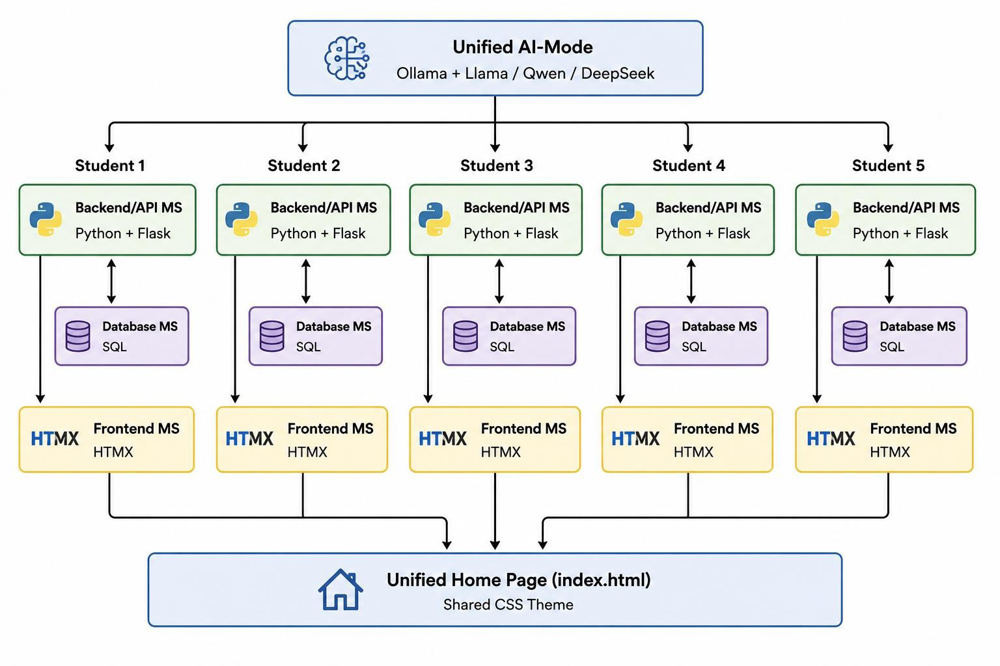
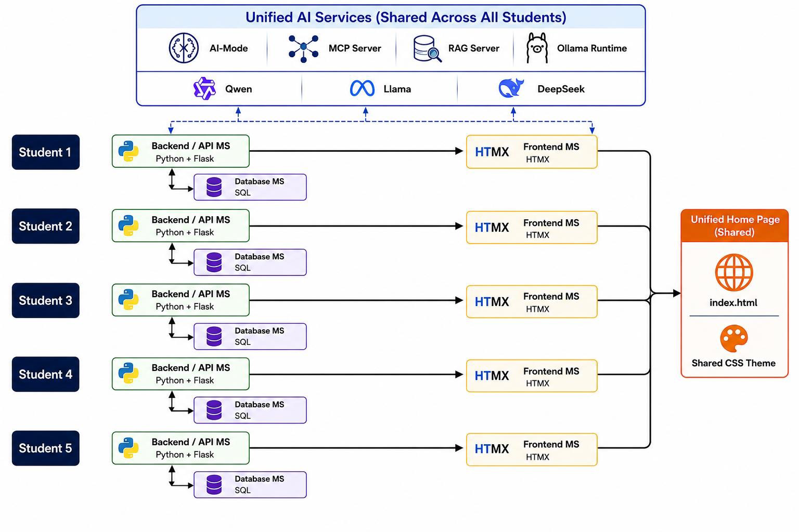
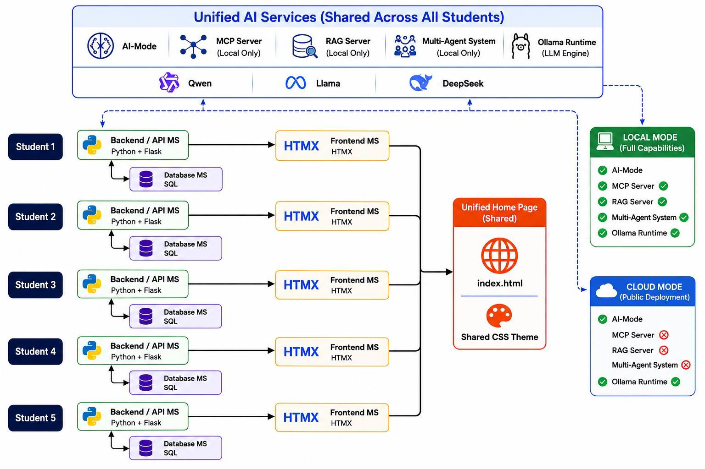
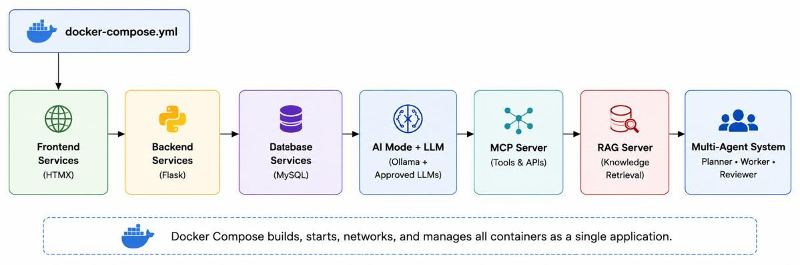
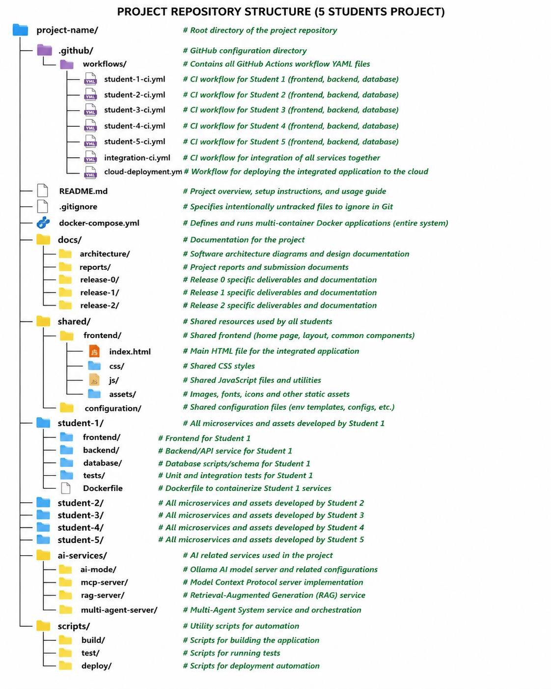
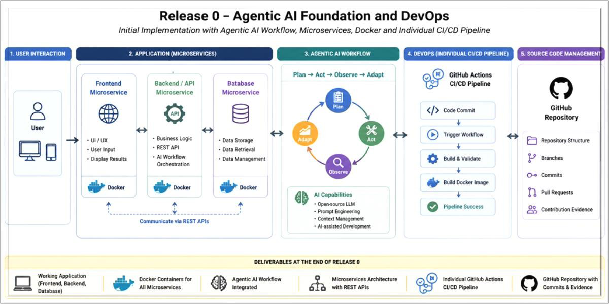
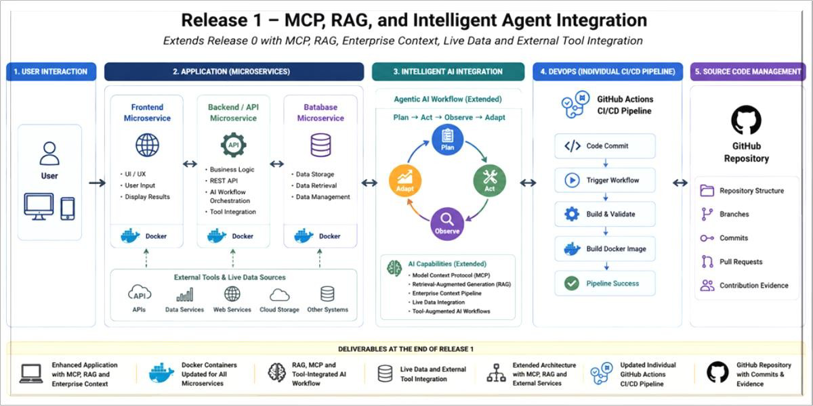
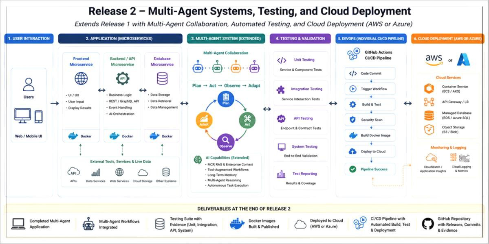

# ASD 2026 Project Specifications

## 1. Project Overview

### 1.1 Purpose

The semester project enables students to apply the concepts covered throughout this unit by designing, developing, integrating, testing, and deploying an Agentic AI software application using modern software engineering practices. Students will apply microservices architecture, DevOps, containerisation, software testing, Retrieval-Augmented Generation (RAG), Model Context Protocol (MCP), multi-agent systems, open-source Large Language Models (LLMs), and both local and cloud deployment while following an iterative and incremental software development approach.

### 1.2 Project Objectives

Upon completion of the project, students will be able to:

- Apply Agile practices throughout the software development lifecycle.
- Design, implement, and integrate a microservices-based software application.
- Develop Agentic AI solutions using open-source Large Language Models (LLMs).
- Implement Retrieval-Augmented Generation (RAG), Model Context Protocol (MCP), and multi-agent systems within an Agentic AI application.
- Apply DevOps, CI/CD, containerisation, and software testing practices to support continuous software delivery.
- Deploy, validate, and demonstrate software applications in both local and cloud environments.
- Collaborate effectively within a software development team using modern source code management and software engineering practices.

### 1.3 Learning Approach

The project follows an iterative and incremental development approach, where the group microservices application is progressively enhanced through three software releases.

### 1.4 Incremental Release Model

| Release | Assessment | Weight | Due Date |
|---|---|---:|---|
| Release 0 – Agentic AI Foundations, Microservices & DevOps | Assessment 1 | 20% | 30 August 2026 |
| Release 1 – MCP, RAG & Intelligent Agent Integration | Assessment 2 | 30% | 27 September 2026 |
| Release 2 – Multi-Agent Systems, Testing & Cloud Deployment | Assessment 3 | 30% | 18 October 2026 |

---

## 2. Project Team

### 2.1 Team Formation

Students are responsible for forming their own project teams and enrolling in a Canvas Group by the end of Week 4.

Group formation rules:

- Establish a group of five (5) students.
- Team must consist of students enrolled in the same workshop class.
- Select an Agentic AI project topic.
- Identify the microservice feature that each student will design and develop.
- Create a shared GitHub repository and include the repository URL in the form.
- Submit the Project Group Registration Form to the tutor during Week 4 workshop.

### 2.2 Individual Responsibilities

Each student is individually responsible for:

- Developing and maintaining one frontend microservice.
- Developing and maintaining one backend/API microservice.
- Developing and maintaining one database microservice.
- Implementing CRUD operations through the frontend and backend microservices.
- Populating each database table with a minimum of ten (10) records.
- Integrating the frontend with the backend API to interact with the Agentic AI models.
- Integrating their assigned microservices into the team's shared GitHub project.
- Implementing and maintaining their own CI/CD workflow.
- Maintaining GitHub commit history and GitHub Actions CI/CD workflow execution.
- Demonstrating the Plan → Act → Observe → Adapt Agentic AI workflow.
- Maintaining pre-testing and post-testing evidence for the assigned microservices.

### 2.3 Team Responsibilities

Each team is responsible for:

- Developing one integrated Agentic AI software application.
- Integrating all individual frontend, backend, and database microservices into a single working AI software application.
- Ensuring every frontend and backend microservice demonstrates successful interaction with the approved LLM(s) during each project showcase.
- Maintaining a shared GitHub repository with a common project structure.
- Maintaining a shared Docker Compose configuration to run the complete application.
- Providing a unified home page (index.html) linking to all individual frontend features.
- Applying a consistent CSS theme and user interface across the entire application.
- Integrating and testing all team microservices before each project release.
- Resolving integration issues before each project showcase.
- Maintaining project documentation throughout all releases.
- Demonstrating the integrated application from a single team member's computer during each project showcase.
- Ensuring each team member demonstrates their assigned microservice feature within the integrated application; this should be recorded in a video (10 minutes max).
- Submitting a technical report (on Canvas) for each project release (one PDF report per group).
- Including a published video URL for the integrated working software in the technical report.

### 2.4 Individual Feature Selection

Each team shall identify the individual feature that each student will design and develop. The feature selection shall be included in the Project Group Registration Form and approved by the tutor before development begins.

For each individual feature, students shall provide:

- Feature name
- Brief feature description
- Frontend microservice description
- Backend/API microservice description
- Database microservice description

Each individual feature must:

- Be integrated into the team's unified Agentic AI application.
- Include frontend, backend, and database microservices.
- Integrate with the approved Agentic AI model(s).
- Support Create, Read, Update, and Delete (CRUD) operations.
- Populate each database table with a minimum of ten (10) records.
- Be accessible from the unified project home page.
- Follow the team's common CSS styling and user interface.
- Be demonstrated during each project showcase as part of the group video.

---

## 3. Project Topic

### 3.1 Project Scope

Each team shall propose, implement, integrate, test, and deploy one original Agentic AI software application consisting of the individual frontend, backend/API, and database microservices developed by each team member.

The integrated application shall implement the shared Plan → Act → Observe → Adapt Agentic AI workflow, support AI-assisted functionality using an approved open-source LLM, follow a microservices architecture, and be containerised, validated, and deployed incrementally across Releases 0, 1, and 2.

### 3.2 Example Domains

Projects may be developed in domains including, but not limited to:

- Healthcare
- Education
- University Management
- Finance and Banking
- Retail and Shopping
- Human Resources
- Logistics and Supply Chain
- Travel and Tourism
- Environmental Sustainability
- Manufacturing and Industry

### 3.3 Project Approval

Each team shall:

- Select a project topic.
- Complete the Project Group Registration Form available on Canvas (Week 0).
- Complete the Individual Feature Selection tables in the Project Group Registration Form.
- Submit the completed Project Group Registration Form to their tutor for approval.
- Obtain tutor approval before commencing project development (by the end of Week 4).

### 3.4 Project Constraints

The proposed project must:

- Address a clearly defined real-world problem.
- Comply with the Individual Responsibilities defined in Section 2.2.
- Comply with the Team Responsibilities defined in Section 2.3.
- Support incremental development across Releases 0, 1, and 2.
- Be deployable to Microsoft Azure or Amazon Web Services (AWS) during Release 2.

---

## 4. Artificial Intelligence Requirements

### 4.1 Recommended Open-Source Models

Approved AI technologies include:

- Ollama (LLM runtime)
- Llama
- Qwen
- DeepSeek

Requirements:

- Teams may use any supported version of the approved LLMs.
- Approved LLMs may be used across individual microservices or project releases.
- All selected LLMs shall satisfy the functional requirements of the assigned microservices.
- Students shall refer to the AI Agent Configuration Guide available on Canvas when configuring and integrating the approved LLM(s).

### 4.2 Agentic AI Implementation

| Release | Required AI Capability | Deployment |
|---|---|---|
| Release 0 | AI-mode, Ollama runtime, one or more approved LLMs (Qwen, Llama, or DeepSeek), and the frontend → backend/API → Ollama → LLM workflow | Local only |
| Release 1 | Release 0 capabilities, plus MCP server, RAG server, and grounded AI responses using retrieved context | Local only |
| Release 2 | Local deployment: Release 1 capabilities, Multi-Agent Server, Planner Agent, Worker Agent, Reviewer Agent, and human review; Cloud deployment: AI-mode, Ollama runtime, approved LLM(s), with MCP Server, RAG Server, and Multi-Agent Server disabled | Local + Cloud |

### 4.3 Shared Team Agentic Loop

Each project team shall implement the following Agentic AI workflow throughout the project: Plan → Act → Observe → Adapt.

### 4.4 Individual AI Assistance

Each student shall use AI-assisted software engineering during the development of their assigned microservices. AI assistance may be used for requirements analysis, software design, code generation, testing, debugging, refactoring, and documentation. Students remain responsible for validating and maintaining all submitted work.

### 4.5 AI Development Tools

Students may use the following AI development tools to support software engineering activities (optional):

- GitHub Copilot
- Claude
- AWS Kiro

### 4.6 AI Usage Policy

Students shall:

- Validate all AI-generated software, documentation, and testing artefacts before submission.
- Accept full responsibility for all submitted work.
- Use only approved open-source LLMs for the project AI implementation.
- Be responsible for the cost of optional commercial AI services and development tools.
- Comply with the University’s Academic Integrity Policy.

---

## 5. Technology Stack

### 5.1 Integrated Development Environment (IDE)

Students shall:

- Use Visual Studio Code (VS Code).
- Use Docker for local development and container execution.
- Refer to the AI Agent Configuration Guide on Canvas for software installation and configuration.

### 5.2 Required Software

Install before commencing Release 0:

- Visual Studio Code
- Python 3.x
- Docker Desktop
- Git
- GitHub
- Ollama (or another approved open-source LLM runtime)

### 5.3 Development Technologies

| Technology | Purpose |
|---|---|
| Python 3.x | Backend microservice development |
| Flask | REST API development |
| HTMX | Frontend microservice development |
| HTML5 / CSS3 | User interface development |
| JavaScript | Client-side interactions |
| SQLite / PostgreSQL | Database microservice development |
| Docker | Containerise frontend, backend, database, and AI services |
| Docker Compose | Execute and integrate the complete multi-container application locally |
| Git | Local source code management |
| GitHub | Shared project repository and collaboration |
| GitHub Actions | CI/CD workflow automation |
| Ollama | Local LLM runtime |
| Llama, Qwen, DeepSeek | Approved open-source LLMs |

### 5.4 Cloud Technologies

Supported final deployment platforms (Release 2):

- Microsoft Azure (Azure Container Apps or Azure App Service)
- Amazon Web Services (Amazon ECS with AWS Fargate)

### 5.5 Learning Resources

Students should refer to the official documentation for each technology, including:

- Visual Studio Code
- Python
- Flask
- HTMX
- Docker
- GitHub Actions
- Ollama
- Azure
- AWS

---

## 6. Software Architecture

### 6.1 Architectural Overview

The project adopts a microservices architecture. Each student develops a frontend, backend/API, and database microservice. The integrated application implements the Plan → Act → Observe → Adapt workflow and integrates shared AI services (Ollama and approved LLMs).

| Release | Architecture |
|---|---|
| Release 0 | Microservices architecture, AI-mode, shared Plan → Act → Observe → Adapt workflow, and individual DevOps CI/CD pipelines. |
| Release 1 | Release 0 architecture extended with MCP, RAG, and local AI services. |
| Release 2 | Release 1 architecture extended with Multi-Agent Systems, testing, and cloud deployment options. |

### 6.2 Progressive Architecture

The software architecture evolves incrementally across three project releases, progressively extending the integrated microservices application with Agentic AI capabilities, advanced AI services, and cloud deployment.

#### 6.2.1 Release 0 Software Architecture

The Release 0 architecture establishes the integrated Agentic AI software application using a microservices design. The architecture shall:

- Integrate five frontend, backend/API, and database microservice sets.
- Implement a unified AI-mode using Ollama and an approved open-source LLM.
- Integrate all frontend microservices through a unified home page and shared CSS theme.
- Support REST API communication between frontend and backend microservices.
- Execute the integrated application locally using Docker Compose.

#### 6.2.2 Release 1 Software Architecture

The Release 1 architecture extends the Release 0 architecture by integrating advanced Agentic AI services. The architecture shall:

- Extend the Release 0 microservices architecture.
- Integrate MCP and RAG servers.
- Support grounded AI responses using RAG.
- Execute the integrated application locally using Docker Compose.

#### 6.2.3 Release 2 Software Architecture

The Release 2 architecture extends the Release 1 system with a Multi-Agent System and cloud deployment support. The architecture shall:

- Extend the Release 1 software architecture.
- Integrate a shared Multi-Agent System.
- Support Planner, Worker, and Reviewer agents.
- Execute AI services locally using Docker Compose.
- Support both local and cloud deployments.

##### Local deployment

- AI-mode
- Ollama runtime
- Approved LLM(s)
- MCP Server
- RAG Server
- Multi-Agent System

##### Cloud deployment

- AI-mode
- Ollama runtime
- Approved LLM(s)
- MCP Server (disabled)
- RAG Server (disabled)
- Multi-Agent System (disabled)

### 6.3 Containerisation

All frontend, backend, database, and AI services shall be containerised using Docker and integrated into a single multi-container application. The containerised architecture shall support:

- Local deployment using Docker Compose with AI-mode, Ollama, approved LLM(s), MCP Server, RAG Server, and the Multi-Agent System enabled.
- Cloud deployment with AI-mode, Ollama, and approved LLM(s), while MCP Server, RAG Server, and the Multi-Agent System remain disabled.

---

## 7. DevOps Requirements

### 7.1 Repository Structure

The project repository shall:

- Be maintained as one shared GitHub repository per project team.
- Follow the standard repository structure defined for this unit.
- Store GitHub Actions workflow files in the `.github/workflows/` directory.
- Store project documentation, architecture diagrams, and reports in the `docs/` directory.
- Store the project overview and setup instructions in `README.md`.
- Store version control exclusions in `.gitignore`.
- Store the Docker Compose configuration in `docker-compose.yml`.
- Store the integrated home page, shared CSS, JavaScript, assets, and common configuration in the `shared/` directory.
- Store each student's assigned frontend, backend/API, database, testing, and Docker artefacts in their designated `student-x/` directory.
- Store the shared AI services in the `ai-services/` directory.
- Store project build, testing, and deployment scripts in the `scripts/` directory.
- Integrate all individual student microservices into one working software application.
- Execute the integrated application locally using the shared `docker-compose.yml`.
- Maintain one shared Docker Compose configuration for the entire project team.
- Maintain one shared cloud deployment for the integrated application.
- Deploy the complete integrated application, not individual student microservices.
- Deploy the integrated application to either Microsoft Azure or Amazon Web Services.
- Require each student to integrate and validate their assigned microservices before cloud deployment.
- Maintain a clear separation between individual student components and shared project components.

### 7.2 Source Code Management

The project team shall:

- Maintain one shared GitHub repository.
- Grant repository access to all team members.
- Use the `main` branch as the primary integration branch.
- Develop features using separate Git branches.
- Merge changes into the `main` branch using Pull Requests.
- Resolve merge conflicts before merging.
- Commit changes regularly using meaningful commit messages.
- Push all changes to the shared GitHub repository.
- Maintain a complete Git commit history throughout the project.
- Integrate individual microservices incrementally.
- Maintain version control for source code, documentation, Docker, and workflow files.
- Exclude generated files, temporary files, and secrets using `.gitignore`.
- Maintain the shared repository throughout Releases 0, 1, and 2.

### 7.3 Workflow Automation

The project team shall maintain GitHub Actions workflow files in the `.github/workflows/` directory.

#### Release 0

The project team shall maintain the following workflow files:

- `student-1.yml` – Build and validate Student 1 microservices.
- `student-2.yml` – Build and validate Student 2 microservices.
- `student-3.yml` – Build and validate Student 3 microservices.
- `student-4.yml` – Build and validate Student 4 microservices.
- `student-5.yml` – Build and validate Student 5 microservices.

#### Release 1

Release 1 shall extend the Release 0 workflow files. The following workflow files shall be updated:

- `student-1.yml` – Build and validate Student 1 microservices with MCP and RAG integration.
- `student-2.yml` – Build and validate Student 2 microservices with MCP and RAG integration.
- `student-3.yml` – Build and validate Student 3 microservices with MCP and RAG integration.
- `student-4.yml` – Build and validate Student 4 microservices with MCP and RAG integration.
- `student-5.yml` – Build and validate Student 5 microservices with MCP and RAG integration.

#### Release 2

Release 2 shall extend the Release 1 workflow automation. The project team shall maintain the following workflow files:

- `student-1.yml` – Execute pre-commit pytest validation and post-commit AI-assisted unit testing.
- `student-2.yml` – Execute pre-commit pytest validation and post-commit AI-assisted unit testing.
- `student-3.yml` – Execute pre-commit pytest validation and post-commit AI-assisted unit testing.
- `student-4.yml` – Execute pre-commit pytest validation and post-commit AI-assisted unit testing.
- `student-5.yml` – Execute pre-commit pytest validation and post-commit AI-assisted unit testing.
- `cloud-deployment.yml` – Execute the deployment workflow for the integrated group application after all individual workflows complete successfully.

### 7.4 Cloud Deployment

The project team shall deploy the integrated software application to one public cloud platform during Release 2. Groups may select either AWS or Azure to deploy the Release 2 application.

| Platform | Service | Purpose |
|---|---|---|
| Microsoft Azure | Azure Container Apps (preferred) | Deploy the integrated application containers, frontend, backend/API services, SQLite database containers, and AI-mode/LLM containers. |
| Microsoft Azure | Azure App Service | Alternative deployment service for hosting the integrated web application. |
| Amazon Web Services (AWS) | Amazon ECS | Orchestrate the integrated application containers and manage networking and health monitoring. |
| Amazon Web Services (AWS) | AWS Fargate | Execute the frontend, backend/API, database, and AI containers without managing virtual machines. |

Release 2 enabled services:

- Frontend microservices
- Backend/API microservices
- SQLite database containers
- AI-mode
- Ollama runtime
- Approved LLM(s)

Release 2 disabled services:

- MCP Server
- RAG Server
- Multi-Agent Server

### 7.5 DevOps Pipeline

The DevOps pipeline shall:

- Begin with source code committed to the shared GitHub repository.
- Execute the assigned GitHub Actions workflow for build, testing, and validation.
- Build and validate the integrated Docker application.
- Execute the shared cloud deployment workflow for the integrated application.
- Deploy the integrated application to the selected Microsoft Azure or Amazon Web Services (AWS) environment.

---

## 8. Project Releases

### 8.1 Release Overview

| Release | Primary Focus |
|---|---|
| Release 0 | Implement an Agentic AI application using a microservices architecture, Docker containerisation, AI-mode, approved LLMs, the Plan → Act → Observe → Adapt workflow, and GitHub Actions workflow automation. |
| Release 1 | Extend the Release 0 application with MCP, RAG, grounded AI responses, and local AI service integration. |
| Release 2 | Extend the Release 1 application with a Multi-Agent System, pre- and post-testing, GitHub Actions workflow automation, and cloud deployment to Microsoft Azure or Amazon Web Services (AWS), with AI-mode enabled and MCP, RAG, and Multi-Agent services disabled in the cloud deployment. |

### 8.2 Release Schedule

| Release | Title | Assessment | Weight | Submission Due |
|---|---|---|---:|---|
| Release 0 | Agentic AI Foundations and DevOps | Assessment 1 | 20% | 30 August 2026 (11:59 PM AEST) |
| Release 1 | MCP, RAG, and Intelligent Agent Integration | Assessment 2 | 30% | 27 September 2026 (11:59 PM AEST) |
| Release 2 | Multi-Agent Systems, Testing, and Cloud Deployment | Assessment 3 | 30% | 18 October 2026 (11:59 PM AEST) |

### 8.3 Submission Requirements

The submission requirements for each project release consist of a software project and a technical report. Each release builds upon the previous release and requires the submission of all artefacts implemented during that release.

#### Release 0 Submissions

##### Software Project

- Shared GitHub repository.
- Standard repository structure.
- Integrated frontend, backend/API, and SQLite database microservices.
- AI-mode implementation.
- Ollama runtime and approved LLM(s).
- Plan → Act → Observe → Adapt workflow.
- `docker-compose.yml`.
- All required Dockerfiles.
- `student-1.yml` to `student-5.yml` workflow files.
- Successful local deployment using Docker Compose.

##### Video URL

- Published showcase video (for example, YouTube or Kaltura).
- The video will be used by the group in Week 6 showcase.
- The video shall include demonstration of the integrated software.
- Each student in the group must participate in the video recording.
- Each student must demonstrate their own feature in the video.
- Video length: 10 minutes maximum.
- The video URL must be included in the technical report.
- The tutor and other teams may participate in Q&A.

##### Technical Report

- Project overview.
- Individual feature allocation.
- Agile team project plan (group).
- Sprint backlog (group).
- Overall project plan (group).
- Functional and non-functional requirements added to the sprint backlog (individual).
- Feature plan (individual).
- Risk management plan (individual).
- Repository structure.
- Individual software architecture diagrams.
- Integrated Release 0 software architecture diagram.
- Docker Compose architecture diagram.
- Plan → Act → Observe → Adapt workflow diagram.
- Description of `student-1.yml` to `student-5.yml`.
- Implementation summary.
- Local testing evidence.
- GitHub Actions workflow execution evidence.
- Docker Compose execution evidence.
- Screenshots of the integrated application.
- Known issues and limitations.
- Contribution logs.
- GitHub commit logs.
- Attendance checkpoints.

#### Release 1 Submissions

##### Software Project

- Updated shared GitHub repository.
- Includes all Release 0 features and required updates for Release 1.
- Integrated frontend, backend/API, and SQLite database microservices.
- AI-mode implementation.
- Ollama runtime and approved LLM(s).
- MCP Server implementation.
- RAG Server implementation.
- Grounded AI response workflow.
- Updated `docker-compose.yml`.
- All required Dockerfiles.
- Updated `student-1.yml` to `student-5.yml` workflow files.
- Successful local deployment using Docker Compose.
- Successful integration of MCP and RAG with the group application.

##### Video URL

- Published showcase video.
- Used in Week 9 showcase.
- Video shall include demonstration of the integrated software.
- Each student must participate in the recording and demonstrate their own feature.
- Video length: 10 minutes maximum.
- Video URL included in the technical report.

##### Technical Report

- Updated project overview.
- Updated Agile team project plan.
- Sprint backlog.
- Updated project plan.
- Functional and non-functional requirements added to the sprint backlog.
- Feature plan.
- Risk management plan.
- Updated repository structure.
- Individual software architecture diagrams.
- Integrated Release 1 software architecture diagram.
- Docker Compose architecture diagram.
- MCP Server architecture and request flow.
- RAG Server architecture and retrieval flow.
- Grounded AI response flow.
- Description of `student-1.yml` to `student-5.yml`.
- Implementation summary for MCP and RAG integration.
- Local integration testing evidence.
- MCP request and response evidence.
- RAG retrieval and grounded response evidence.
- GitHub Actions workflow execution evidence.
- Docker Compose execution evidence.
- Screenshots of the integrated application with MCP and RAG enabled.
- Known issues and limitations.
- Contribution logs.
- GitHub commit logs.
- Attendance checkpoints.

#### Release 2 Submissions

##### Software Project

- Complete GitHub repository.
- Final integrated application source code.
- Includes all Release 1 features and required updates for Release 2.
- Frontend, backend/API, and SQLite database.
- AI-mode, Ollama, and approved LLM services (local and cloud).
- MCP Server, RAG Server, and Multi-Agent Server (local).
- Docker Compose configuration.
- Dockerfiles for microservices.
- `student-1.yml` to `student-5.yml`.
- `cloud-deployment.yml`.
- Pre-commit pytest testing scripts.
- Post-commit AI-assisted unit testing scripts.
- Azure or AWS deployment scripts.
- Successful local deployment.
- Successful cloud deployment.

##### Video URL

- Published showcase video.
- Used in Week 12 showcase.
- Video shall include demonstration of the integrated software.
- Each student must participate in the recording and demonstrate their own feature.
- Video length: 10 minutes maximum.
- Video URL included in the technical report.

##### Technical Report

- Updated project overview.
- Updated Agile team project plan.
- Sprint backlog.
- Updated project plan.
- Functional and non-functional requirements added to the sprint backlog.
- Feature plan.
- Risk management plan.
- Final repository structure.
- Individual software architecture.
- Integrated software architecture.
- Docker Compose architecture.
- Multi-Agent System architecture.
- Cloud deployment architecture.
- DevOps pipeline architecture.
- Description of `student-1.yml` to `student-5.yml`.
- Description of `cloud-deployment.yml`.
- Pre-commit pytest evidence.
- Post-commit AI-assisted unit testing evidence.
- Deployment script execution evidence.
- GitHub Actions workflow execution evidence.
- Local deployment evidence.
- Cloud deployment evidence.
- Screenshots of the integrated application.
- Contribution logs.
- GitHub commit logs.
- Attendance checkpoints.

---

This cleaned version preserves the project requirements while improving readability and structure for use in reports, planning, or team documentation.