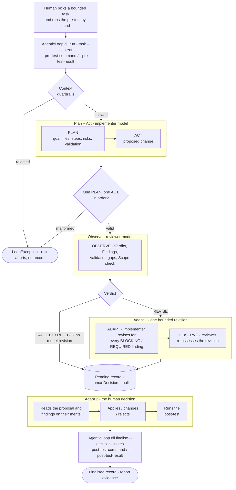
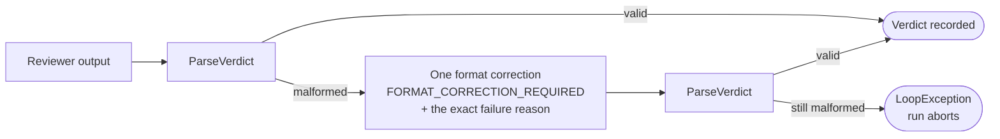

# Release 0 Agentic Loop Workflow - Plan, Act, Observe, Adapt

The shared two-model development loop: two **different** Ollama models and one
human. The implementer model plans and acts, the reviewer model observes, and
the human owns Adapt. Implemented by `ai-services/agentic-loop`
(.NET 8, Compose service `agentic-loop`, host `5180`).

The loop **never writes source files, executes commands, commits or pushes.** It
reads only the context files it is given and writes one auditable JSON record.
Every change to the repository is made by a human who has read the proposal.

## Workflow



The machine half is bounded at **one** revision on purpose: unbounded
model-to-model iteration produces a diff too large for one human decision to
mean anything. The loop then stops and waits - a verdict cannot apply itself.

## Phase ownership

| Phase | Performed by | Recorded as |
|---|---|---|
| Plan, Act | implementer model (`IMPLEMENTER_MODEL`) | `planAct` |
| Observe | reviewer model (`REVIEWER_MODEL`), **plus the human's own test runs** | `observe`, `reviewerVerdict`, `preTest`, `postTest` |
| Adapt - machine, only on `REVISE` | implementer model, then a second reviewer pass | `adaptedProposal`, `adaptedProposalReview`, `finalReviewerVerdict` |
| Adapt - human, always | the human | `humanDecision`, `humanNotes`, `postTest`, `finalisedAt` |

Observe is deliberately two things: a model critique, and evidence from tests a
human actually ran. A small reviewer model can produce a confident finding about
code that does not exist; a passing test says nothing about scope.

## Reviewer output gate



`ParseVerdict` requires exactly one `[OBSERVE]`, one valid `Verdict:` line, and
one each of `Findings:`, `Validation gaps:` and `Scope check:` in that order,
none empty. Findings must use a valid `Severity:` or state exactly `- None`, and
`REVISE`/`REJECT` cannot be paired with no findings. One correction attempt; a
second failure ends the run.

## Key constraints

- **Distinct models required** - the run aborts if the implementer and reviewer tags match.
- **Context guardrails** - task ≤ 4,000 chars; ≥ 1 context file; ≤ 16,000 bytes per file and ≤ 32,000 combined; must resolve inside `/workspace` (symlinks re-checked); allow-listed extensions only; `.git`, `.env*`, key and credential files blocked; valid UTF-8, no binaries; content scanned for secrets.
- **Deterministic and hashed** - temperature 0, context 16,384, max output 4,096; every context file and both prompts are SHA-256 hashed into the record.
- **`finalise` preconditions** - decision must be `kept`, `changed` or `rejected`; notes required; post-test command **and** result required; a record cannot be finalised twice.
- **Only finalised records are evidence.** A pending record proves only that two models were called.

## Commands

Run the pre-test yourself first - the service records what you supply, it does
not execute it.

```powershell
docker compose exec agentic-loop dotnet /app/AgenticLoop.dll run `
  --task "Implement the selected bounded change" `
  --context "path/to/relevant/source-file" `
  --pre-test-command "dotnet test path/to/tests" `
  --pre-test-result "All 12 tests passed before the change."
```

```powershell
docker compose exec agentic-loop dotnet /app/AgenticLoop.dll finalise `
  --record "/workspace/docs/agentic-loop-records/<record>.json" `
  --decision changed `
  --notes "Applied the implementer proposal; rejected the unrelated finding because ..." `
  --post-test-command "dotnet test path/to/tests" `
  --post-test-result "All 14 tests passed after the change."
```

`--implementer-prompt` and `--reviewer-prompt` are optional, defaulting to
`/app/prompts/*.md`; model tags default to the Compose environment variables.
Each prompt must declare exactly one `Version:` line, which the record captures
alongside the prompt's content hash - so a custom prompt is visible in the
evidence rather than hidden in it.

## Finalised records

Both in [`docs/agentic-loop-records/`](../agentic-loop-records/); the rules for
what a report-ready record must contain are in that folder's
[README](../agentic-loop-records/README.md).

| Record | Subject | Implementer | Reviewer prompt | Verdict / decision |
|---|---|---|---|---|
| `20260906T053024Z-ad4b32c6…` | `formatElapsed`, Student 5 frontend | `qwen2.5-coder:7b` | `student5-reviewer-llama32-v2` | REVISE / `changed` |
| `20260906T104055Z-f52cc6be…` | `formatElapsed`, Student 3 frontend | `qwen2.5:3b` | `student5-reviewer-llama32-v2` | REVISE / `changed` |

Both used `llama3.2:3b` as reviewer. The first is analysed phase by phase in
[`student-5/docs/review-record.md`](../../student-5/docs/review-record.md) -
including a reviewer `REQUIRED` finding that described code not present in the
proposal, which the human Adapt phase rejected. That is the workflow behaving
correctly: the gates caught the malformed verdict, the loop refused to
self-apply, and a human made the call.

## Related

[Integrated architecture](integrated-architecture.md) ·
[Compose architecture](compose-architecture.md) ·
[DevOps pipeline](devops-pipeline.md) ·
[service setup and tests](../../ai-services/agentic-loop/README.md)
