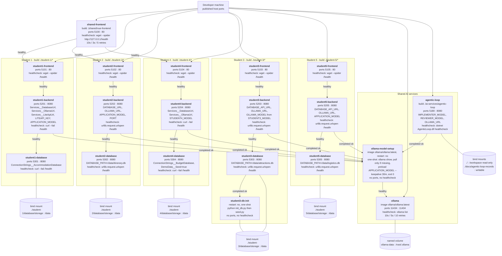

# Release 0 Docker Compose Architecture

The whole integrated application runs from one shared configuration:
`docker-compose.yml` at the repository root, with an optional
`docker-compose.gpu.yml` override that only adds `gpus: all` to the `ollama`
service. Everything on this page is derived from those two files.

Twenty services are defined: five sets of three feature services, the shared
frontend gateway, the Ollama runtime, its one-shot model-setup job, the Student 3
one-shot database initialiser, and the agentic loop.

## Diagram

**Reading the arrows.** A solid labelled arrow points from a service to what it
`depends_on`: "healthy" is `condition: service_healthy` and "completed ok" is
`condition: service_completed_successfully`. Lines to cylinders are volumes.
Arrows from the developer machine are published host ports.

## Services

| Service | Image or build context | Ports | depends_on | Healthcheck | Volumes |
|---|---|---|---|---|---|
| `shared-frontend` | `./shared/vue-frontend` | 5100 : 80 | `student1-frontend`, `student2-frontend`, `student4-frontend` healthy | `wget --quiet --spider http://127.0.0.1/health` | - |
| `student1-frontend` | `./student-1/frontend` | 5101 : 80 | `student1-backend` healthy | `wget --spider` on `/health` | - |
| `student1-backend` | `./student-1/backend` | 5201 : 8080 | `student1-database` healthy, `ollama-model-setup` completed | `curl --fail --silent localhost:8080/health` | - |
| `student1-database` | `./student-1/database` | 5301 : 8080 | - | `curl --fail --silent localhost:8080/health` | `./student-1/database/storage:/data` |
| `student2-frontend` | `./student-2/frontend` | 5102 : 80 | `student2-backend` healthy | `wget --spider` on `/health` | - |
| `student2-backend` | `./student-2/backend` | 5202 : 8080 | `student2-database` healthy, `ollama-model-setup` completed | `python -c urllib.request.urlopen('/health')` | - |
| `student2-database` | `./student-2/database` | 5302 : 8080 | - | `python -c urllib.request.urlopen('/health')` | `./student-2/database/storage:/data` |
| `student3-frontend` | `./student-3/frontend` | 5103 : 80 | `student3-backend` healthy | `wget --spider` on `/health` | - |
| `student3-backend` | `./student-3/backend` | 5203 : 8080 | `student3-database` healthy, `ollama-model-setup` completed | `python -c urllib.request.urlopen('/health')` | - |
| `student3-db-init` | `./student-3/database` | - | - | - | `./student-3/database/storage:/data` |
| `student3-database` | `./student-3/database` | 5303 : 8080 | `student3-db-init` completed | `python -c urllib.request.urlopen('/health')` | `./student-3/database/storage:/data` |
| `student4-frontend` | `./student-4/frontend` | 5104 : 80 | `student4-backend` healthy | `wget --spider` on `/health` | - |
| `student4-backend` | `./student-4/backend` | 5204 : 8080 | `student4-database` healthy, `ollama-model-setup` completed | `curl --fail --silent localhost:8080/health` | - |
| `student4-database` | `./student-4/database` | 5304 : 8080 | - | `curl --fail --silent localhost:8080/health` | `./student-4/database/storage:/data` |
| `student5-frontend` | `./student-5/frontend` | 5105 : 80 | `student5-backend` healthy | `wget --spider` on `/health` | - |
| `student5-backend` | `./student-5/backend` | 5205 : 8080 | `student5-database` healthy, `ollama-model-setup` completed | `python -c urllib.request.urlopen('/health')` | - |
| `student5-database` | `./student-5/database` | 5305 : 8080 | - | `python -c urllib.request.urlopen('/health')` | `./student-5/database/storage:/data` |
| `ollama` | `ollama/ollama:latest` | 11434 : 11434 | - | `ollama list`, 10s / 5s / 10 retries | `ollama-data:/root/.ollama` |
| `ollama-model-setup` | `ollama/ollama:latest` | - | `ollama` healthy | - | - |
| `agentic-loop` | `./ai-services/agentic-loop` | 5180 : 8080 | `ollama-model-setup` completed | `dotnet /app/AgenticLoop.dll healthcheck` | `./:/workspace:ro`, `./docs/agentic-loop-records:/workspace/docs/agentic-loop-records` |

All feature services use `restart: unless-stopped`; the two one-shot containers
use `restart: "no"`. Every healthcheck except `ollama`'s uses
`interval: 10s`, `timeout: 3s`, `retries: 5`. The database images built on
`python:3.11-slim` poll `/health` through Python's `urllib` because that base
image ships without `curl` or `wget`.

## The init container pattern

Two containers in the stack exist only to run once and exit, and dependents gate
on `service_completed_successfully` rather than on health.

**`ollama-model-setup`** is the model provisioner. It receives `OLLAMA_HOST`,
`OLLAMA_MODELS`, `APPLICATION_MODEL` and `STUDENT4_MODEL`, waits for `ollama` to
report healthy, then loops over those tags: `ollama show` first, and `ollama pull`
only when the tag is missing from the persistent `ollama-data` volume. It
finishes by running the application model once with `--keepalive 30m` so the
first user request does not pay the cold-load cost, then exits 0. All five
backends and the agentic loop depend on its completion, which is what guarantees
no AI request arrives mid-download. On a warm volume it is close to a no-op; on a
cold one it is the long pole of the first `docker compose up`.

**`student3-db-init`** is the schema provisioner for Student 3. It is built from
the same context as `student3-database` but overrides the entrypoint to run
`python init_db.py` then `python seed.py` against the same
`./student-3/database/storage` bind mount, and `student3-database` will not start
until it exits 0. The seed is idempotent, so restarting against an existing file
does not duplicate rows. The other four features initialise and seed inside their
own database service on startup instead, which is why only Student 3 has a
separate init container.

## Two properties worth knowing before a demo

- `shared-frontend` declares `depends_on` for the Student 1, 2 and 4 frontends
  only. Starting the gateway by name (`docker compose up shared-frontend`) does
  not pull in the Student 3 or Student 5 containers, and `/attractions/` and
  `/logistics/` return a proxy error until those are started. `docker compose up`
  with no service names starts everything and is the supported path.
- The model-setup loop iterates `OLLAMA_MODELS`, `APPLICATION_MODEL` and
  `STUDENT4_MODEL`. `STUDENT3_MODEL` is not in that list, so Student 3's
  `qwen2.5:3b` is pulled only because `.env.example` includes it in
  `OLLAMA_MODELS`. Running without copying `.env.example` to `.env` falls back to
  the Compose default `OLLAMA_MODELS` value, which does not contain it.
