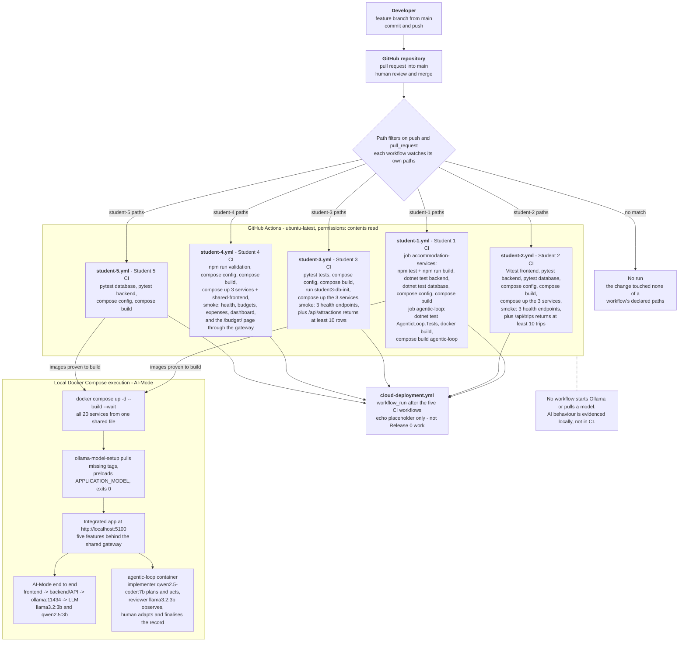

# Release 0 DevOps Pipeline Architecture

How a change travels from a developer's machine to validated, buildable
containers: GitHub as the shared repository, five path-filtered GitHub Actions
workflows, and local Docker Compose execution where AI-Mode is actually
exercised.

## Diagram



## Commit to GitHub

Work happens on a feature branch cut from `main`, is pushed to the shared GitHub
repository, and reaches `main` through a pull request. Both events matter to the
pipeline: every student workflow declares `push` and `pull_request` triggers, so
a branch push validates work in progress and the pull request validates the
merge candidate. All five workflows run on `ubuntu-latest` with
`permissions: contents: read` and nothing more.

## Path filters

Each workflow watches only the paths it owns, so an unrelated change does not
spend CI minutes on all five features.

| Workflow | Watched paths |
|---|---|
| `student-1.yml` | `student-1/**`, `shared/vue-frontend/**`, `ai-services/agentic-loop/**`, `docker-compose.yml`, `.env.example`, `scripts/verify-agentic-models.ps1`, itself |
| `student-2.yml` | `student-2/**`, `shared/vue-frontend/**`, `docker-compose.yml`, itself |
| `student-3.yml` | `student-3/**`, `shared/vue-frontend/**`, `docker-compose.yml`, itself |
| `student-4.yml` | `student-4/**`, `shared/vue-frontend/**`, `package.json`, `scripts/test-student4.ps1`, `.env.example`, `docker-compose.yml`, itself |
| `student-5.yml` | `student-5/**`, `shared/vue-frontend/**`, `docker-compose.yml`, itself |

Two entries are on every list, and both are deliberate. `docker-compose.yml`
holds every feature's ports, dependency conditions and bind mounts in one shared
file, so a change there re-runs all five sets of checks rather than silently
breaking another feature. `shared/vue-frontend/**` is the gateway and home page
every feature is reached through, so a change there is validated against all five
features' builds.

Aside from paths, the five triggers are uniform: `push` and `pull_request` on any
branch. `student-4.yml` additionally exposes `workflow_dispatch` for manual runs.

## What each workflow builds and validates

Every workflow follows the same shape - install, test, validate the shared
Compose file, build images - and three of them go on to start containers and
smoke-test them.

- **`student-1.yml`** runs two independent jobs. `accommodation-services` sets up
  Node 22 and .NET 8, runs `npm ci`, `npm test` and `npm run build` for the Vue
  frontend, `dotnet test` for the backend and database API projects, then
  `docker compose config --quiet` and a Compose build of `shared-frontend` and
  the three Student 1 images. `agentic-loop` restores and tests
  `ai-services/agentic-loop/tests/AgenticLoop.Tests.csproj`, builds the image
  directly with `docker build`, and builds it again through Compose. It is the
  only workflow that validates the shared agentic loop.
- **`student-2.yml`** sets up Python 3.11 and Node 22, runs the frontend Vitest
  suite and both pytest suites, validates the Compose config, builds the shared
  and Student 2 images, starts the three Student 2 services with
  `--no-deps --wait`, and smoke-tests the three `/health` endpoints plus
  `/api/trips`, asserting at least 10 seeded trips. It tears down with
  `docker compose down` in an `if: always()` step.
- **`student-3.yml`** runs one `pytest tests` invocation from `student-3/` that
  covers both services, validates the Compose config, builds the shared and
  Student 3 images including `student3-db-init`, runs that init container to
  create and seed the schema, starts the three services, and smoke-tests the
  three `/health` endpoints plus `/api/attractions`, asserting at least 10 seeded
  attractions.
- **`student-4.yml`** runs `npm --prefix student-4/frontend run validation`,
  which installs dependencies, runs the frontend, backend and database suites and
  builds both frontends. It then validates the Compose config, builds the shared
  and Student 4 images, starts the Student 4 services together with
  `shared-frontend`, and smoke-tests health endpoints, seeded budgets and
  expenses, the dashboard endpoint, and the `/budget/` page fetched through the
  gateway on port 5100. It is the only workflow that asserts a feature is
  reachable through the shared entry point.
- **`student-5.yml`** installs both requirements files with pip caching and runs
  the database and backend pytest suites as two separate steps with different
  `working-directory` values - both services define a module named `app`, so a
  single combined run collides on import. It then validates the Compose config
  and builds the three Student 5 images. It starts no containers.

`.github/workflows/cloud-deployment.yml` triggers on `workflow_run` completion of
the five student workflows and runs a single `echo` step. It deploys nothing;
cloud deployment is not a Release 0 deliverable.

## Local Docker Compose execution and AI-Mode

CI proves that source is tested and that every image builds. It deliberately does
not run a model: no workflow starts the `ollama` service, and the backend suites
mock Ollama, which keeps CI fast and deterministic. AI-Mode is therefore
evidenced by the local integrated run.

```powershell
Copy-Item .env.example .env
docker compose up -d --build --wait
```

`ollama-model-setup` pulls any missing tag into the shared `ollama-data` volume,
preloads `APPLICATION_MODEL`, and exits; only then do the five backends start.
With the stack healthy, `http://localhost:5100` serves the shared home page and
each feature is exercised through it, including the AI request path
frontend -> backend/API -> Ollama -> approved LLM. The shared `agentic-loop`
container runs beside the application on port 5180 and is driven from the
terminal: the implementer model plans and acts, the reviewer model observes, the
loop writes a JSON record under `docs/agentic-loop-records/`, and a human makes
the Adapt decision and finalises the record.

Evidence of both - a healthy Compose stack and a finalised agentic-loop record -
belongs in the technical report; see [`README.md`](README.md) in this folder for
where each artefact currently lives.
