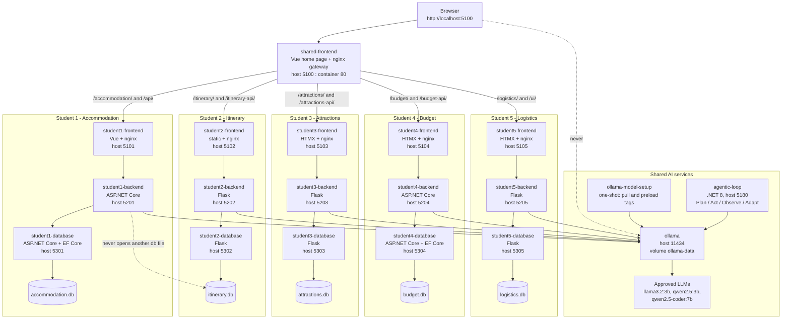

# Release 0 Integrated Software Architecture

The integrated architecture of Group 45's Agentic AI Trip Planning and Travel
Management platform: one shared containerised home page, five
frontend/backend/database microservice sets, and the shared Ollama runtime and
agentic loop. Every element below is defined in the repository-root
`docker-compose.yml` and `shared/vue-frontend/nginx.conf`.

Service-level diagrams for individual features live in each student's
`student-N/docs/architecture.md`.

## Diagram

The dotted edges state two rules the design enforces: no browser reaches Ollama
directly, and no service opens a SQLite file it does not own.

## Request flow

A user opens `http://localhost:5100`. The `shared-frontend` container serves the
Vue home page, which lists all five features and links to them by relative path.
The same container is also the gateway: its nginx configuration proxies each
feature path to that student's frontend container by Compose DNS name
(`/accommodation/` to `student1-frontend`, `/itinerary/` to `student2-frontend`,
`/attractions/` to `student3-frontend`, `/budget/` to `student4-frontend`,
`/logistics/` to `student5-frontend`), and proxies the matching API prefixes to
the corresponding backend containers. Because every feature is reached through
one origin, no page needs CORS and every URL on a feature page can stay relative.

Inside a feature the path is always the same three hops. The frontend container
serves static assets and proxies its own `/api/` calls to its backend; the
backend owns the public contract, validates input, and calls its database service
over HTTP; the database service is the only process that opens the SQLite file.
For an AI request the backend adds one more hop: it builds a prompt from data it
has already read back from its own database service, then calls
`http://ollama:11434` with the model tag it was configured with, and validates
the model's response before returning it. The marked AI path is therefore
frontend -> backend/API -> Ollama -> LLM; the browser never holds an Ollama URL,
and no model name is hard-coded in calling code - each backend reads its tag from
an environment variable (`APPLICATION_MODEL`, `STUDENT4_MODEL`, or
`STUDENT3_MODEL`).

Every backend that calls Ollama also waits on `ollama-model-setup`, a one-shot
container that pulls any missing model tag into the shared `ollama-data` volume
and preloads the application model before exiting. That ordering is what stops a
first request arriving while a model is still downloading.

The `agentic-loop` container sits beside the application rather than in the
request path. It is a development-time service: it uses two distinct models from
the same Ollama runtime - an implementer for Plan and Act and a reviewer for
Observe - and writes JSON records to `docs/agentic-loop-records/` for a human to
finalise. It serves no application traffic and applies no change to the
repository.

## Database ownership rule

Each SQLite database is owned solely by its own database microservice and is
reached only through that service's HTTP API.

- `student1-database` is the only service that opens `accommodation.db`;
  `student2-database` the only one that opens `itinerary.db`;
  `student3-database` `attractions.db`; `student4-database` `budget.db`;
  `student5-database` `logistics.db`.
- Each file is bind-mounted from that student's `database/storage/` directory, so
  it is visible to exactly one container.
- A backend never imports a SQLite driver for another feature's data. Every read
  and write travels over HTTP to the owning database API, which owns validation
  and schema for its own tables.
- Cross-feature data access, when it is added, must also go through the owning
  service's published API - never through its file, tables, or schema.

This is what makes each feature independently testable (the backend suites mock
HTTP rather than a file) and what keeps schema changes contained to the service
that owns them.
