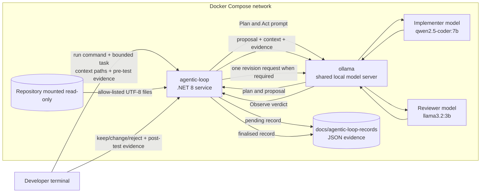
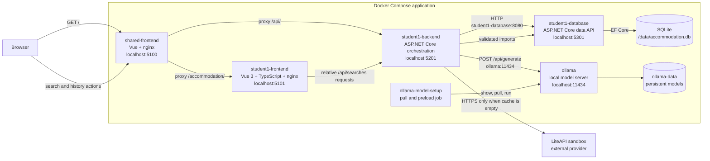
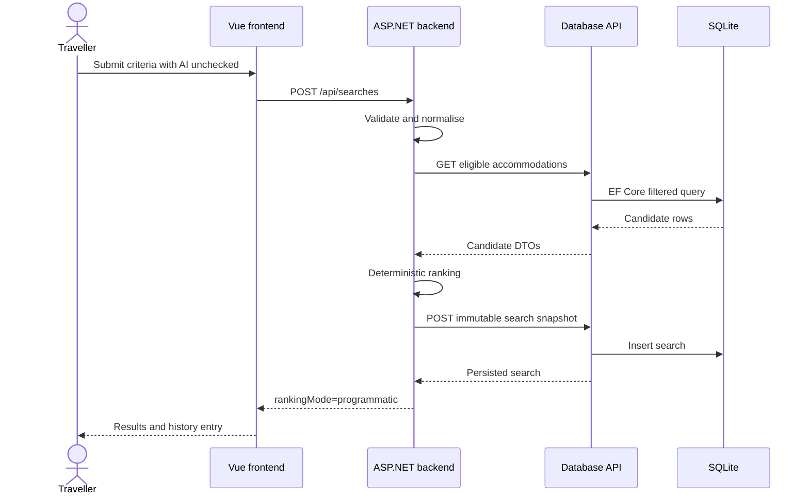
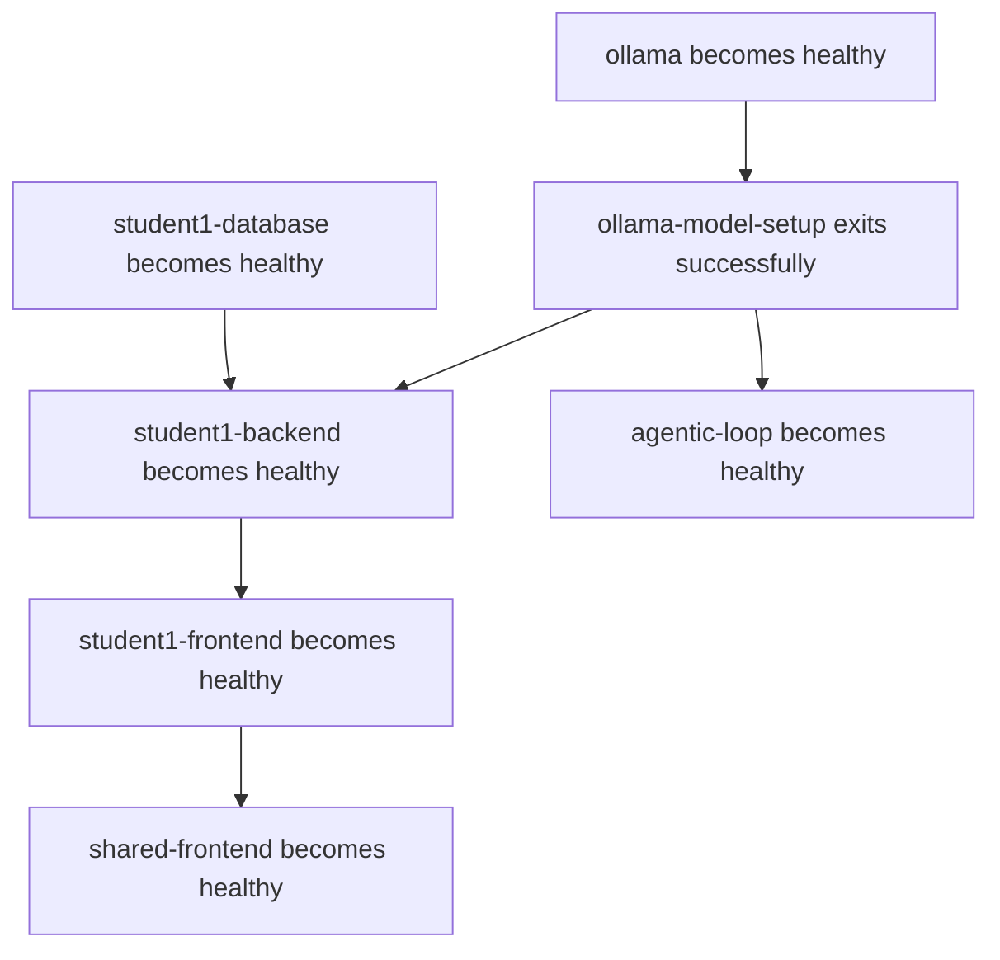
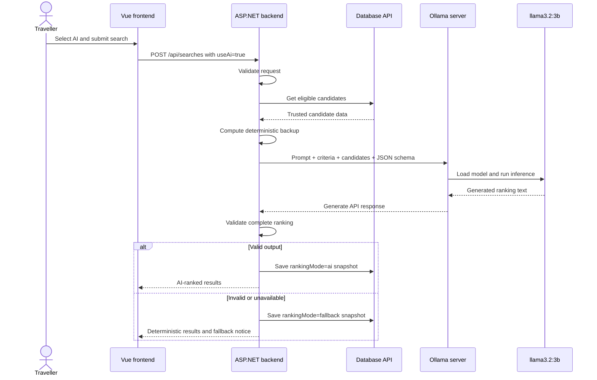

# Student 1 AI Systems and Feature Architecture

This document describes the two AI-related systems used by Student 1:

1. the shared **agentic assistant**, which supports developers through a Plan -> Act -> Observe -> Adapt workflow;
2. the **AI Accommodation Recommender**, which is the traveller-facing feature built from frontend, backend, database, Ollama, and optional LiteAPI components.

Both systems use the same local Ollama server, but they have different users, prompts, models, inputs, outputs, and authority.

| Concern | Agentic assistant | Accommodation feature |
|---|---|---|
| User | Developer | Traveller |
| Purpose | Propose and review engineering work | Search and rank accommodation |
| Entry point | Terminal command | Vue web interface |
| Model use | Distinct implementer and reviewer models | One configured ranking model |
| Output | Plan, proposal, review, optional revision, evidence record | Ranked accommodation results and reasons |
| Final authority | Human developer | Validating ASP.NET backend |
| Shared dependency | `ollama:11434` | `ollama:11434` |

## 1. Shared Agentic Assistant

### Purpose

The agentic assistant is a .NET 8 service under `ai-services/agentic-loop/`. It supports a controlled software-engineering workflow:

1. **Plan** - an implementer model analyses a bounded task.
2. **Act** - the implementer proposes a concrete change.
3. **Observe** - a different reviewer model checks the proposal.
4. **Adapt** - if revision is required, the implementer gets one bounded attempt to address the findings.
5. **Human decision** - a developer keeps, changes, or rejects the proposal and records real post-test evidence.

The assistant does not implement the traveller-facing recommendation feature at runtime. It is a development tool used to help create and review project work.

### Agentic Assistant Architecture



### Compose Service

The `agentic-loop` service is defined in `docker-compose.yml`.

It receives:

- `OLLAMA_URL=http://ollama:11434`;
- `IMPLEMENTER_MODEL`;
- `REVIEWER_MODEL`;
- `ASPNETCORE_URLS`;
- `AGENTIC_LOOP_HEALTH_URL`.

It mounts:

- the repository at `/workspace` as read-only;
- `docs/agentic-loop-records` as a writable evidence directory.

The read-only repository mount is important. The service can inspect explicitly selected files, but it cannot silently edit source code.

The service waits for `ollama-model-setup` to finish before starting. Its health check verifies that:

- the implementer and reviewer model values exist;
- the two roles use different model tags;
- both models are available from Ollama.

### Input and Context Controls

The developer starts a bounded run with a command similar to:

```powershell
docker compose exec agentic-loop dotnet /app/AgenticLoop.dll run `
  --task "Implement one bounded accommodation change" `
  --context "student-1/docs/requirements.md" `
  --context "student-1/path/to/relevant-file" `
  --pre-test-command "<actual command>" `
  --pre-test-result "<actual result>"
```

`AgenticLoopApplication.RunAsync()` parses the command and calls `ValidateRunInput()` and `LoadContextAsync()`.

The runner rejects:

- an empty or oversized task;
- missing context;
- equal implementer and reviewer models;
- paths outside the mounted workspace;
- symbolic links that escape the workspace;
- binary or non-UTF-8 files;
- oversized files or combined context;
- known secret and credential patterns.

Only files explicitly passed through `--context` are loaded. The whole repository is not automatically sent to a model.

### Plan and Act

The implementer prompt is stored at:

`ai-services/agentic-loop/prompts/implementer.md`

The runner combines:

- the implementer prompt;
- the bounded task;
- the selected file content;
- the real pre-test command;
- the supplied pre-test result.

It calls the implementer model through Ollama and requires exactly one `[PLAN]` section followed by one `[ACT]` section.

The implementer model is expected to identify:

- the goal;
- applicable requirements;
- selected files;
- implementation steps;
- risks;
- validation;
- the proposed change;
- unresolved issues.

The output is a proposal only. The runner does not apply it.

### Observe

The reviewer prompt is stored at:

`ai-services/agentic-loop/prompts/reviewer.md`

The reviewer receives:

- the original task;
- the same selected context;
- the implementer's proposal;
- the pre-test evidence.

The reviewer must return an `[OBSERVE]` section with:

- `Verdict: ACCEPT`, `REVISE`, or `REJECT`;
- findings with severity and evidence;
- validation gaps;
- a scope check.

`ParseVerdict()` rejects malformed reviewer output and prevents `ACCEPT` when blocking or required findings remain.

The reviewer is deliberately a different model from the implementer so the same configured model does not author and approve its own proposal.

### Adapt

When the reviewer returns `REVISE`, `ExecuteLoopAsync()` allows one bounded adaptation:

1. the original implementer receives the original task, proposal, and reviewer findings;
2. the implementer produces one revised `[PLAN]` and `[ACT]`;
3. the reviewer checks the revised proposal;
4. the second reviewer verdict becomes the final model verdict.

There is no unlimited autonomous loop. One adaptation limit prevents repeated scope expansion, excessive model use, and false claims of eventual correctness.

If the first verdict is `ACCEPT` or `REJECT`, the adaptation call is skipped.

### Human Decision and Evidence

After the model workflow, the service writes a pending JSON record under `docs/agentic-loop-records/`.

The record includes:

- task;
- selected context paths and hashes;
- Ollama runtime version;
- model tags;
- prompt versions;
- pre-test evidence;
- Plan/Act output;
- Observe output;
- optional adapted proposal and review;
- reviewer verdicts.

The developer then:

1. manually decides what to keep, change, or reject;
2. manually applies any accepted source change;
3. manually runs the post-test;
4. finalises the record.

```powershell
docker compose exec agentic-loop dotnet /app/AgenticLoop.dll finalise `
  --record "/workspace/docs/agentic-loop-records/<record>.json" `
  --decision changed `
  --notes "<what was kept, changed, or rejected>" `
  --post-test-command "<actual command>" `
  --post-test-result "<actual result>"
```

The assistant never runs arbitrary validation commands, writes source files, commits, or pushes. Human review remains mandatory.

### How Ollama Is Used by the Agentic Assistant

The agentic service uses Ollama as a local HTTP inference server.

`OllamaClient.GenerateAsync()` sends model prompts to:

```text
POST http://ollama:11434/api/generate
```

The request identifies either the implementer or reviewer model tag. Ollama loads that model, runs the prompt, and returns generated text. The .NET service validates the required output structure before continuing.

The assistant and accommodation feature share the Ollama server and model storage, but they do not share prompts or request workflows.

### Agentic Assistant Code References

| Responsibility | File | Key symbols |
|---|---|---|
| Command entry point | `ai-services/agentic-loop/Program.cs` | `AgenticLoopApplication.RunAsync()` |
| Workflow and safety | `ai-services/agentic-loop/AgenticLoopApplication.cs` | `RunLoopAsync()`, `LoadContextAsync()`, `ExecuteLoopAsync()`, `ParseVerdict()` |
| Ollama HTTP client | `ai-services/agentic-loop/AgenticLoopApplication.cs` | `OllamaClient` |
| Implementer contract | `ai-services/agentic-loop/prompts/implementer.md` | `[PLAN]`, `[ACT]` |
| Reviewer contract | `ai-services/agentic-loop/prompts/reviewer.md` | `[OBSERVE]`, verdict and findings |
| Container image | `ai-services/agentic-loop/Dockerfile` | .NET publish and runtime image |
| Runtime instructions | `ai-services/agentic-loop/README.md` | Run and finalise commands |
| Deployment | `docker-compose.yml` | `agentic-loop`, `ollama`, `ollama-model-setup` |

## 2. Student 1 AI Accommodation Recommender

### Feature Purpose

The Student 1 feature allows a traveller to:

- enter destination, travel dates, guest count, and nightly budget;
- receive programmatically ranked accommodation by default;
- optionally request AI ranking with free-text preferences;
- view explanations for the ranking;
- reopen, rename, and delete saved searches.

The feature is built as three Student 1 microservices plus shared infrastructure:

- `student1-frontend`;
- `student1-backend`;
- `student1-database`;
- shared `ollama`;
- one-shot `ollama-model-setup`;
- shared entry page;
- optional external LiteAPI provider.

### Microservice Architecture



### How the Microservices Communicate

#### Shared Frontend to Student 1 Frontend

The integrated entry page runs in `shared-frontend` on `http://localhost:5100`.

`shared/vue-frontend/src/App.vue` links to `/accommodation/`.

`shared/vue-frontend/nginx.conf` proxies that route to:

```text
http://student1-frontend/
```

The browser therefore stays on the shared application URL while nginx forwards the request across the internal Compose network.

#### Browser and Frontend to Backend

The Vue frontend calls only relative backend routes:

```text
/api/searches
/api/searches/{id}
```

`student-1/frontend/src/api.ts` contains the typed `searchesApi` client.

Both shared nginx and Student 1 nginx proxy `/api/` to:

```text
http://student1-backend:8080
```

The browser never receives an Ollama URL, database connection string, or LiteAPI key.

#### Backend to Database API

The backend receives:

```text
Services__DatabaseUrl=http://student1-database:8080
```

`DatabaseApiClient` calls:

- `/api/data/accommodations` for filtered candidates and imports;
- `/api/data/searches` for persisted search history.

The backend has a three-second database HTTP timeout. It validates database response payloads before returning them to the frontend.

#### Database API to SQLite

Only `student1-database` configures EF Core and SQLite.

The database service:

- applies migrations during startup;
- exposes accommodation and search CRUD endpoints;
- filters candidates by destination, price, capacity, and active state;
- stores search results as immutable JSON snapshots.

The backend never opens the SQLite file directly.

#### Backend to LiteAPI

The backend calls LiteAPI only when the database returns no eligible candidates.

It requests at most 10 sandbox results, validates them, converts valid total prices into nightly prices, imports them through the database API, and repeats the database query.

The external API key remains in the backend-only `LITEAPI_KEY` environment variable.

#### Backend to Ollama

When the traveller explicitly selects AI ranking, the backend calls:

```text
POST http://ollama:11434/api/generate
```

The backend sends a controlled prompt and validated candidate data. Ollama runs the configured local model and returns proposed ranks and reasons. The backend validates all of the output before using it.

### Normal Search Flow



Programmatic ranking orders candidates by:

1. distance from the budget midpoint;
2. nightly price;
3. accommodation ID.

### Search History Flow

| Action | Browser-facing API | Database API | Behaviour |
|---|---|---|---|
| Create | `POST /api/searches` | `POST /api/data/searches` | Stores criteria, mode, and complete result snapshot. |
| List | `GET /api/searches` | `GET /api/data/searches` | Returns newest first. |
| Reopen | `GET /api/searches/{id}` | `GET /api/data/searches/{id}` | Returns stored results without reranking. |
| Rename | `PATCH /api/searches/{id}` | `PATCH /api/data/searches/{id}` | Changes only title and update time. |
| Delete | `DELETE /api/searches/{id}` | `DELETE /api/data/searches/{id}` | Deletes the saved search and snapshot. |

The immutable snapshot means a reopened search does not change when catalogue data is edited or deleted.

### How `docker-compose.yml` Works

`docker-compose.yml` defines how the complete local application is built, networked, configured, started, checked, and persisted.

#### Images and Build Contexts

| Service | Source or image | Runtime role |
|---|---|---|
| `shared-frontend` | `shared/vue-frontend` | Shared Vue build served by nginx |
| `student1-frontend` | `student-1/frontend` | Student 1 Vue build served by nginx |
| `student1-backend` | `student-1/backend` | .NET 8 orchestration API |
| `student1-database` | `student-1/database` | .NET 8 data API with EF Core |
| `ollama` | `ollama/ollama:latest` | Long-running local model server |
| `ollama-model-setup` | `ollama/ollama:latest` | One-shot model installation and preload |
| `agentic-loop` | `ai-services/agentic-loop` | Development assistant service |

The Vue Dockerfiles use two stages:

1. Node runs `npm ci` and creates the production Vite build.
2. nginx serves only the generated static files.

The .NET Dockerfiles similarly publish with an SDK image and run the published output using a smaller ASP.NET runtime image.

#### Ports

Mappings use `host:container` format:

| Service | Host port | Container port |
|---|---:|---:|
| Shared frontend | 5100 | 80 |
| Student 1 frontend | 5101 | 80 |
| Student 1 backend | 5201 | 8080 |
| Student 1 database | 5301 | 8080 |
| Ollama | 11434 | 11434 |
| Agentic loop | 5180 | 8080 |

Host ports are for browsers, developers, and demonstrations. Containers communicate using service names and container ports.

#### Compose DNS

Compose creates a private network and makes service names resolvable as hostnames:

- `student1-backend`;
- `student1-database`;
- `ollama`;
- `student1-frontend`.

For example, the backend calls `http://student1-database:8080`, not `http://localhost:5301`.

Inside a container, `localhost` means that same container. Compose DNS is what connects the microservices.

#### Environment Variables

The backend receives:

- `Services__DatabaseUrl`;
- `Services__OllamaUrl`;
- `Services__LiteApiUrl`;
- `LITEAPI_KEY`;
- `APPLICATION_MODEL`;
- `ASPNETCORE_HTTP_PORTS`.

ASP.NET Core interprets double underscores as configuration sections. For example:

```text
Services__OllamaUrl
```

becomes:

```text
Services:OllamaUrl
```

The database receives:

```text
ConnectionStrings__AccommodationDatabase=Data Source=/data/accommodation.db
```

The setup job receives the shared model list and application model:

```text
OLLAMA_MODELS
APPLICATION_MODEL
```

#### Health Checks and Startup Order



The backend does not start until:

- SQLite is reachable through the healthy database service;
- required Ollama models have been checked or installed;
- the application model has been preloaded.

`docker compose up --wait` waits for health and completion conditions rather than only waiting for container processes to begin.

#### Persistent Storage

Two different mount types are used:

| Mount | Type | Purpose |
|---|---|---|
| `./student-1/database/storage:/data` | Bind mount | Persists the submitted SQLite database in the repository directory. |
| `ollama-data:/root/.ollama` | Named volume | Persists downloaded model files outside Git. |

Deleting and recreating a container therefore does not automatically delete the database or downloaded Ollama models.

#### Main and GPU Compose Files

The main `docker-compose.yml` remains CPU-compatible.

`docker-compose.gpu.yml` contains:

```yaml
services:
  ollama:
    gpus: all
```

Running:

```powershell
docker compose -f docker-compose.yml -f docker-compose.gpu.yml up -d --build --wait
```

makes Compose merge the files. The full Ollama definition comes from the main file, while the override adds NVIDIA GPU access.

All backend URLs, prompts, APIs, validation, and persistence remain the same. Only Ollama's inference execution changes.

### How the Built-In AI Recommendation Works

The built-in AI feature is not a separate chatbot and is not the agentic assistant. It is one optional ranking step inside the Student 1 backend.

#### High-Level AI Flow



#### What Ollama Actually Does

Ollama is a local model manager and inference server.

It performs four main jobs:

1. downloads and stores model files;
2. loads the requested model into RAM and, when available, VRAM;
3. accepts prompts through an HTTP API;
4. runs the model and returns generated text.

Ollama is not compiled into the Vue or ASP.NET code. It feels built into the application because Compose starts it, installs its models, connects the backend to it, and keeps its data in the same deployment.

The application does not train a new model. It uses the existing open-source `llama3.2:3b` model and constrains it with:

- a versioned task prompt;
- validated application data;
- a request-specific JSON schema;
- strict backend output validation;
- deterministic fallback.

#### Model Installation and Preloading

The `ollama` container is the long-running HTTP server.

The `ollama-model-setup` container is a one-shot startup job. Its shell command:

1. reads `OLLAMA_MODELS` and `APPLICATION_MODEL`;
2. checks each tag with `ollama show`;
3. downloads missing tags with `ollama pull`;
4. runs the application model once;
5. requests a 30-minute keep-alive;
6. exits successfully.

The model files are stored in the `ollama-data` volume, so they normally do not need to be downloaded on every startup.

Preloading matters because loading model weights can take longer than generating a response after the model is already in memory. The backend has a 12-second Ollama timeout. Warming the model during startup avoids spending that timeout on a cold load during the traveller's first search.

#### Frontend AI Opt-In

The search form keeps AI unchecked by default.

When AI is selected:

- the preferences field is displayed;
- the frontend sends `useAi: true`;
- the backend may call Ollama.

When it is not selected:

- preferences are hidden and sent empty;
- the backend uses programmatic ranking;
- no Ollama request occurs.

This keeps AI use explicit and avoids sending free text when it has no effect.

#### Backend-Controlled Prompt

The application prompt is stored at:

`student-1/backend/Prompts/accommodation-ranking-v1.txt`

The prompt tells the model to:

- rank only supplied candidates;
- treat preferences and accommodation text as untrusted data;
- return JSON only;
- include every candidate exactly once;
- use unique contiguous ranks;
- produce short evidence-based reasons;
- avoid invented facts.

`OllamaRankingClient.RankAsync()` adds validated criteria and candidate fields to that prompt.

The browser cannot replace the system task with an arbitrary prompt. User preferences are embedded only as untrusted ranking data.

#### Ollama HTTP Request

The backend sends a non-streaming request to:

```text
POST http://ollama:11434/api/generate
```

The request includes:

- `model`: the configured `APPLICATION_MODEL`;
- `prompt`: instructions plus validated criteria and candidates;
- `stream: false`;
- `format`: an exact JSON schema;
- `temperature: 0`;
- a bounded prediction length;
- `keep_alive: 30m`.

The JSON schema is built from the current candidate set. It requires:

- an array with exactly the candidate count;
- only IDs that were supplied;
- rank values within the correct range;
- a reason string;
- no additional properties.

#### Inference

During inference, Ollama tokenises the prompt and passes it through the loaded `llama3.2:3b` model.

The model produces text one token at a time until it completes the response or reaches the output limit. The JSON schema steers generation toward the required structure, while temperature `0` reduces randomness.

In CPU mode, model calculations use host CPU and system memory.

In GPU mode:

- Docker exposes the NVIDIA GPU to the Ollama container;
- Ollama detects compatible acceleration;
- supported model layers are loaded into VRAM;
- remaining work uses the available CPU and memory as needed.

The backend does not use CUDA directly. Docker and Ollama isolate GPU handling from the application code.

#### Backend Validation

Generated output is untrusted even when Ollama successfully returns HTTP `200`.

`ValidateRanking()` rejects the whole response unless:

- generation is marked complete;
- response text exists;
- the text is valid JSON;
- the result count equals the candidate count;
- every ID belongs to a supplied candidate;
- each candidate appears exactly once;
- ranks are unique and contiguous;
- reasons satisfy formatting and length rules;
- no unknown fields are included.

One invalid entry rejects the entire AI response.

The model returns only:

- accommodation ID;
- rank;
- reason.

Trusted name, destination, nightly price, and capacity values are restored from the original database candidates. The model cannot change those values.

#### Fallback

Before calling Ollama, the backend computes the deterministic ranking.

The backend uses it if Ollama:

- exceeds the 12-second timeout;
- cannot be reached;
- returns an unsuccessful status;
- returns an incomplete response;
- produces malformed JSON;
- omits or duplicates candidates;
- invents candidate IDs;
- produces invalid ranks or reasons.

The completed search is still persisted with:

```text
rankingMode = fallback
```

The frontend displays a notice explaining that deterministic fallback was used.

AI is therefore an enhancement rather than a requirement for basic feature availability.

#### Why Ollama Is Suitable Here

Ollama supports the Release 0 architecture because it:

- runs models locally rather than sending traveller data to a cloud LLM;
- exposes a simple HTTP API that ASP.NET can call;
- supports named open-source model tags;
- stores models in a persistent Docker volume;
- supports CPU operation and optional NVIDIA acceleration;
- can serve both the application model and development-loop models from one runtime.

The trade-off is that local performance depends on the demonstration machine's RAM, CPU, GPU, model size, and whether the model is warm.

### Failure Boundaries

| Failure | Application behaviour |
|---|---|
| Invalid traveller input | Backend returns `400`; database, LiteAPI, and Ollama are not called. |
| Database unavailable | Backend returns `503`. |
| Invalid database response | Backend returns `502`. |
| LiteAPI unavailable | Backend returns provider-specific `503`. |
| Invalid LiteAPI response | Backend returns provider-specific `502`. |
| Ollama unavailable or invalid | Backend returns valid deterministic results with fallback notice. |
| No candidates after import | Backend skips Ollama, persists an empty snapshot, and returns an empty state. |

Database and provider failures are not disguised as AI fallback. Fallback applies only after a valid request and candidate set reach the optional AI ranking stage.

### Feature Code References

| Responsibility | File | Key symbols |
|---|---|---|
| Shared route | `shared/vue-frontend/nginx.conf` | `/accommodation/`, `/api/` |
| Shared navigation | `shared/vue-frontend/src/App.vue` | Accommodation feature link |
| Frontend coordinator | `student-1/frontend/src/App.vue` | `submitSearch()` |
| Frontend API | `student-1/frontend/src/api.ts` | `searchesApi` |
| AI control | `student-1/frontend/src/components/SearchForm.vue` | AI opt-in and preferences |
| Result states | `student-1/frontend/src/components/SearchResults.vue` | AI, programmatic, fallback, import notices |
| Backend startup | `student-1/backend/Program.cs` | HTTP clients, URLs, timeouts, prompt loading |
| Search workflow | `student-1/backend/Api/SearchEndpoints.cs` | `CreateAsync()` |
| Validation | `student-1/backend/Api/SearchValidator.cs` | `SearchValidator.Validate()` |
| Deterministic ranking | `student-1/backend/Api/DeterministicRanker.cs` | `Rank()` |
| Ollama integration | `student-1/backend/Clients/OllamaRankingClient.cs` | `RankAsync()`, `ValidateRanking()` |
| Application prompt | `student-1/backend/Prompts/accommodation-ranking-v1.txt` | Ranking instructions |
| Database HTTP boundary | `student-1/backend/Clients/DatabaseApiClient.cs` | `DatabaseApiClient` |
| Provider boundary | `student-1/backend/Clients/LiteApiClient.cs` | `LiteApiClient` |
| Database startup | `student-1/database/Program.cs` | EF Core and migrations |
| Catalogue API | `student-1/database/Api/AccommodationEndpoints.cs` | Catalogue CRUD and filters |
| History API | `student-1/database/Api/SearchEndpoints.cs` | Snapshot CRUD |
| Persistence context | `student-1/database/Data/DatabaseContext.cs` | `DatabaseContext` |
| Search schema | `student-1/database/Data/Configurations/SearchConfiguration.cs` | Constraints and JSON snapshot |
| Main deployment | `docker-compose.yml` | Services, DNS, health, environment, volumes |
| GPU deployment | `docker-compose.gpu.yml` | `ollama.gpus: all` |
| Integrated startup | `scripts/start-app.ps1` | Explicit `-Gpu` selection |

### Key Architectural Guarantees

- The frontend calls only the backend.
- Only the database service opens SQLite.
- The backend calls LiteAPI and Ollama; the browser does not.
- Programmatic ranking is the default.
- Ollama is called only after explicit AI opt-in and only when candidates exist.
- Model output is never trusted without whole-response validation.
- AI failure cannot corrupt rankings or prevent an otherwise valid search from being saved.
- Search history reopens stored snapshots without reranking.
- Containers use Compose DNS rather than host `localhost`.
- SQLite and model data persist outside replaceable containers.
- CPU and GPU modes use the same application code and API contract.

