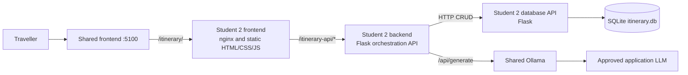
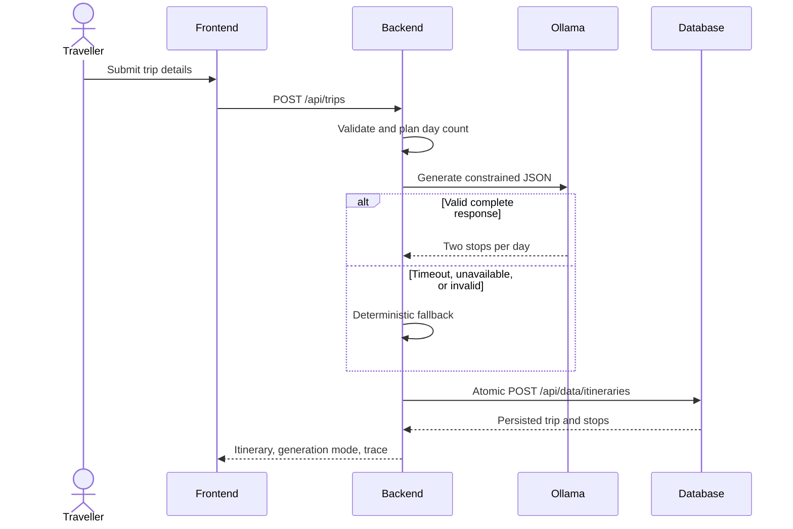
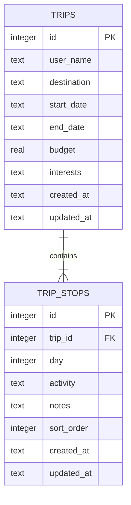
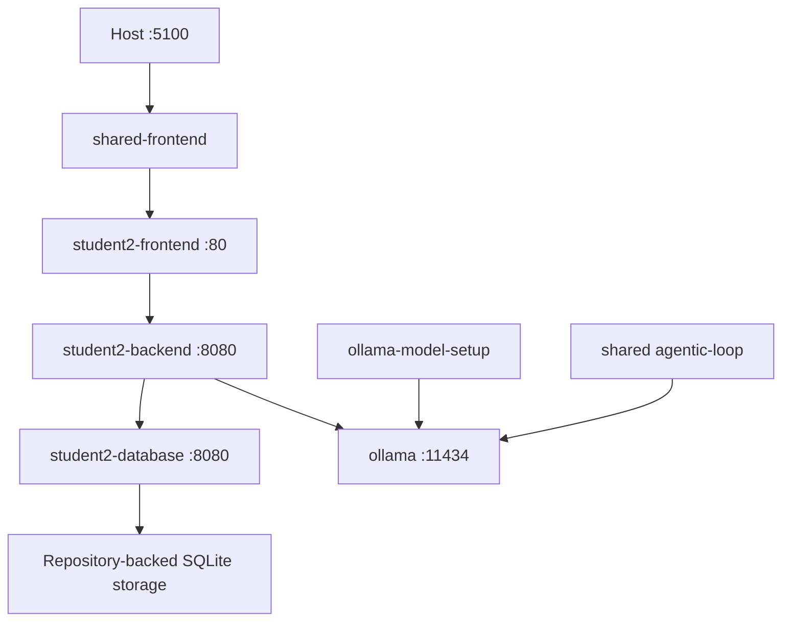
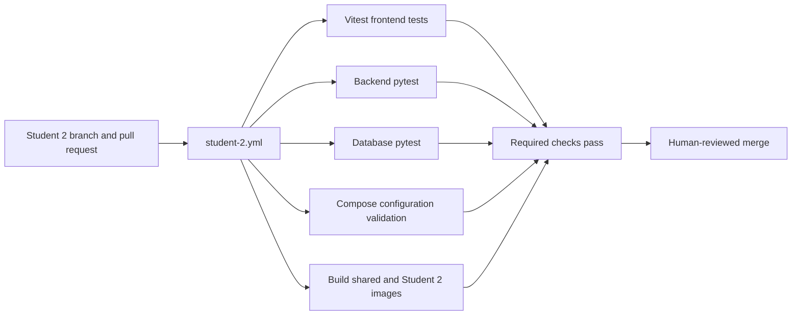

# Itinerary Planner Architecture and Data Design

## Individual Service Architecture

The browser calls only the backend through the frontend/shared reverse proxies. The backend validates input, controls AI generation and fallback, and requests persistence over HTTP. Only the database service opens SQLite.

## AI Request Flow

## Conceptual Data Model and ERD

A trip represents one traveller's planning request. A trip contains one or more ordered stops; a stop belongs to exactly one trip.

## Logical and Physical Design

- `trips.id` and `trip_stops.id` are auto-incrementing SQLite integer primary keys.
- `trip_stops.trip_id` is a required foreign key with `ON DELETE CASCADE`.
- `ix_trip_stops_trip_day` orders stop retrieval by trip, day, and sort order.
- Text length, budget, day, and sort-order checks are enforced by both API validation and SQLite constraints.
- UTC timestamps are stored as ISO 8601 text.
- The database file is bind-mounted from `student-2/database/storage` to `/data`.
- Atomic itinerary endpoints validate all input before opening the write sequence and commit trip/stops together.

## Docker Compose Architecture

## DevOps Pipeline

## Development Agentic Workflow

This development loop is separate from itinerary generation and must be evidenced by the shared runner's finalised record.
