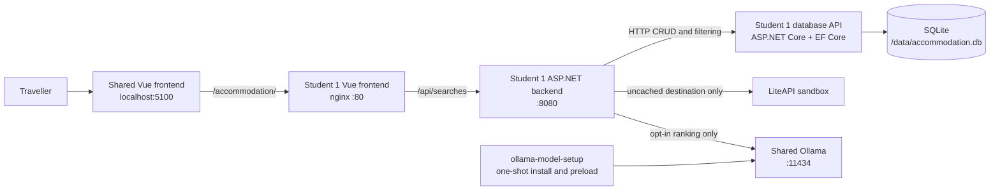
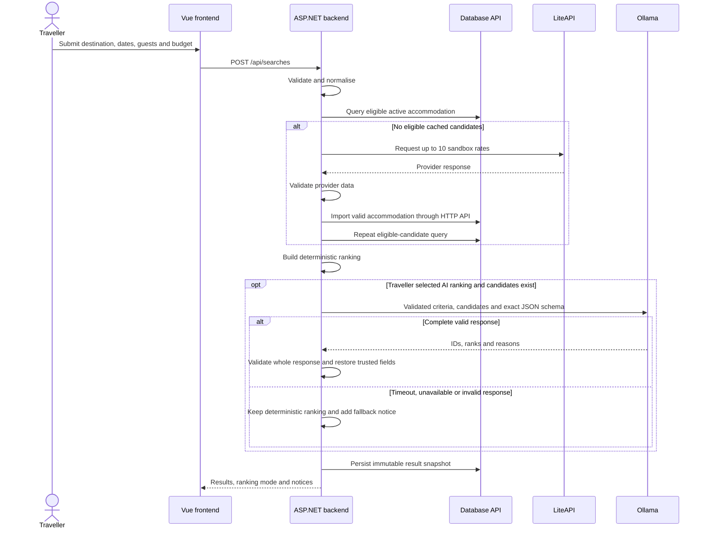
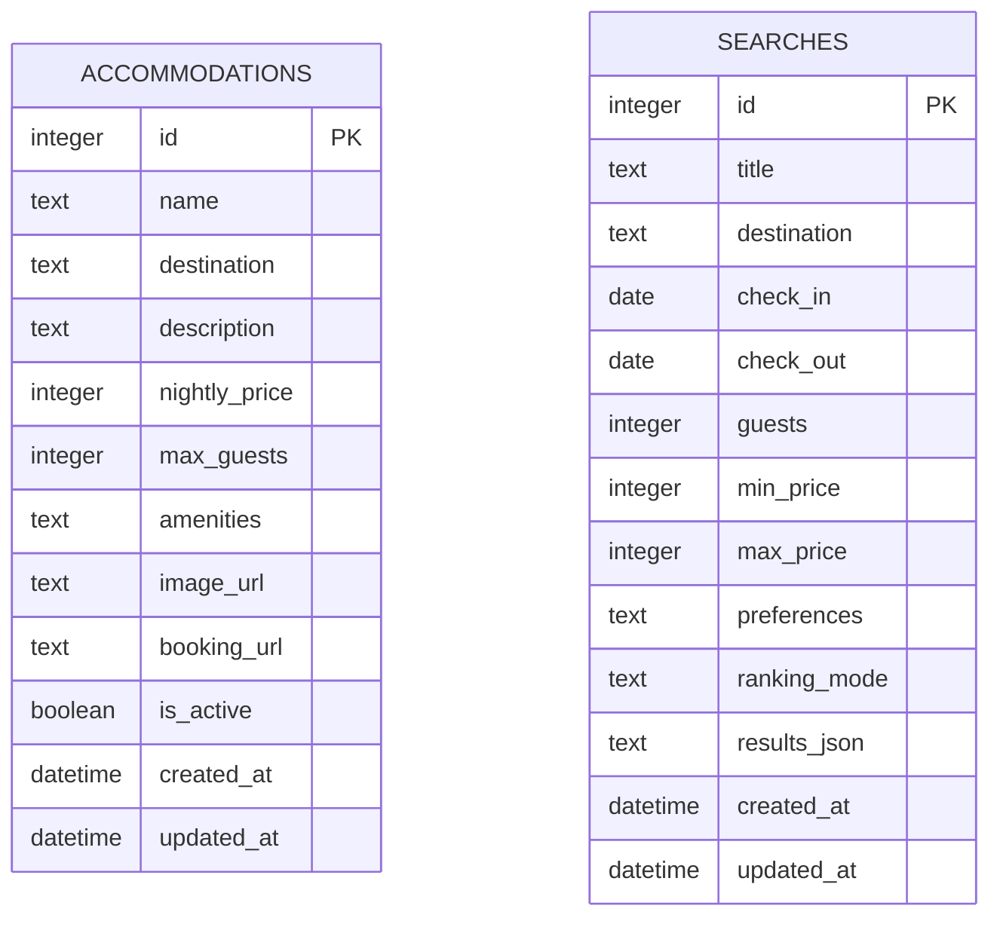
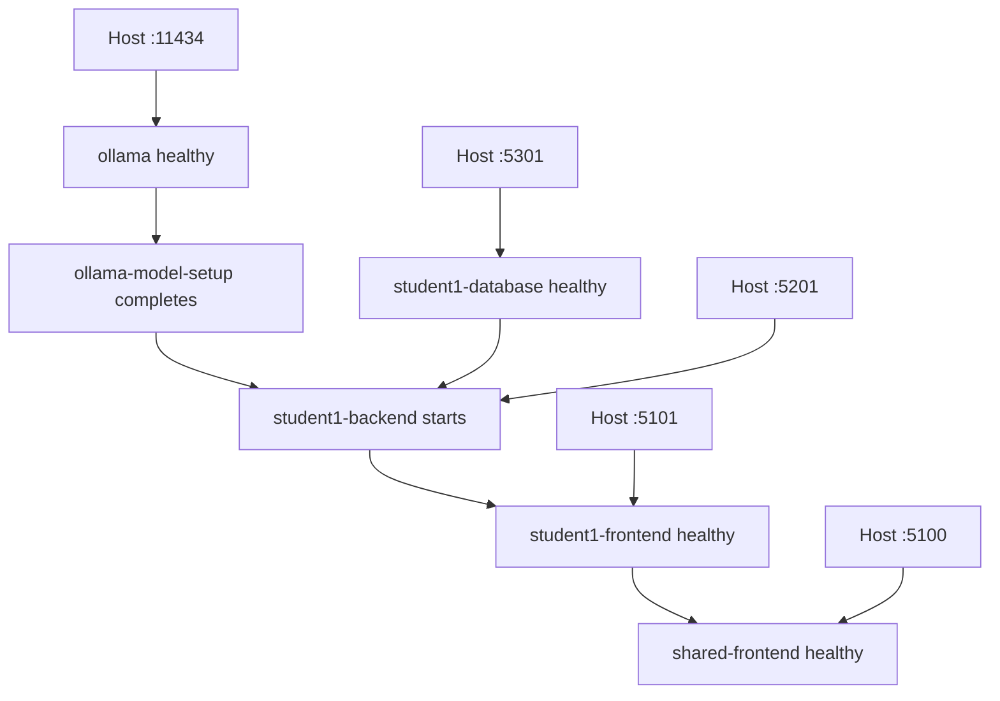

# Student 1 AI Accommodation Recommender Architecture

## Overview

Student 1 provides a traveller-facing **AI Accommodation Recommender**. One
configured application model may rank eligible accommodation after explicit
opt-in. The application uses the team's shared Ollama runtime and persistent
model store, and accepts model output only after backend validation.

## Integrated Architecture

The frontend calls only the backend. The backend owns validation, provider
imports, deterministic ranking, optional AI ranking, fallback, and persistence
orchestration. Only the database API references EF Core or opens SQLite.

## Accommodation Recommender

### Search Flow

Programmatic ranking is the default and orders candidates by:

1. distance from the nightly-budget midpoint;
2. nightly price;
3. accommodation ID.

An empty candidate list skips Ollama and persists an empty snapshot. Reopening a
saved search returns that stored snapshot and never reruns ranking.

### Application AI Boundary

The ranking prompt is stored at
`student-1/backend/Prompts/accommodation-ranking-v1.txt`. The backend sends only
validated criteria and eligible candidate fields. Preferences, descriptions,
and other free text are marked as untrusted data rather than instructions.

`OllamaRankingClient.RankAsync()` calls Ollama's non-streaming
`POST /api/generate` endpoint with:

- `APPLICATION_MODEL`, currently defaulting to `llama3.2:3b`;
- an exact candidate-specific JSON array schema;
- temperature `0`, `num_predict` `700`, and `keep_alive` `30m`;
- a 12-second HTTP timeout configured by the backend.

The complete response is rejected unless it contains every supplied candidate
exactly once, valid contiguous ranks, no extra properties, and distinct
sentence-form reasons of 8-18 words. Names, destinations, prices, and capacities
are restored from trusted database candidates rather than model output.

### Persistence Design

The two tables have no live relationship. `searches.results_json` is an
immutable display snapshot, so catalogue updates or deletion cannot change
previous recommendations.

- Prices are stored as integer cents through EF Core decimal conversions.
- Accommodation name and destination uniqueness is case-insensitive.
- Amenities and result snapshots are constrained to valid JSON arrays.
- Ranking mode is constrained to `programmatic`, `ai`, or `fallback`.
- The repository-backed bind mount preserves the submitted SQLite database.

### Public and Internal APIs

| Boundary | Routes | Responsibility |
|---|---|---|
| Browser to backend | `POST/GET /api/searches`, `GET/PATCH/DELETE /api/searches/{id}` | Search and history workflow |
| Backend to database API | `/api/data/accommodations` | Catalogue CRUD, filtering, provider imports |
| Backend to database API | `/api/data/searches` | Immutable search-history CRUD |
| Health | `GET /health` | Container readiness |

Database requests use a three-second timeout. LiteAPI requests use a ten-second
timeout. Database and provider failures return dependency errors; they are not
misreported as AI fallback.

## Docker Compose Topology

`ollama-model-setup` is a short-lived setup job, not a second model server. It
checks each tag in `OLLAMA_MODELS` plus `APPLICATION_MODEL`, pulls only missing
models, preloads the application model with a 30-minute keep-alive, and exits.
All application consumers then use `http://ollama:11434`.

| Storage | Compose mount | Purpose |
|---|---|---|
| Accommodation data | `./student-1/database/storage:/data` | Repository-backed SQLite persistence |
| Model files | `ollama-data:/root/.ollama` | Shared persistent Ollama model store |

The main `docker-compose.yml` remains CPU-compatible.
`docker-compose.gpu.yml` adds only `gpus: all` to the shared `ollama` service.
`scripts/start-student1.ps1` automatically uses the GPU override when a
Docker-accessible NVIDIA runtime is detected. `scripts/start-app.ps1 -Gpu`
enables it explicitly for the complete integrated application.

## Code References

| Component | File | Key symbols or configuration |
|---|---|---|
| Shared route and API proxy | `shared/vue-frontend/nginx.conf` | `/accommodation/`, `/api/` |
| Frontend coordinator | `student-1/frontend/src/App.vue` | Search and history coordination |
| Frontend API client | `student-1/frontend/src/api.ts` | `searchesApi` |
| Search form | `student-1/frontend/src/components/SearchForm.vue` | AI opt-in and preferences |
| Search orchestration | `student-1/backend/Api/SearchEndpoints.cs` | `CreateAsync()` |
| Input validation | `student-1/backend/Api/SearchValidator.cs` | `Validate()` |
| Deterministic ranking | `student-1/backend/Api/DeterministicRanker.cs` | `Rank()` |
| Application AI client | `student-1/backend/Clients/OllamaRankingClient.cs` | `RankAsync()`, response validation |
| Provider client | `student-1/backend/Clients/LiteApiClient.cs` | Sandbox search and mapping |
| Database client | `student-1/backend/Clients/DatabaseApiClient.cs` | HTTP persistence boundary |
| EF Core context | `student-1/database/Data/DatabaseContext.cs` | Accommodation and search sets |
| Physical constraints | `student-1/database/Data/Configurations/` | Entity mappings and checks |
| Main deployment | `docker-compose.yml` | Services, health, dependencies, environment, volumes |
| GPU override | `docker-compose.gpu.yml` | Shared Ollama GPU access |

## Architectural Guarantees

- The browser never receives database, Ollama, or LiteAPI credentials.
- Only the database service opens SQLite.
- Programmatic ranking works without Ollama and is the default.
- AI is called only after explicit opt-in and only when candidates exist.
- Invalid model output cannot modify trusted accommodation fields.
- AI failure produces deterministic results rather than a failed valid search.
- Search history reopens immutable snapshots without reranking.
- One shared Ollama runtime serves all configured application models.
