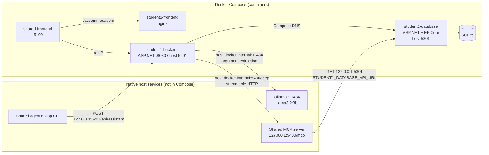
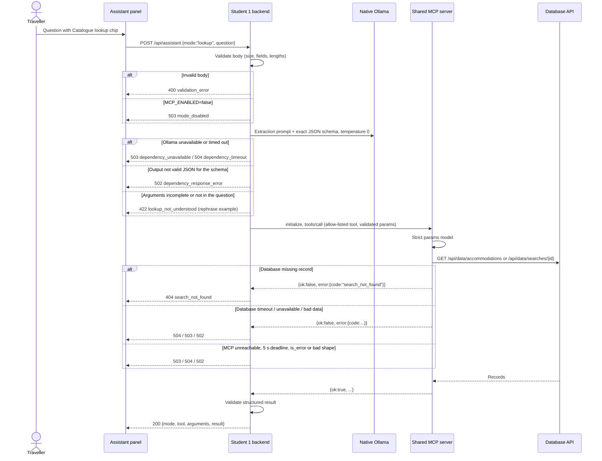

# Release 1 MCP HLD - Catalogue Lookup

Status: design for Release 1 chunks 1-5, 27 September 2026. Implementation
evidence is recorded in [prompt-log.md](prompt-log.md),
[review-record.md](review-record.md) and the
[Release 1 runbook](release-1-runbook.md). This document does not claim that any
live check passed.

Companion design: [Release 1 RAG HLD](release-1-rag-hld.md).

## 1. Purpose and Scope

A traveller asks one catalogue question in the accommodation page's
**Trip assistant** with the **Catalogue lookup** chip selected. The backend turns
the question into validated arguments for one read-only tool on the shared MCP
server, calls it, validates the structured result and shows it.

In scope:

- two read-only tools, `accommodation.find` and `accommodation.get_search`, in
  `ai-services/mcp-server/tools/accommodation.py`;
- `POST /api/assistant` with `mode: "lookup"` in the Student 1 backend;
- one Ollama argument-extraction call with a versioned backend prompt;
- a backend MCP client built on the official C# SDK;
- the assistant panel's lookup mode;
- `MCP_ENABLED` and `RAG_ENABLED` flags, Compose wiring and CI with the modes
  disabled;
- a Student 1 fixture in the shared loop's `validate-mcp` mode.

Out of scope: chat history or multi-turn state, automatic routing between
lookup and guide, tools that write data, new tables or migrations, changes to
Release 0 ranking, and Release 2 multi-agent work.

## 2. Requirements Traceability

| ID | Requirement | Measurable target | Release 1 criterion |
|---|---|---|---|
| R1-MCP-01 | Frontend -> backend -> shared MCP returns a structured tool result shown in the UI. | One live lookup through `http://localhost:5100/accommodation/` shows the tool name, arguments and results. | MCP integration |
| R1-MCP-02 | Tools are read-only. | Both tools issue only `GET` requests to the database API; tests assert the URL, method and timeout. | Tool boundaries |
| R1-MCP-03 | Tool parameters are strict. | Unknown fields, wrong types and out-of-range values raise a tool error before any database call. | Tool boundaries, security |
| R1-MCP-04 | The backend calls only allow-listed tools. | Calling any name other than the two tools throws before a session opens; a unit test proves no connection is made. | Tool boundaries, security |
| R1-MCP-05 | Model-extracted arguments are never trusted. | Extraction output is checked against an exact schema, the argument bounds and the question text. Invalid output returns `422 lookup_not_understood` and makes no MCP call. | Security, prompt engineering |
| R1-MCP-06 | Structured results are validated. | Missing, extra or out-of-range fields, `is_error` results and `ok:false` results never reach the UI as success. | Reliability, grounding and traceability |
| R1-MCP-07 | Deadlines are bounded. | Database read 3 s (tool); MCP session 5 s (backend outer deadline); extraction 12 s. Worst-case lookup is under 18 s. | Performance, reliability |
| R1-MCP-08 | Request input is bounded. | Bodies over 8192 bytes, unknown fields or questions outside 1-1000 characters return `400 validation_error`. | Security |
| R1-MCP-09 | Disabled mode is explicit. | With `MCP_ENABLED=false`, lookup returns `503 mode_disabled` and makes no Ollama or MCP call. Any flag value other than `true` or `false` stops the backend at startup. | Configuration, CI |
| R1-MCP-10 | CI stays offline. | `student-1.yml` runs every Student 1 test plus `test_accommodation_tools.py` with the modes disabled and fakes for Ollama and MCP. It makes no live model or MCP call. | DevOps |
| R1-MCP-11 | Release 0 still works. | Every existing backend, database, frontend and loop test passes after each chunk. | Working software |
| R1-MCP-12 | Output is rendered safely. | All tool data is shown through Vue text interpolation; no `v-html` exists in the feature. | Security, usability |
| R1-MCP-13 | Usability states are distinct. | Loading, result, empty result, rephrase, disabled and dependency-error states each have visible text and a live-region announcement. | Usability |
| R1-MCP-14 | The loop validates the feature. | `validate-mcp --feature student-1` captures the backend response and a deterministic contract result. | Agentic workflow |

## 3. Architecture and Containerisation Boundary



- The frontend calls only its backend. The shared gateway already proxies
  `/api/` to `student1-backend`, so `/api/assistant` needs no proxy change.
- The backend reaches native services through `host.docker.internal`, which
  Compose maps to `${LOCAL_AI_HOST:-host-gateway}`. This is the same approach
  used for Ollama.
- The native MCP server reads the database API through its published loopback
  port, not through SQLite. The database service remains the only SQLite owner.
- No native service is bound to a public interface, and DNS-rebinding
  protection stays enabled.

## 4. Request Flow



## 5. Contracts

### 5.1 Backend endpoint

`POST /api/assistant`, `Content-Type: application/json`, at most 8192 bytes.

```json
{ "mode": "lookup", "question": "Find stays in Tokyo for 2 guests under $200" }
```

The body must be an object with exactly `mode` and `question`. `question` is
trimmed and must be 1-1000 characters. Until guide mode ships in RAG chunk 2,
only `lookup` is accepted.

Success (`200`):

```json
{
  "mode": "lookup",
  "tool": "accommodation.find",
  "arguments": { "destination": "Tokyo", "guests": 2, "max_nightly_price": 200 },
  "result": {
    "ok": true,
    "count": 1,
    "accommodations": [
      { "id": 3, "name": "Asakusa Garden Hotel", "destination": "Tokyo",
        "nightlyPrice": 145, "maxGuests": 2, "amenities": ["Wi-Fi"] }
    ]
  }
}
```

For `accommodation.get_search`, `result` is
`{ "ok": true, "search": { ... } }` as defined below. Errors use the existing
Student 1 envelope `{ error: { code, message, fields, correlationId } }`.

### 5.2 Tools

Both tools use the shared convention of one object parameter named `params`,
for example `{"params": {"destination": "Tokyo"}}`. The pydantic model uses
`extra="forbid"`, and the published schema is rebuilt so extra top-level keys
are rejected as well.

| Tool | Params | Database call | Result |
|---|---|---|---|
| `accommodation.find` | `destination` string 1-100 (required); `guests` int 1-20 (optional); `max_nightly_price` number > 0 and <= 100000 (optional) | `GET /api/data/accommodations?destination=&guests=&maxPrice=&active=true` | `{ok:true, count, accommodations:[{id, name, destination, nightlyPrice, maxGuests, amenities}]}`, cheapest first, then by ID, at most 20. `count` is the number returned. |
| `accommodation.get_search` | `search_id` int > 0 (required) | `GET /api/data/searches/{search_id}` | `{ok:true, search:{id, title, criteria:{destination, checkIn, checkOut, guests, minimumPrice, maximumPrice}, rankingMode, results:[{rank, accommodationId, name, nightlyPrice, reason}]}}` |

Field names follow the database API's camelCase JSON (`nightlyPrice`,
`maxGuests`, `minimumPrice`, `rankingMode`, `accommodationId`). Prices are
decimal dollars; the database stores cents but returns dollars. The saved
search's free-text `preferences` is deliberately **omitted**, because it is
traveller-entered text that the lookup does not need.

The tool validates every dependency record: ID types, string lengths, price
range, guest range, amenities as a string list, `isActive` true, a destination
that matches the request case-insensitively, contiguous ranks and a
`rankingMode` of `programmatic`, `ai` or `fallback`.

Domain errors are `{ok:false, error:{code, message}}`:

| Code | Cause |
|---|---|
| `search_not_found` | Database returned 404 for the search ID. |
| `dependency_timeout` | Database read exceeded 3 s. |
| `dependency_unavailable` | Connection failure or non-success status. |
| `invalid_dependency_response` | Invalid JSON or a record that fails validation. |

### 5.3 Argument extraction

The prompt is stored in `student-1/backend/Prompts/assistant-lookup-v1.txt`. The
Ollama `format` is an exact schema owned by the backend:

```json
{ "type": "object", "additionalProperties": false, "required": ["tool"],
  "properties": {
    "tool": { "enum": ["accommodation.find", "accommodation.get_search"] },
    "destination": { "type": "string", "minLength": 1, "maxLength": 100 },
    "guests": { "type": "integer", "minimum": 1, "maximum": 20 },
    "max_nightly_price": { "type": "number", "exclusiveMinimum": 0, "maximum": 100000 },
    "search_id": { "type": "integer", "minimum": 1 } } }
```

The request uses temperature 0 and `keep_alive` 30m. The question is sent as a
JSON string value marked as untrusted data. The backend then enforces:

- `find` requires `destination`, and forbids `search_id`;
- `get_search` requires `search_id`, and forbids every other argument;
- the destination must appear in the question (case-insensitive), and the
  search ID's digits must appear in the question, so the model cannot invent
  either value;
- all bounds from 5.2 hold after parsing.

If any check fails, the backend returns `422 lookup_not_understood` with an
example rephrase and never calls MCP.

### 5.4 Error mapping

| Condition | HTTP | Code |
|---|---:|---|
| Bad content type, body over 8192 bytes, invalid JSON, unknown field, bad mode or question length | 400 | `validation_error` |
| Mode flag off | 503 | `mode_disabled` |
| Extraction incomplete or ungrounded | 422 | `lookup_not_understood` |
| Tool `search_not_found` | 404 | `search_not_found` |
| Ollama or MCP connection failure; tool `dependency_unavailable` | 503 | `dependency_unavailable` |
| Ollama 12 s or MCP 5 s deadline; tool `dependency_timeout` | 504 | `dependency_timeout` |
| Malformed model output, `is_error`, invalid structured result, tool `invalid_dependency_response` or unknown code | 502 | `dependency_response_error` |

Messages are fixed and do not include dependency details.

## 6. Tool Boundaries and Security

| Threat | Control |
|---|---|
| Prompt injection in the question | The question is data inside a JSON value. The model can only choose among two tool names and typed values; the backend re-validates them and checks they appear in the question. The model cannot change the tool list, the URL or the output shape. |
| Model hallucinating arguments | Required-argument rules plus the question-text checks in 5.3. |
| Calling an unexpected tool | The backend allow-list is checked before a session opens. The server exposes other students' tools, but the backend cannot call them. |
| Writing data through MCP | Both tools only perform `GET` requests; there are no write tools. |
| Oversized or malformed input | 8192-byte body limit and strict field set in the backend; 8192-byte request limit and strict params models on the server. |
| Leaking free text | `get_search` omits preferences; error messages are fixed strings. |
| Script injection in the UI | Vue text interpolation only; no `v-html`. |
| Network exposure | MCP stays on `127.0.0.1` (or a documented private interface) with DNS-rebinding protection enabled. It is a development service without authentication and must not be exposed publicly. |

## 7. Configuration and Flags

| Setting | Where | Local demo | CI |
|---|---|---|---|
| `MCP_ENABLED` | Compose `student1-backend` `${MCP_ENABLED:-false}` | `true` in `.env` | `false` (unset) |
| `RAG_ENABLED` | Compose `student1-backend` `${RAG_ENABLED:-false}` | `true` in `.env` | `false` (unset) |
| `MCP_SERVER_URL` | Compose (existing) | `http://host.docker.internal:5400/mcp` | unused |
| `Services__OllamaUrl` | Compose (existing) | `http://host.docker.internal:11434` | unused |
| `STUDENT1_DATABASE_API_URL` | Native MCP server environment | default `http://127.0.0.1:5301` | tests patch `requests.get` |
| `LOCAL_AI_HOST` | Compose `extra_hosts` | `host-gateway`, or a private host address | unused |

The backend reads the flags from configuration. A missing flag means `false`.
Any value other than `true` or `false` throws during startup.

## 8. Test and Validation Strategy

| Layer | Automated (CI) | Live (local) | Evidence to capture |
|---|---|---|---|
| MCP tools | `test_accommodation_tools.py`: success shape, 20-item cap, strict params, top-level extra keys, GET-only URL and timeout, 404, timeout, connection error, bad JSON, bad records, preferences omitted | Native SDK `tools/call` against the running database API | Terminal output of both tools |
| Backend | Endpoint tests with fake extractor and MCP client: disabled mode, body limits, unknown fields, 422 rephrase, allow-list rejection, domain-error mapping, timeout, malformed result; extractor tests for schema and grounding rules; flag parsing | `curl` to `http://localhost:5201/api/assistant` through the container | Request and response |
| Frontend | Component tests: chip state, request body, results table, saved-search view, raw result toggle, error and rephrase states, no `v-html` | Browser at `http://localhost:5100/accommodation/` | Screenshots |
| Loop | `IsValid` tests for the Student 1 MCP contract; Student 2 tests unchanged | `validate-mcp --feature student-1` | Pending record JSON |
| Release 0 | Existing suites unchanged | AI ranking re-verified against native Ollama | Search response |

## 9. Risks

| Risk | Impact | Mitigation | Contingency |
|---|---|---|---|
| Container cannot reach native host services (seen on Student 2's Podman/WSL host) | Live lookup fails with 503 | `host.docker.internal` plus `LOCAL_AI_HOST` override; check from inside the container in chunk 1 | Record as a known limitation with the diagnosis; code and CI do not depend on it |
| C# SDK 2.2.0 does not interoperate with Python `mcp==2.2.0` | No MCP call from the backend | Spike in chunk 3 against the real server | Minimal streamable-HTTP JSON-RPC client behind the same interface; record why |
| Cold model load exceeds the 12 s extraction deadline | 504 on the first lookup | `keep_alive` 30m; document warming the model | Retry after warm-up; deadline is not raised silently |
| Small model extracts wrong or missing arguments | Wrong or no lookup | Schema-constrained output, grounding checks and a rephrase response with examples | Traveller rephrases; the search form still works |
| Native Ollama not installed on the demo machine | Lookup extraction cannot run | Runbook prerequisites | Record the skipped live checks honestly |

## 10. Delivery Chunks

| # | Branch | Contents | Done when |
|---|---|---|---|
| 0 | `BCP/R1_Chunk_0-MCP_And_RAG_HLDs` | This HLD, the RAG HLD, plan, requirements and context updates | Docs only; links resolve |
| 1 | `BCP/R1_MCP_Chunk_1-Native_Host_Connectivity_And_Flags` | Compose flags, `.env.example` note, backend flag parsing, connectivity check, Release 0 AI re-check | Existing suites pass; connectivity works or is recorded as a limitation |
| 2 | `BCP/R1_MCP_Chunk_2-Accommodation_MCP_Tools` | `tools/accommodation.py`, registration, tests, MCP README | Full MCP suite passes; live tool call output captured |
| 3 | `BCP/R1_MCP_Chunk_3-Backend_Catalogue_Lookup` | SDK client, prompt, extractor, `POST /api/assistant` lookup, tests | Backend suite passes, including the failure cases; live `curl` through the container |
| 4 | `BCP/R1_MCP_Chunk_4-Assistant_Panel_Lookup_Mode` | Assistant panel with the lookup chip, states and tests | Frontend tests and strict build pass; panel works in the integrated app |
| 5 | `BCP/R1_MCP_Chunk_5-Agentic_Loop_And_CI_Validation` | Loop `--feature student-1` MCP fixture and tests, CI and test-script updates | Loop tests pass (Student 2 unchanged); local CI script passes with the modes disabled; live `validate-mcp` captured |

RAG chunks 6-9 are defined in the [RAG HLD](release-1-rag-hld.md#10-delivery-chunks).

## 11. Merge Order

Branches are stacked: each starts from the previous branch's tip. Merge them
strictly in order 0 -> 9 using **Create a merge commit**, not squash or rebase,
so each later branch still contains its parents' exact commits and merges
without conflicts. If a fix for an earlier chunk is needed after that chunk is
pushed, it is added as a new commit on the current branch; pushed history is
never rewritten.
