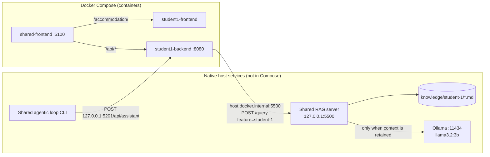
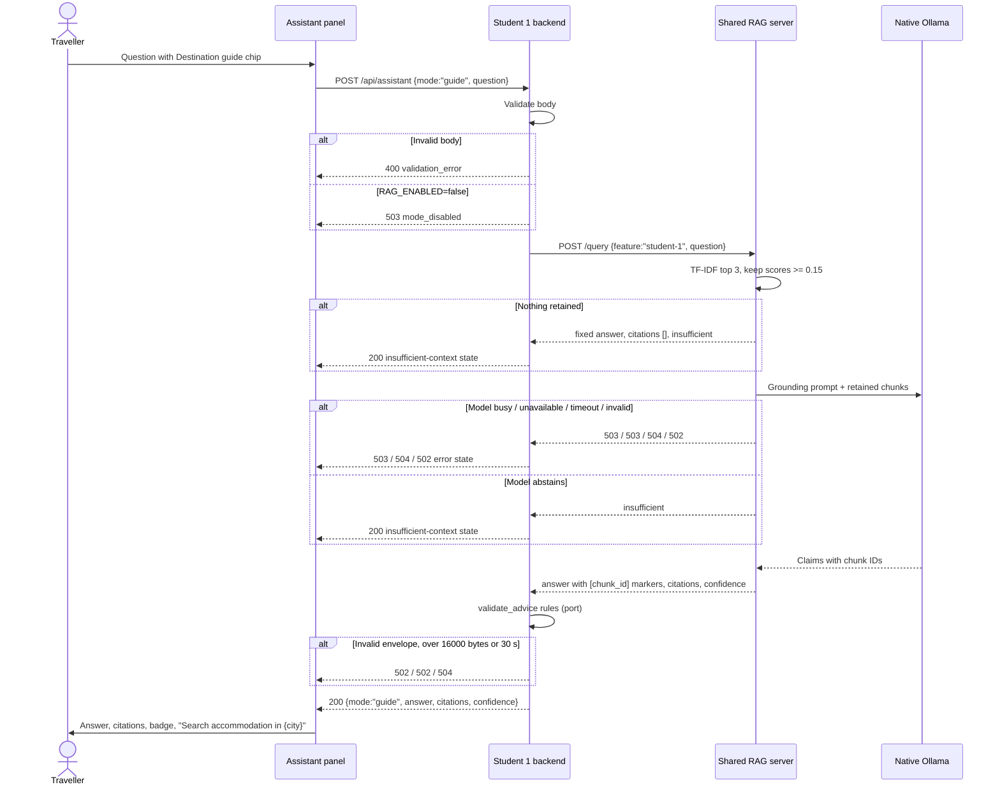

# Release 1 RAG HLD - Destination Guide

Status: design for Release 1 chunks 6-9, 27 September 2026. Implementation
evidence is recorded in [prompt-log.md](prompt-log.md),
[review-record.md](review-record.md) and the
Release 1 runbook (`release-1-runbook.md`, added in chunk 9). This document does not claim that any
live check passed.

Companion design: [Release 1 MCP HLD](release-1-mcp-hld.md). The endpoint,
flags, error envelope and containerisation boundary are shared with it.

## 1. Purpose and Scope

A traveller asks one "where to stay" question in the **Trip assistant** with
the **Destination guide** chip selected. The backend sends it to the shared RAG
server with `feature: "student-1"`. The server retrieves Student 1's curated
destination guides and returns a grounded answer with citations and a
confidence category, or a fixed insufficient-context answer. The UI shows the
answer, the citations and the confidence. It also offers "Search accommodation
in {city}" for cited catalogue cities.

In scope:

- 10 knowledge files in `ai-services/rag-server/knowledge/student-1/`, one per
  catalogue destination;
- Student 1 grounding questions and offline retrieval tests;
- `POST /api/assistant` with `mode: "guide"` and a validating `RagClient`;
- the guide chip, citation list, confidence badge, insufficient-context state
  and destination pre-fill in the assistant panel;
- a Student 1 fixture in the shared loop's `validate-rag` mode, CI updates and
  the runbook.

Out of scope:

- changes to the shared retrieval, thresholds, prompt or generation code;
- embeddings;
- cities outside the catalogue (Sydney exists only as LiteAPI-imported data and
  gets no guide);
- live prices, visas or events;
- chat history;
- feeding guide answers into the ranking prompt (the pre-fill only sets the
  search form's destination field).

## 2. Requirements Traceability

| ID | Requirement | Measurable target | Release 1 criterion |
|---|---|---|---|
| R1-RAG-01 | Frontend -> backend -> shared RAG returns a grounded answer with citations and confidence. | One live guide question through `http://localhost:5100/accommodation/` shows the answer, 1-3 citations and a high, medium or low badge. | RAG integration |
| R1-RAG-02 | Missing context is explicit. | Unsupported or off-topic questions show a distinct insufficient-context state with no citations. | Grounding |
| R1-RAG-03 | Citations are valid. | The backend accepts only 1-3 unique citations. Each `chunk_id` matches `^[a-zA-Z0-9_-]+#\d+$`, each score is in (0, 1], and the `[chunk_id]` markers in the answer exactly equal the citation set. | Grounding and traceability |
| R1-RAG-04 | An insufficient answer is exact. | `confidence` is `insufficient`, `citations` is `[]` and the answer equals the fixed server string; anything else returns 502. | Grounding |
| R1-RAG-05 | Retrieval is city-accurate. | For every relevant single-city dataset question, all retained chunks come from that city's file. Cross-city questions retain chunks from both named cities. | Grounding |
| R1-RAG-06 | Unsupported questions retrieve nothing. | Unsupported-city and off-topic dataset questions retain no chunk scoring 0.15 or more, so the server skips generation. | Grounding, reliability |
| R1-RAG-07 | Deadlines and size are bounded. | Backend RAG call 30 s outer deadline (server: 25 s query, 20 s model). Response read in chunks and capped at 16000 bytes. | Performance, reliability |
| R1-RAG-08 | Disabled mode is explicit. | With `RAG_ENABLED=false`, guide returns `503 mode_disabled` and makes no RAG call. | Configuration, CI |
| R1-RAG-09 | Rendering is safe. | Answer and snippets render as text; markers stay literal text; no `v-html`. | Security |
| R1-RAG-10 | CI stays offline. | Offline retrieval tests and backend tests with a fake RAG client run in CI; `RAG_LIVE_EVAL` is not set. | DevOps |
| R1-RAG-11 | The loop validates the feature. | `validate-rag --feature student-1` captures the backend answer and a deterministic contract result. | Agentic workflow |
| R1-RAG-12 | Content is honest. | Every file states "Last reviewed: 2026-09" and that it is curated demonstration content with no live prices or guarantees. | Grounding |

## 3. Architecture and Containerisation Boundary



The connection approach matches the MCP HLD: `RAG_SERVER_URL` is
`http://host.docker.internal:5500`, and `extra_hosts` maps that name to
`${LOCAL_AI_HOST:-host-gateway}`.

## 4. Request Flow



## 5. Contracts

### 5.1 Knowledge format

The server splits each file at blank lines and drops any paragraph that starts
with `#`. The first `# Heading` becomes the citation `source`, and `chunk_id` is
`<file-stem>#<paragraph-index>`. Each file follows this format:

```markdown
# Tokyo — Where to Stay
Last reviewed: 2026-09. Curated demonstration content for the Accommodation
Recommender: general guidance only, no live prices, availability or guarantees.

Tokyo overview: ...

Tokyo who it suits: families ..., couples ..., budget travellers ..., nightlife ...

Tokyo safety: ...
```

- The review line and scope note sit directly under the heading, in the same
  paragraph. That paragraph starts with `#`, so it is dropped: it can never be
  cited and never dilutes retrieval.
- There are 8 content paragraphs in a fixed order: 1 overview, 2 who it suits,
  3 safety, 4 travelling with children, 5 cost and budget, 6 best time to visit,
  7 neighbourhoods to stay in, 8 getting around. Chunk IDs are therefore
  predictable, e.g. `tokyo#3` is Tokyo safety.
- Every paragraph starts with `<City> <topic>:` and repeats the city name
  once. This means a Tokyo question cannot score well against a Paris
  paragraph that shares only generic words.
- Paragraphs use the words travellers actually type: safe, family, families,
  kids, children, budget, cheap, nightlife, winter, summer, quiet, walkable.
- File stems are `tokyo`, `paris`, `new-york`, `rome`, `barcelona`,
  `singapore`, `vancouver`, `cape-town`, `reykjavik` and `dubai`.

### 5.2 RAG envelope (shared server, unchanged)

`POST /query {"feature":"student-1","question":"..."}` returns
`{answer, citations:[{source, chunk_id, snippet, score}], confidence}`, where
confidence is `high`, `medium`, `low` or `insufficient`.

### 5.3 Backend endpoint (guide)

Request: `{"mode":"guide","question":"Is Tokyo safe for families?"}`. The same
validation applies as for lookup (MCP HLD 5.1).

Success (`200`):

```json
{
  "mode": "guide",
  "answer": "Tokyo is considered very safe for families ... [tokyo#3]",
  "citations": [
    { "source": "Tokyo — Where to Stay", "chunk_id": "tokyo#3",
      "snippet": "Tokyo safety: ...", "score": 0.41 }
  ],
  "confidence": "high"
}
```

The RAG fields sit at the root so the shared loop's RAG validator reads them
unchanged. The backend ports Student 2's `validate_advice` rules:

- The body has exactly `answer`, `citations` and `confidence`.
- The answer is 1-2000 characters after trimming.
- Insufficient: no citations, and the answer equals
  `Not enough information in the knowledge base to answer this.`
- Grounded: confidence is `high`, `medium` or `low`, with 1-3 unique citations.
  Each citation has a source of 1-200 characters, a `chunk_id` matching the
  pattern (at most 160 characters), a snippet of 1-280 characters and a finite
  score in (0, 1]. There are no extra citation fields, and the set of
  `[chunk_id]` markers in the answer equals the set of citation IDs.

### 5.4 Error mapping

| Condition | HTTP | Code |
|---|---:|---|
| Invalid request body | 400 | `validation_error` |
| `RAG_ENABLED=false` | 503 | `mode_disabled` |
| RAG connection failure, or RAG 503 (unavailable or busy) | 503 | `dependency_unavailable` |
| 30 s backend deadline, or RAG 504 | 504 | `dependency_timeout` |
| RAG 502, 400 or other status; invalid JSON; over 16000 bytes; envelope fails validation | 502 | `dependency_response_error` |

### 5.5 City pre-fill

The frontend holds the 10 catalogue city names. A citation maps to a city only
when its `source` exactly equals `<City> — Where to Stay`. Each distinct mapped
city gets one button. Pressing it puts the city in the search form's
destination field and moves focus there. It does not submit the search.

## 6. Grounding, Traceability and Confidence

| Concern | Control |
|---|---|
| Untrusted question | The shared server passes it as JSON data to the versioned [grounding prompt](../../ai-services/agentic-loop/prompts/rag-grounding-v1.txt). The model may cite only retrieved IDs, and claims cannot contain brackets or URLs. |
| Prompt injection | Injection-shaped dataset cases must abstain in live evaluation. Offline, they are tested for what retrieval retains. |
| Traceability | Every grounded sentence ends with `[chunk_id]` markers that the backend checks against the citations. Chunk IDs identify a file and paragraph, and the UI shows the source, ID and snippet. |
| Confidence | Set by the shared server from the lowest cited score: low from 0.15, medium from 0.30, high from 0.40. The thresholds are **not** changed. Student 1 tunes its text instead and reports the scores it measures. |
| Honesty | The content is marked as curated demonstration content; the UI states that guide answers are general guidance. |
| Read-only | The guide path reads Markdown and returns text. It writes nothing and does not affect ranking. |
| Safe rendering | Answer, markers and snippets use Vue text interpolation only. |
| Network | The RAG server stays on loopback or a documented private interface. |

## 7. Configuration and Flags

The table in the [MCP HLD](release-1-mcp-hld.md#7-configuration-and-flags)
applies. The guide-specific settings are `RAG_ENABLED` (default `false`) and
`RAG_SERVER_URL` (`http://host.docker.internal:5500`). On the native RAG server
they are `OLLAMA_URL` and `RAG_MODEL=llama3.2:3b`.

## 8. Test and Validation Strategy

| Layer | Automated (CI) | Live (local) | Evidence |
|---|---|---|---|
| Knowledge | `test_student1_retrieval.py`: 10 files × 8 chunks, heading sources, every relevant question retains only that city's chunks, cross-city retains both, unsupported and off-topic retain nothing. The shared grounding-dataset test covers the new cases. | `RAG_LIVE_EVAL=1` run when Ollama is available | Printed scores, and live output if available |
| Backend | Endpoint tests with a fake RAG client: grounded, insufficient, disabled, 400, 503, 504, 502, oversized, marker mismatch, bad chunk ID, bad score, duplicate citations, extra fields, wrong abstention text | `curl` through the container: one grounded answer and one insufficient answer | Request and response |
| Frontend | Guide chip, citations, badge, insufficient state, markers as text, pre-fill action | Three demo questions in the integrated app | Screenshots |
| Loop | `IsValid` for Student 1 RAG | `validate-rag --feature student-1` | Pending record JSON |

## 9. Risks

| Risk | Impact | Mitigation | Contingency |
|---|---|---|---|
| TF-IDF matches exact tokens only ("safe" and "safety" are different terms) | Relevant questions may score low or insufficient | Paragraphs use common traveller words and their variants; the dataset measures the scores | Report the calibration concern; do not change the shared thresholds |
| Unknown words (e.g. "Bali") score zero, so "Is Bali safe?" matches other cities' "safe" paragraphs | Unsupported city may retrieve another city's chunk | City name repeated in each paragraph to lower the scores of generic-word matches; dataset measures the score; the grounding prompt requires abstention | Record in the runbook known issues; live evaluation checks abstention |
| Single-generation limit on the RAG server | Concurrent questions get 503 busy | Single-question panel with duplicate-submit prevention; 503 message says to try again | Documented behaviour |
| Cold model load exceeds the 20 s model deadline | 504 on the first guide question | Warm the model (the lookup path uses the same model) | Retry after warm-up |
| Container-to-host networking | Live guide fails | As in the MCP HLD | Known limitation |

## 10. Delivery Chunks

| # | Branch | Contents | Done when |
|---|---|---|---|
| 6 | `BCP/R1_RAG_Chunk_1-Destination_Knowledge_Base` | 10 knowledge files, grounding questions, offline retrieval tests | Full RAG suite passes; relevant and unsupported questions behave as expected |
| 7 | `BCP/R1_RAG_Chunk_2-Backend_Destination_Guide` | `RagClient`, guide mode on `/api/assistant`, validation and tests | Backend suite passes; a live grounded answer and a live insufficient answer come back through the container |
| 8 | `BCP/R1_RAG_Chunk_3-Assistant_Panel_Guide_Mode` | Guide chip, citations, badge, insufficient state, city pre-fill, tests | Frontend tests and build pass; three demo questions work in the integrated app |
| 9 | `BCP/R1_RAG_Chunk_4-Agentic_Loop_And_CI_Validation` | Loop Student 1 RAG fixture and tests, CI and test-script RAG steps, `release-1-runbook.md` | Every Student 1 suite, the MCP, RAG and loop suites and `docker compose config` pass; live `validate-rag` captured |

MCP chunks 0-5 are defined in the [MCP HLD](release-1-mcp-hld.md#10-delivery-chunks).

## 11. Merge Order

This follows the [MCP HLD merge order](release-1-mcp-hld.md#11-merge-order):
merge the stacked branches strictly 0 -> 9 with **Create a merge commit**.
