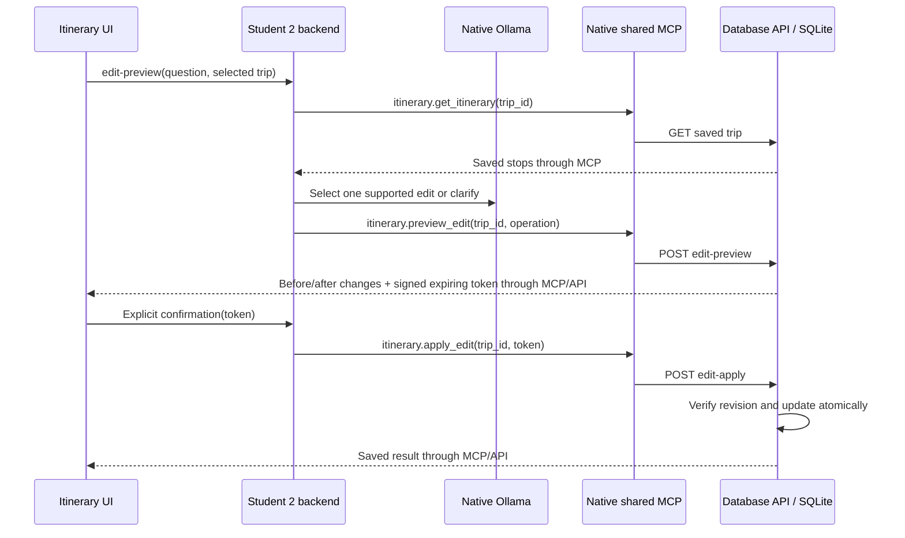

# Student 2 Release 1 Implementation Design

Status: implementation reference, 27 September 2026. The component slices below are implemented, but runtime/evidence gates are not all complete. See the [runbook](release-1-runbook.md) for measured results and remaining limitations. Proposed wording below records the original design, not proof that every verification criterion passed.

## Editor and Advice Update - 1 October 2026

The showcase UI places a tabbed Trip assistant beside, not inside, the saved
itinerary. Its navigation and scrolling content are separate on desktop; narrow
screens use distinct stacked regions. Numbered Current/Proposed comparisons,
change counts and Not saved labels precede explicit confirmation. Phone previews
stack the two states. Successful saves provide action-specific feedback and brief
highlights. RAG source markers open numbered excerpts; Source relevance replaces
the ambiguous Confidence label. Cancellation uses the existing request-version
guard to ignore late advice responses. No backend contracts changed for this UI.

The current UI separates **MCP actions** from **RAG guidance**, superseding the
review design below. See [requirements](requirements.md#release-1-editor-and-advice-integration)
for the authoritative bounds and failure behavior.



The database owns deterministic day/stop moves, additions, removals, title/notes
updates, same-duration date shifts and one-level undo, plus snapshot hashing and
token signing. Tokens contain the trip ID, operation (including proposed text
when applicable) and full-state revision; signing does not encrypt them.
The process-local random key invalidates previews on restart. The backend
never exposes confirmation to the model and rejects invalid or inconsistent tool
results. Human confirmation remains necessary because schema checks cannot prove
that an interpreted command matches user intent. Only the database opens SQLite.

RAG follows UI -> backend -> database snapshot and optional MCP weather -> shared
RAG -> retrieved knowledge + native model. Context is capped and contains no
traveller name. Forecast data is displayed beside, not inside, knowledge citations.
The new weather-planning source supplies general guidance; it is not a live forecast.
The original question still controls retrieval and unsupported questions abstain.

The dedicated shared [edit prompt](../../ai-services/agentic-loop/prompts/itinerary-edit-v1.txt)
defines model-selected edits; the [review prompt](../../ai-services/agentic-loop/prompts/itinerary-review-v1.txt)
retains legacy review stages. The shared
[RAG prompt](../../ai-services/agentic-loop/prompts/rag-grounding-v1.txt) defines
trip-context handling. Neither runtime prompt is copied into feature documentation.

## Itinerary Review Update - 30 September 2026

This section supersedes the summary/overview UI and location-confirmation design
below. The older endpoints are compatibility contracts, not the current UI flow.

`POST /api/trips/{id}/review` takes exactly `{question}`. With AI and MCP enabled,
the backend asks the configured local application model for one of two plans:
`[itinerary.get_itinerary]` or `[itinerary.get_itinerary, itinerary.get_overview]`.
It validates the complete plan before executing anything and supplies the route's
trip ID itself. No model-supplied arguments, arbitrary tools, URLs or writes exist.

The new itinerary tool reads the database API once and returns
`{ok:true,summary,stops}`. Stops expose only ID, day, activity and notes (at most
200). The overview tool retains its summary/weather envelope, now selecting the
first geocoding match by default. Legacy explicit IDs remain allow-listed.

The same model then receives validated tool results and returns
`{findings:[{day,observation,suggestion,stopIds,weatherDates}],limitation}`.
At most five findings are accepted. Each stop reference must belong to the stated
day; weather references must identify an available forecast for that same trip day.
The backend attaches the actual stop/forecast evidence plus that day's stop count.
Summary disagreement across the two reads rejects a changed-trip result.
This is not a transactional snapshot: edits preserving the summary can still race.

The UI displays observations, proposed changes, expandable evidence, limitations,
used tools and optional dated forecasts. It removes duplicate metrics and the
location picker, names the top-match place, prevents duplicate submissions, and
discards/cancels reviews invalidated by selection or mutation. No review is saved.

Authoritative runtime instructions:
[itinerary-review-v1.txt](../../ai-services/agentic-loop/prompts/itinerary-review-v1.txt).
`ITINERARY_REVIEW_PROMPT` can override the local prompt path; the backend image
copies the shared source using a narrowly allow-listed repository-root build context.
Two 20-second model calls plus 5/15-second MCP calls fit within the 70-second browser
and 75-second nginx deadlines. No retries or autonomous loop are added.

Validation enforces schemas and evidence references, not factual entailment of
free-text prose. Live useful-answer, refusal, injection and source-support checks
are required before claiming grounded review quality. Weather is uncertain and
top-result geocoding may select the wrong place. RAG remains a separate workflow.

## Purpose and Scope

Implement the [Release 1 plan](release-1-plan.md) as two complete user interactions within the existing Itinerary Planner:

1. Inspect a saved itinerary using a read-only MCP tool.
2. Ask a planning question and receive a local-model-generated answer grounded in itinerary knowledge, with citations and confidence.

Preserve the [existing architecture](architecture.md), trip/stop CRUD, atomic regeneration, AI generation/fallback, shared `/itinerary/` route, and database ownership. No new server per student, database table, chat history, automatic itinerary mutation, booking service, or Release 2 agent is required. Existing application prompts and endpoints remain unchanged unless explicitly described below.

Authority: [Release 1 brief](../../docs/Project_Specifications/Release_1_brief.md), [feature requirements](requirements.md), and [risk plan](risk-plan.md). This document specifies proposed contracts; it does not claim shared-team agreement or successful execution.

## Design Decisions

| Decision | Reason |
|---|---|
| Separate explicit MCP and RAG actions from itinerary generation. | Each assessed path is demonstrable; new dependency failures cannot silently change saved trips. |
| Let MCP read the database API directly using a configured host address. | The result reflects persisted data without a backend callback cycle; SQLite remains database-owned. |
| RAG answers documented planning questions, not personal trip analysis. | A small reviewed knowledge base can support useful answers without transmitting names, saved trips, or unsupported live travel facts. |
| Keep the existing TF-IDF retrieval for this release. | Adding local-model generation does not require replacing retrieval or adding an embedding model. Assess its limitations with labelled queries. |
| Preserve the shared RAG response envelope. | Student 3 and future consumers should not need a different public contract for generated answers. |
| Keep advice and summary results transient. | No schema migration or new persistence ownership is needed. |
| Use explicit enable flags and injected clients. | CI can test enabled behavior with fakes while application execution performs no live AI/MCP/RAG calls. |

## Ownership and Minimum Dependencies

| Work | Owner | Needed to run Student 2? |
|---|---|---|
| Itinerary tool, knowledge, backend/UI integration, feature tests and workflow | Student 2 | Yes |
| Shared MCP process, supported SDK/transport, network access | Shared owner, with Student 2 contract tests | Yes; existing registry/transport can be reused subject to verification |
| Confidence policy, grounded generation, shared RAG request/output validation | Shared RAG owner | Yes; current confidence implementation raises `NotImplementedError`, and current answers are extractive |
| Host-native Ollama and Student 2 container-to-host configuration | Shared deployment owner with Student 2 | Yes |
| MCP/RAG validation modes in the shared loop | Shared loop owner; Student 2 supplies fixtures | Required for assessment, not the application request path |
| Other students' integrations, group evidence/report/video | Group | Required for release completion, not isolated Student 2 development |

Do not create an itinerary-specific replacement RAG implementation while waiting for the shared owner. Develop against the agreed contract with fakes, then require real end-to-end evidence.

## Request Flows

```mermaid
sequenceDiagram
    actor Traveller
    participant UI as Itinerary UI / shared proxy
    participant API as Student 2 backend (container)
    participant MCP as Shared MCP (host)
    participant DB as Student 2 database API (container)
    Traveller->>UI: Inspect saved itinerary
    UI->>API: POST /api/trips/12/mcp-summary
    API->>API: Check enabled mode and validate request
    API->>MCP: Initialize MCP session; call itinerary.get_summary
    MCP->>DB: GET /api/data/trips/12 via host port 5302
    DB-->>MCP: Persisted trip and stops
    MCP->>MCP: Validate data and calculate summary
    MCP-->>API: Structured tool result
    API->>API: Validate result; map errors
    API-->>UI: Summary or controlled error
```

```mermaid
sequenceDiagram
    actor Traveller
    participant UI as Itinerary UI / shared proxy
    participant API as Student 2 backend (container)
    participant RAG as Shared RAG (host)
    participant KB as Student 2 knowledge
    participant LLM as Local Ollama
    Traveller->>UI: Ask planning question
    UI->>API: POST /api/itinerary-advice
    API->>RAG: POST /query with fixed feature student-2
    RAG->>KB: Retrieve and filter up to three relevant chunks
    alt Insufficient evidence
        RAG-->>API: Fixed insufficient answer; no citations
    else Relevant evidence
        RAG->>LLM: Question and allow-listed context; constrained generation
        LLM-->>RAG: Source-linked answer or abstention
        RAG->>RAG: Validate output; build citations from retrieved chunks
        RAG-->>API: Grounded answer, citations, confidence
    end
    API->>API: Validate public response
    API-->>UI: Advice, insufficient state, or dependency error
```

Only existing feature microservices run in Compose. Both new browser requests use `/itinerary-api/`; nginx maps that prefix to backend `/api/`. AI/MCP/RAG/loop processes run on the host. The loop does not sit between the UI and these services.

## Backend API Contracts

### Mode Discovery

Add `GET /api/capabilities`, returning configuration only, without probing upstream services:

```json
{"aiEnabled":true,"mcpEnabled":true,"ragEnabled":true}
```

The UI uses this to disable unavailable modes. A true flag does not promise a healthy dependency; execution errors still need handling. `/health` remains independent of optional AI services. If capability loading fails, preserve CRUD and disable the new actions with retryable feedback.

### MCP Summary

`POST /api/trips/{id}/mcp-summary` accepts no body or an empty JSON object. Reject nonempty/nonobject bodies and nonpositive IDs. The backend selects the tool itself; callers cannot choose a tool, target service, database path, or feature.

Successful `200` response, with illustrative fixture values:

```json
{
  "tool": "itinerary.get_summary",
  "summary": {
    "tripId": 12,
    "destination": "Tokyo",
    "startDate": "2026-10-10",
    "endDate": "2026-10-12",
    "dayCount": 3,
    "stopCount": 4,
    "plannedDayCount": 2,
    "unplannedDays": [3],
    "totalBudget": 900,
    "dailyBudgetAllocation": 300
  }
}
```

No user name, interests, activity/notes text, or model-generated claims are returned. Budget values use the same unit as the saved trip; do not invent a currency or describe allocation as actual expenditure.

### Combined Trip Overview (28 September Update)

The UI now uses `POST /api/trips/{id}/mcp-overview` and the registered
`itinerary.get_overview` tool instead of the summary-only action. Existing
summary clients and loop validation fixtures remain compatible.

The request is empty or `{ "locationId": 1850147 }`. Positive integer IDs only;
extra fields, arbitrary tools, coordinates, and upstream URLs are rejected.
The tool reads the trip through the database API, calculates the existing summary,
then searches up to five Open-Meteo location matches for the saved destination.
Multiple matches require confirmation; a supplied ID must match a current result.
No location choice is persisted and no trip data is modified.

The response contains `tool`, the unchanged `summary`, and `weather`:

- `status`: `choose_location`, `not_found`, `available`, `partial`, `outside_window`, or `unavailable`.
- `locations` and optional `location`: bounded provider IDs, names, region/country and coordinates.
- `days`: trip-date forecasts with `date`, `weatherCode`, `minTemperature`,
  `maxTemperature`, and `precipitationProbability`. Missing individual values are null.
- `unavailableDates`: the exact complement of forecast dates within the trip.
- `retrievedAt`: UTC retrieval time for successfully retrieved forecasts, otherwise null.

Open-Meteo returns up to 16 days using `timezone=auto` and Celsius. The tool
validates units, consecutive dates, array lengths and numeric bounds; the backend
independently validates the public envelope, dates, selection and summary.
Weather failures degrade only the weather portion. Database/MCP failures retain
the existing controlled API errors. Fixed HTTPS URLs, no redirects, bounded
streaming reads and deadlines limit the external-service boundary.

The combined panel includes location selection, daily forecast rows, unavailable
dates, retrieval time and attribution. It does not infer activity suitability or
claim real-world itinerary feasibility. Only the destination query and coordinates
reach the external provider. No LLM is needed for this MCP interaction.

### Grounded Advice

`POST /api/itinerary-advice` accepts exactly `{ "question": "..." }`. Require a string, trim whitespace, and enforce 1-1000 characters. Reject additional fields, including `feature`, `tripId`, or an upstream URL. Set the feature server-side.

Preserve the shared `200` response shape:

```json
{
  "answer": "The budget is the total for the trip, not a nightly amount. [budget-basics#1]",
  "citations": [
    {
      "source": "Itinerary budget basics",
      "chunk_id": "budget-basics#1",
      "snippet": "The itinerary budget is the total budget for the trip.",
      "score": 0.74
    }
  ],
  "confidence": "high"
}
```

This is a schema example, not observed retrieval output. Actual chunk IDs and scores must come from the index. `score` is similarity, not probability. Supported answers have 1-3 distinct citations and a 1-2000 character answer. The backend validates field types, enum values, finite scores in `[0,1]`, bounded source/snippet strings, and source-reference consistency.

An ordinary insufficient-context response is `200`, with `confidence: "insufficient"`, `citations: []`, and the existing fixed answer: `Not enough information in the knowledge base to answer this.` Do not substitute deterministic travel advice.

### Errors

Use the existing `{error: {code, message, fields}}` shape and correlation response header. Public messages must not expose exception text, host paths, prompt bodies, or credentials.

| HTTP status | Code | Meaning |
|---|---|---|
| 400 | `validation_error` | Invalid public input; no upstream call. |
| 404 | `trip_not_found` | MCP lookup found no persisted trip. |
| 503 | `mode_disabled` | Requested integration is disabled; no upstream call. |
| 503 | `dependency_unavailable` | MCP, RAG, model, or tool database is unreachable/unhealthy. |
| 504 | `dependency_timeout` | Bounded upstream operation exceeded its deadline. |
| 502 | `invalid_dependency_response` | Protocol/schema failure, unknown tool error, or unusable model output. |

These mappings apply to new routes; avoid changing legacy CRUD error behavior as unrelated cleanup. Never use `200` with a plausible-looking answer after an infrastructure failure.

## MCP Tool and Client

Register `itinerary.get_summary` in the existing [registry](../../ai-services/mcp-server/tools/__init__.py). Follow the nested parameter convention in [attractions tools](../../ai-services/mcp-server/tools/attractions.py): MCP arguments are `{"params":{"trip_id":12}}`. Require a strict positive integer and forbid extra fields inside `params`; explicitly test extra top-level fields because SDK handling may differ.

Tool processing:

1. Read the trip only through `GET /api/data/trips/{id}` at server-configured `STUDENT2_DATABASE_API_URL` (host default `http://127.0.0.1:5302`). Never call the new backend route from the tool.
2. Validate dates, finite nonnegative budget, stop ownership, and each stop day against the inclusive trip duration (1-31 days). Reject corrupt upstream data, rather than calculate a misleading summary.
3. Compute `dayCount` inclusively, `stopCount` from the returned stops, `plannedDayCount` from distinct stop days, and `unplannedDays` as sorted missing days. Multiple stops on a day count once; a trip with no stops has every day unplanned.
4. Compute daily allocation as total budget divided by day count, using decimal arithmetic and two-decimal half-up rounding. This is indicative allocation, not a schedule whose rounded amounts must sum exactly to the original total.
5. Return a structured domain envelope: success `{ok: true, summary: ...}`; expected failures `{ok: false, error: {code, message}}` with a finite allow-list of the error codes above. SDK validation/protocol failures may instead set MCP `isError`; the backend must handle both and must not parse error prose to determine status.

Place the new injectable MCP/RAG adapters in one proposed `student-2/backend/ai_clients.py` module; add routes and optional keyword-only client/settings injection to the existing `create_app` factory without breaking its current positional parameters.

Use the official MCP SDK for initialization and `tools/call`; inspect `tools/list` in protocol tests. Wrap the asynchronous client session in a synchronous adapter for current Flask handlers, with one session/event-loop lifetime per request and deterministic cleanup. Do not retain loop-bound sessions in a module global. Use the same supported async runtime for cancellable HTTP in the RAG adapter. Verify SDK APIs in the selected environment before choosing imports or pinning dependencies.

A five-second MCP deadline covers connect, initialization, tool call, and cleanup; the tool database request has a shorter three-second limit. Validate the decoded SDK structured result against the envelope above. Confirm whether the pinned SDK wraps returned dictionaries; normalize only its verified shape, not arbitrary text that resembles JSON. No automatic retries are required for this release.

## Shared RAG Changes

The existing [handler](../../ai-services/rag-server/server.py), [retrieval](../../ai-services/rag-server/retrieval.py), and [confidence function](../../ai-services/rag-server/confidence.py) are the shared implementation surfaces. Do not fork them for Student 2.

### Knowledge and Retrieval

- Add six short Student 2 documents covering dates/day numbering, budget allocation, interests/stops, editing, regeneration/fallback, and saved-trip behavior. Validate statements against current feature behavior; label demo data as synthetic.
- Use the existing Markdown heading/paragraph chunking. Chunk IDs currently derive from file stem and paragraph position, so they are stable only for a given knowledge revision. Record the Git commit with evidence and restart/reload the cached index after edits.
- Allow only known `student-1` through `student-5` identifiers before filesystem access. Validate question length and reject extra request fields in shared `POST /query` as well as at the Student 2 boundary.
- Retrieve up to three chunks, then filter out zero/below-threshold matches. `top_k` currently returns entries even at zero score; a nonempty list is not evidence of relevance.
- Implement confidence using an ordered insufficient/low/medium/high threshold policy calibrated on labelled queries from all available feature corpora. Keep thresholds explicit and versioned, but do not invent values before measurement. Low-confidence supported answers remain distinct from no usable evidence.

### Generation and Citation Validation

Send the normalized question and only retained chunks (IDs, titles, full bounded text) to a single approved local model, defaulting to the group's `llama3.2:3b`. No MCP access, arbitrary file access, personal trip data, or network tools are available to the model.

Store the proposed versioned prompt at `ai-services/agentic-loop/prompts/rag-grounding-v1.txt`, as required by the workspace runtime-prompt rule. The RAG service loads it via an explicit repository-relative resolved path; it does not invoke the loop. Leave the existing itinerary generation prompt in place.

Request constrained model JSON with `status: "answered" | "insufficient"` and a bounded `claims` array. Each answered claim contains text and one or more retrieved chunk IDs. Build the public answer from validated claims with source markers; construct citation metadata from the index, never from model-supplied titles, snippets, scores, or URLs. Return only citations actually used. Confidence is assigned by retrieval policy over cited evidence, never by the model.

Validate exact model fields, lengths, nonempty answered claims, allow-listed IDs, and no unexpected references. Missing/invalid IDs, malformed JSON, or contradictions with the output contract produce `502`; do not silently drop bad claims and present the remainder as validated. A valid model abstention returns the same insufficient-context response as inadequate retrieval. Model connection failure returns `503`, and timeout returns `504`.

**Grounding limitation:** valid citation IDs do not prove that a claim is entailed by its source. Prompt constraints plus schema validation reduce risk but do not establish factual correctness. Manually check claim-to-source support on held-out fixtures, test adversarial requests, and record unsupported-answer failures as release blockers for those scenarios. Do not describe a second model's approval as proof.

Use full retrieved text for generation and evidence; public citation snippets can remain capped at the existing 280 characters. The generated request should have a bounded context budget (proposed 6000 characters across chunks), with oversized chunks handled deterministically before prompting. Document truncation when it affects answerability.

## Frontend Integration

Extend [app.js](../frontend/app.js), [index.html](../frontend/index.html), and [styles.css](../frontend/styles.css) in place. Reuse the existing API helper, feedback dialog, status treatment, and responsive layout; do not introduce a framework or a separate landing page.

| Control/state | Behavior |
|---|---|
| Itinerary summary action | Available only for an opened saved trip and enabled MCP. Display labelled day/stop counts, unplanned days, and daily budget allocation beside itinerary metrics. |
| Planning advice form | One labelled question field, explicit submit action, and an unframed result area. Works without a selected trip; do not imply that it has read the user's itinerary. |
| Citations/confidence | Display confidence as text and provide accessible expandable source titles, chunk IDs, and snippets. Treat IDs as identifiers, not arbitrary clickable URLs. |
| Loading | Separate MCP/RAG busy states; disable repeat submission for that action while keeping unrelated CRUD available. |
| Empty/insufficient/error | Distinct states; clear stale success content before loading and on failure. Dependency failure never looks like a supported answer. |
| Navigation/edit race | Abort or invalidate pending summary requests when the selected trip changes or any relevant trip/stop mutation succeeds. Compare captured trip ID and request generation before rendering. |
| Advice race | Use a request generation counter/abort signal so older responses cannot replace the latest question's result. Browser cancellation must not be relied on to cancel server/model work. |

Keep focus on the initiating control, announce completion/error through existing accessible status mechanisms, and render all answer/source text as text or through the existing escaping helper. Never inject model Markdown/HTML directly. Check keyboard operation and 320px, 768px, and 1280px layouts.

## Configuration and Deployment

| Setting | Proposed behavior |
|---|---|
| `AI_ENABLED` | Default true to preserve existing generation behavior. False calls the existing deterministic fallback directly for create and both regeneration paths, without an Ollama call. Preserve existing `generationMode` values. |
| `MCP_ENABLED`, `RAG_ENABLED` | Default false until configured; local demo explicitly enables them, CI explicitly disables them. Parse strict booleans; reject invalid settings at startup. |
| `MCP_SERVER_URL` | Full MCP transport URL, including the verified SDK route. Proposed container URL is `http://host.docker.internal:5400/mcp`; `/mcp` must be verified, not assumed from the README's base address. |
| `RAG_SERVER_URL` | Container base URL `http://host.docker.internal:5500`; append fixed `/query`. |
| `OLLAMA_URL` | Student 2 container uses `http://host.docker.internal:11434`; native RAG/loop use `http://127.0.0.1:11434`. |
| `APPLICATION_MODEL` | Retain Student 2's existing configured model; shared RAG uses an explicitly agreed model setting, not one supplied by the browser. |
| `STUDENT2_DATABASE_API_URL` | Host MCP uses `http://127.0.0.1:5302`; ordinary backend/database communication still uses Compose DNS. |

Shared deployment removes Ollama/model-setup/loop service definitions and obsolete dependencies from Compose without deleting model or database storage. All five feature microservice sets remain. Add host-gateway mapping where needed; validate host binding, firewall, and MCP origin/host protections from an actual backend container. A loopback-only host bind may not be reachable from Docker. Do not expose these unauthenticated development services publicly or claim tool allow-lists provide user authorization.

Use a RAG server deadline of 25 seconds, including a model deadline no greater than 20 seconds; backend RAG deadline 30 seconds; browser request deadline 35 seconds. Verify reverse proxy and application-server limits exceed the upstream budget. Ordinary socket read timeouts alone do not enforce an end-to-end deadline: use cancellable async operations with an outer deadline and verify slow-response behavior. Bound model output and shared concurrent generation; return a controlled busy/unavailable result rather than allow an unbounded queue. Record cold-load/model-contention limitations on the demo machine.

## Implementation Slices and File Impact

Proposed new module names below are not existing files. Extend existing tests and utilities where practical rather than creating a parallel framework.

| Slice | Changes | First acceptance check |
|---|---|---|
| 1. Configuration and adapters | Backend `app.py`, proposed `ai_clients.py`, requirements, existing backend tests. | All three disabled modes make zero upstream calls; existing factory tests still pass. |
| 2. MCP vertical slice | Proposed shared `tools/itinerary.py`, registry, backend summary route, existing UI, itinerary tool tests. | Fixture summary from protocol invocation matches persisted data; bad input makes zero DB calls. |
| 3. Shared RAG foundation | Existing RAG retrieval/confidence/handler, proposed generation helper, shared prompt, dependencies and shared tests. | Fake model receives only retained chunks; no-context skips generation; invalid citations fail closed. |
| 4. Student 2 RAG slice | Student 2 knowledge, advice route, frontend result states and tests. | Relevant/irrelevant fixtures produce distinct grounded/insufficient states through the backend. |
| 5. Host deployment and CI | Root Compose/env/start documentation, Student 2 workflow and test runner. | Container-to-host live calls work; CI app runs with explicit AI/MCP/RAG disable flags. |
| 6. Assessment validation | Shared loop modes, Student 2 fixtures, docs and contribution/evidence records. | Both native loop modes and integrated UI demonstrations have genuine captured outputs. |

Host setup can proceed alongside slices 1-4. No slice is live-complete until it passes the real shared-service path, not only test doubles.

## Verification Matrix

| Layer | Required checks |
|---|---|
| Tool | Valid trip, empty stops, inclusive dates, duplicate stop days, rounding, absent trip, malformed DB payload, dependency timeout, strict IDs, extra fields, and no write calls. |
| Protocol/client | SDK initialization, discovery, exact nested arguments, structured result shape, `isError`, cancellation/session cleanup, failed handshake, and unsupported/unknown tool responses. |
| Backend | Input/body bounds, fixed feature/tool/URLs, all error mappings, citation/confidence consistency, capabilities, injected fakes, disabled zero-call assertions, and existing generation/fallback behavior. |
| Shared RAG | Zero-score results, feature isolation/path traversal, calibrated thresholds, irrelevant keyword overlap, context bounds, safe prompt construction, model abstention, invented citations, invalid output, and model outage/timeout. |
| Frontend | Summary/advice success, loading/disabled/insufficient/errors, safe rendering, citations, duplicate submits, stale-response rejection after trip mutations, keyboard/focus, and viewport checks. |
| Regression/CI | Existing frontend/backend/database suites, atomic writes, ownership/order/date constraints, ten-record minimums, image builds and smoke tests with flags propagated into containers. |
| Live integration | Unified UI -> backend -> real shared MCP/RAG; genuine local-model generation; cited-source manual check; forced outages; persistence restart; no AI services defined in Compose. |

Reuse [the Student 2 test runner](../../scripts/test/student-2.ps1) and [workflow](../../.github/workflows/student-2.yml), extending triggers for owned shared tools/knowledge/contracts. CI tests enabled paths only with injected fakes; application smoke execution must explicitly disable AI/MCP/RAG and never download/start models. Capture a successful remote run for the final commit separately from local results.

Store real request/response and terminal evidence with commit, corpus/prompt revision, model tag, date, expected/actual outcomes, and screenshots. Include held-out grounding questions, insufficient context, and native loop outputs. Never treat example JSON in this design as evidence.

## Decisions Before Implementation

1. Group owners accept the itinerary tool/response envelope and backward-compatible RAG generation design.
2. A minimal protocol smoke test confirms the installed SDK imports, transport route, strict argument handling, structured output shape, and per-request session cleanup. Do not assume compatibility with the CI Python version.
3. Labelled knowledge queries determine confidence thresholds and expose retrieval limitations; source-reference validation alone cannot close this gate.
4. A backend-container connection test confirms host binding/firewall configuration without public exposure, and deadline tests confirm cleanup under failure.

Everything else above is a concrete proposed default. The [completion plan](release-1-plan.md) remains the source for scheduling, all ten marking criteria, group submission, and attendance requirements.