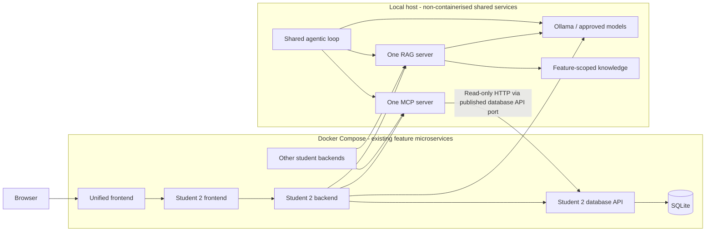

# Student 2 Release 1 Plan - Itinerary Planner

Status: implementation in progress as of 27 September 2026, not release-complete. The baseline below describes the pre-implementation state; proposed sections remain the target, not proof of completion.

Current checkpoint: Student 2 summary/advice routes, UI controls, mode flags, shared itinerary tool, RAG generation/knowledge, native-service Compose/CI changes, and shared loop validation modes are implemented with isolated tests passing. Native MCP SDK execution against persisted data succeeded. Diagnostic frontend viewport/error checks and additional transport/race tests passed. Container-to-host integration remains blocked by unresolved VM/host connectivity, and native Ollama was not found at its standard installation location. Live generated-answer and loop evidence, integrated five-feature checks, cross-feature calibration, and remote CI/report evidence remain pending. See the [native-service runbook](release-1-runbook.md) and [prompt log](prompt-log.md) for exact results and limitations.

The [implementation design](release-1-design.md) defines proposed API/tool contracts, component changes, shared dependencies, and validation gates for this plan.

## Goal and Authority

Extend the existing itinerary planner with useful MCP and RAG interactions through the integrated frontend and backend, while preserving trip/stop CRUD, persistence, AI generation, regeneration, and deterministic fallback.

The [Release 1 brief](../../docs/Project_Specifications/Release_1_brief.md) governs this extension. Retain the feature obligations in the [project specifications](../../docs/Project_Specifications/Project_Specifications.md), [requirements](requirements.md), and [Release 0 feature plan](feature-plan.md), except where Release 1 explicitly changes deployment boundaries.

**Deadline to confirm:** the Release 1 brief says **4 October 2026, 11:59 PM AEST**; the general specifications say **27 September 2026**. Confirm the current Canvas/tutor deadline immediately. The schedule below provisionally uses the newer release-specific brief, not a confirmed extension. All members must attend the Week 9 showcase.

## Current Baseline

These are source/document observations, not fresh execution results. Historical completion claims must be revalidated for Release 1.

| Area | Observed state | Release 1 work |
|---|---|---|
| Student 2 feature | Static HTML/CSS/JavaScript frontend, Flask backend and database API, SQLite; integrated at `/itinerary/`. | Extend the existing feature, not a replacement application. |
| Backend | [app.py](../backend/app.py) exposes trip/stop CRUD and regeneration; model generation and fallback already exist. No MCP/RAG routes or explicit mode switches were found in this implementation. | Add bounded clients, feature-specific endpoints, and explicit mode configuration. |
| MCP | [Tool registry](../../ai-services/mcp-server/tools/__init__.py) registers Student 3 attractions tools; no itinerary module is registered. | Add Student 2 read-only tools to the same server. Do not create another MCP server. |
| RAG | [Query handler](../../ai-services/rag-server/server.py) returns the highest-ranked chunk verbatim without a model call. [Confidence categorization](../../ai-services/rag-server/confidence.py) raises `NotImplementedError`; only Student 3 knowledge is present. | Add itinerary knowledge, calibrate confidence, and have the shared RAG server generate grounded responses using a local approved model. Extractive retrieval alone does not satisfy the brief's stated generation flow. |
| Deployment | [Compose](../../docker-compose.yml) still points Student 2 at `http://ollama:11434` and depends on model setup. Shared loop documentation describes container execution. | Coordinate host-native Ollama and loop migration, and configure local MCP/RAG access for every backend. |
| CI | [Student 2 workflow](../../.github/workflows/student-2.yml) runs tests, image builds, and service smoke checks; no explicit AI/MCP/RAG disable configuration is present. | Disable live integrations deliberately during CI while retaining mocked integration tests. |
| Evidence | Release 0 plans and logs exist, but they are not Release 1 execution evidence. Some shared READMEs lag the source. | Record new commands, results, screenshots, workflow links, and commit references; reconcile documentation as work lands. |

## Scope and Ownership

**Student 2 owns:** itinerary MCP tools and knowledge, backend clients/endpoints, frontend controls/results, feature regression tests, Student 2 CI changes, contribution records, and the itinerary demonstration.

**Shared team work, with named owners agreed in Phase 1:** MCP transport and common tool policy; RAG generation, validation, and confidence policy; host-native Ollama and agentic loop; root Compose/start scripts; integrated five-feature testing; report and video assembly. Student 2 supplies contracts, fixtures, review, and execution evidence but must not assume sole ownership or duplicate these services.

**Keep out of scope:** Release 2 agents/cloud deployment, bookings, live travel data, automatic MCP writes, authentication redesign, and new database tables unless an agreed requirement needs them. Existing database tables must retain at least ten representative records each. MCP/RAG responses can remain transient; persistent chat history is not required by this brief.

## Proposed Student 2 Experience

Confirm these concrete feature choices in Phase 1 before implementation:

| Interaction | Proposed contract | User-visible result |
|---|---|---|
| Inspect saved itinerary using MCP | `POST /api/trips/{id}/mcp-summary` calls registered `itinerary.get_summary` with a positive `trip_id`. The tool reads the Student 2 database API using a server-configured host URL. | Structured destination/date range, day and stop counts, unplanned days, and average daily budget allocation. Label allocation clearly; it is not a spending estimate. Omit traveller identity from tool output. |
| Ask an itinerary-planning question using RAG | `POST /api/itinerary-advice` accepts `{question}`; the backend supplies the fixed `feature: "student-2"` to shared `POST /query`. | Grounded answer, source titles, chunk references/snippets, and `high`, `medium`, `low`, or `insufficient` confidence. |

These endpoint/tool names are proposals, not existing APIs. Use the existing same-origin `/itinerary-api/` proxy; the browser never calls MCP, RAG, Ollama, or SQLite directly. Keep the MCP tool read-only and RAG advice separate from automatic itinerary mutation.

Suggested RAG topics: trip date/day rules, total versus daily budget, interests and stop planning, editing and regeneration, saved-trip behavior, and AI/fallback limitations. Write approximately six short, independently useful documents under `ai-services/rag-server/knowledge/student-2/`. Ground them in verified feature behavior. Do not invent live prices, opening hours, availability, or destination safety facts.

## Target Architecture

The diagram is a proposed Student 2 integration view. The final group report also needs a complete five-feature architecture and separate MCP/RAG interaction-flow diagram.

## Delivery Phases

Complete each gate before calling its phase done. Capture evidence while executing, not after the final implementation day.

### Phase 1 - Agree Contracts and Establish the Baseline

- [ ] Confirm deadline, shared owners, merge order, and the proposed itinerary interactions.
- [ ] Agree the installed MCP SDK version, streamable HTTP endpoint/path, tool schema/error envelope, and a supported client lifecycle in Flask. Use the official SDK rather than ad hoc JSON calls that bypass MCP initialization or tool invocation.
- [ ] Agree RAG request/response schemas, feature allow-list, local model, grounding policy, confidence calibration, and error handling with the shared owner.
- [ ] Agree `AI_ENABLED`, `MCP_ENABLED`, `RAG_ENABLED`, server URLs, and disabled-mode behavior. AI disable must bypass model calls and retain the existing deterministic generator; MCP/RAG disable must return a documented unavailable state without network calls.
- [ ] Run the existing frontend/backend/database suites and integrated CRUD/AI checks; record the current commit, commands, results, and any blockers. Use [scripts/test/student-2.ps1](../../scripts/test/student-2.ps1) as the existing test entry point.

**Gate:** contracts and owners are recorded; existing behavior has a reproducible baseline. No unsupported protocol, ownership, or runtime assumption remains hidden.

### Phase 2 - Make Shared Host Services Reachable

- [ ] With the shared owner, run Ollama, MCP, RAG, and the .NET loop natively. Remove AI service definitions and obsolete model-setup dependencies from root Compose; preserve every student's frontend/backend/database and stored data.
- [ ] Point container backends at host-native services: proposed Ollama `http://host.docker.internal:11434`, MCP `http://host.docker.internal:5400` plus the agreed transport path, and RAG `http://host.docker.internal:5500`.
- [ ] Add host-gateway mapping where needed. Host-side MCP database access must use a published API address such as `http://127.0.0.1:5302`, not Compose DNS and never a SQLite path.
- [ ] Validate bind addresses, MCP allowed hosts/origins, and firewall rules from an actual backend container. A successful host `localhost` call does not prove container reachability; do not expose unauthenticated tools publicly to solve connectivity.
- [ ] Update shared setup/start instructions, model provisioning, environment examples, and loop context/output paths for host execution. Keep credentials and machine-specific paths out of Git.

**Gate:** the integrated app starts through Compose with no AI-Mode, MCP, RAG, or loop services defined; containers can reach required host services; Student 2 still demonstrates genuine local AI generation and fallback.

### Phase 3 - Deliver One Complete MCP Interaction

- [ ] Add an itinerary tool module to the existing registry, with read-only database API access, positive integer IDs, unknown-field rejection, bounded output, dependency timeout, and structured not-found/unavailable errors.
- [ ] Add an injectable MCP client and the agreed backend endpoint. Allow only the intended tool and arguments; do not accept arbitrary tool names, upstream URLs, SQL, file paths, or HTTP methods from the browser/model.
- [ ] Add an itinerary action and structured result display using existing UI conventions. Handle loading, missing trip, disabled mode, upstream failure, and stale results after switching/editing trips.
- [ ] Extend existing backend/frontend suites and the shared MCP tests. Cover tool discovery and invocation through the MCP protocol, validation, no writes, dependency failure, and disabled-mode zero calls.

**Gate:** a saved itinerary opened from `http://localhost:5100/itinerary/` produces a valid tool result through frontend -> backend -> shared MCP -> database API. Capture UI, backend response, and terminal MCP discovery/call evidence for the same fixture.

### Phase 4 - Deliver Grounded RAG Advice

- [ ] Add reviewed Student 2 knowledge with stable source headings/chunk references and provenance. Keep runtime prompts only under [shared runtime prompts](../../ai-services/agentic-loop/prompts/); link to them from feature docs rather than duplicating them.
- [ ] With the shared owner, replace the unimplemented confidence function with thresholds calibrated on relevant, ambiguous, and unrelated questions across feature corpora. Document that retrieval confidence is not a probability of factual correctness.
- [ ] Extend the shared RAG handler to send only relevant retrieved context to the approved local model. Treat questions and documents as untrusted data. Require source-linked answers and reject references not present in retrieved context.
- [ ] Return the fixed insufficient-context answer with empty citations and `confidence: "insufficient"` when retrieval is inadequate; skip generation in that case. Never turn a model outage into a fabricated answer or label an infrastructure error as insufficient context.
- [ ] Add backend validation and a RAG client using fixed `feature: "student-2"`; validate answer, citation, and confidence fields before returning them.
- [ ] Add the advice UI with answer, readable source details, confidence, insufficient-context, disabled, loading, and service-error states. Render model/source text safely and prevent out-of-order requests from replacing newer results.
- [ ] Test relevant/irrelevant questions, misleading keyword overlap, prompt-injection-shaped content, unknown features/path traversal, empty knowledge, missing/invalid citations, generation timeout, malformed responses, and no network calls when disabled. Reuse shared test conventions and fixtures.

**Gate:** the integrated UI shows a genuine local-model-generated answer grounded in Student 2 knowledge with traceable citations and confidence. An out-of-scope question shows insufficient context without an unsupported answer. Store retrieval scores/chunks, model tag, API response, and screenshots.

### Phase 5 - Extend and Run the Shared Agentic Loop

- [ ] Coordinate separate MCP and RAG validation modes in the existing loop; retain Release 0 modes and the Plan -> Act -> Observe -> Adapt/human-review workflow.
- [ ] MCP validation checks discovery, allowed inputs, structured successful results, and boundary rejection. RAG validation checks retrieval, generated answer support, citations, confidence, and insufficient-context behavior.
- [ ] Supply Student 2 fixtures and actual executed results. A model's statement that tests passed is not validation; the itinerary API's `agentTrace` is not shared-loop evidence.
- [ ] Run both modes natively and retain timestamped outputs with commit, mode, model tags, fixture, actual checks/results, and human decisions under [shared loop records](../../docs/agentic-loop-records/). Link the records from Student 2 evidence.

**Gate:** both native validation modes produce successful captured outputs, failed checks are reported honestly, and existing loop modes still work. Do not claim proposed commands or fabricated JSON as execution evidence.

### Phase 6 - CI and Regression Gates

- [ ] Update the Student 2 workflow and test script to cover new frontend/backend and itinerary shared-service tests; trigger on relevant shared tool, knowledge, contract, and prompt changes.
- [ ] Explicitly set AI/MCP/RAG disabled for CI application execution and pass those settings into Compose containers. Ensure mocked contract tests can opt in with fakes and never require host-native services or model downloads.
- [ ] Retain production image builds, Compose validation, database/health smoke checks, and add disabled-endpoint and CRUD/persistence checks. Assert disabled modes make zero upstream calls, not merely that failed calls fall back.
- [ ] Run all existing Student 2 suites, shared tests for touched behavior, and loop regression tests. Verify whole-trip atomic regeneration, stop ownership/order, date constraints, failure preservation, and ten-record minimums remain intact.
- [ ] Obtain a successful `student-2.yml` run URL for the final relevant commit; do not substitute local test results for GitHub Actions evidence.

**Gate:** Student 2 CI passes without live AI services; the full feature still has local enabled-mode evidence. The group collects equivalent successful workflow evidence for every student.

### Phase 7 - Integrated Validation and Submission

- [ ] Reproduce native-service startup and the complete Compose deployment from documented instructions. Capture commands, running-container status, shared-home access, host connectivity, and persistence after restart without deleting data volumes.
- [ ] Re-run Student 2 CRUD, AI success/fallback, MCP success/boundary rejection, RAG grounded/insufficient/error behavior through the unified UI; verify keyboard operation and 320px, 768px, and 1280px layouts.
- [ ] Join the group test on one demonstration machine. Every feature must show MCP and RAG through its UI/backend and retain Release 0 behavior; a working Student 2 alone is not group completion.
- [ ] Update requirements, architecture, risk/known-issues records, browser checklist, prompt/review logs, and contribution log as implementation lands. Link real Release 1 commits and evidence; leave unexecuted work visibly pending.
- [ ] Provide Student 2 report content and evidence to the group editor: scope, measurable requirements, tool boundary/input/output, knowledge/retrieval/generation design, validation results, limitations, and identifiable contributions.
- [ ] Assemble one group PDF, at most 3000 words plus diagrams, named `group-<group number>.pdf`, with repository URL, one published showcase video URL (at most ten minutes), all five contribution logs, and required evidence. Allocate Student 2 roughly one minute of the video and preserve shared terminal/loop demonstration time.
- [ ] Rehearse Q&A: explain MCP protocol versus ordinary HTTP, the read-only boundary, retrieval versus generation, citation/confidence limits, host/container networking, CI disablement, and personal commits. Confirm all members' Week 9 attendance and one designated submitter.

**Gate:** all ten criteria below have verifiable evidence, the group application is operational, and the report/video are accessible to the tutor. Human attendance/submission tasks cannot be marked complete by code changes.

## Measurable Acceptance Targets

These are proposed engineering targets to confirm in Phase 1, not values mandated by the brief.

| Concern | Target and verification |
|---|---|
| Reliability | Preserve the existing 3-second database and 20-second application-model timeouts; cap MCP at 5 seconds and end-to-end RAG at 30 seconds with the model timeout shorter than the outer request deadline. Test timeout/error paths. |
| Performance | Record ten representative warm calls per mode and cold-start timing on the demo machine; aim for MCP within 5 seconds and RAG within 30 seconds. Document measured hardware/model limits and preload requirements. |
| Input/output bounds | Propose a 1-1000 character question, maximum three retrieved chunks, and bounded answer/tool payloads; validate both incoming requests and upstream responses. |
| Grounding | Every accepted source reference resolves to retrieved context; manually check factual claims against cited text in the demo set. Unsupported questions return insufficient context, not fallback advice. |
| Calibration | Maintain at least twelve labelled Student 2 queries covering relevant, ambiguous, and irrelevant cases; retain some unseen during threshold tuning and record classification errors. Recheck shared thresholds across other features. |
| Security and boundaries | Zero arbitrary tool/URL selection, SQLite access outside the database API, tool writes, or unsafe HTML rendering. Unknown feature identifiers cannot select arbitrary knowledge directories. |
| Availability | Basic saved-trip CRUD remains operational with MCP/RAG/Ollama stopped; AI failures retain deterministic fallback and MCP/RAG show accurate unavailable states. |
| Usability | Visible status and source/confidence text, keyboard access, no duplicate submissions, and no horizontal overflow at the three agreed viewport widths. |

## Evidence and Marking Map

Each criterion is worth three marks. Evidence should identify date, commit, command/request, expected and actual result, and a durable path or URL. Redact personal data and secrets. Create evidence artefacts only from real runs.

| Criterion | Student 2 evidence | Shared dependency |
|---|---|---|
| 1. Setup and architecture | Updated feature structure, host/container connections, interaction flow. | Complete architecture and MCP/RAG flow diagrams. |
| 2. Feature microservices | UI/API CRUD, database counts/persistence, genuine AI success and fallback. | All existing features remain integrated. |
| 3. MCP | Tool name/schema/boundaries, terminal protocol call, API result, UI capture. | One shared operational MCP server. |
| 4. RAG | Knowledge provenance, retrieved chunks/scores, model-generated answer, citations/confidence, insufficient-context test and UI capture. | Shared generation and calibrated confidence work. |
| 5. Agentic loop | Student 2 fixtures and linked MCP/RAG validation records. | Both modes execute natively; captured outputs in report. |
| 6. DevOps | Successful Student 2 run URL/log and explicit disabled-mode configuration. | Equivalent evidence for all five workflows. |
| 7. Compose | Student 2 service status, host-service connectivity, shared route access. | Whole-app deployment log; AI services absent from Compose. |
| 8. Working software | One joined-up itinerary demonstration with Release 0, MCP, and RAG paths. | Five-feature integration summary on one machine. |
| 9. Report/evidence | Student 2 contribution log with identifiable commits and limitations. | One complete PDF, accessible repository/video, all student logs. |
| 10. Demonstration/Q&A | Student 2 demonstration segment and explanation rehearsal. | Week 9 attendance by every member. |

Use the existing [contribution log](contribution-log.md), [prompt log](prompt-log.md), and [review record](review-record.md). This plan is not a claim that any Release 1 implementation gate has passed.

## Provisional Schedule and Risks

| Date | Priority | Exit condition |
|---|---|---|
| 27 September | Phase 1; begin shared deployment/RAG/loop work in parallel with Student 2 work. | Deadline and owners confirmed; baseline/contracts recorded. |
| 28 September | Phase 2 and itinerary MCP tool/client. | Host connectivity and retained AI operation; protocol tests pass. |
| 29 September | Complete Phase 3; prepare Student 2 knowledge and RAG fixtures. | MCP UI path evidenced. |
| 30 September - 1 October | Phase 4 and shared Phase 5. | Generated grounded RAG and both loop validation modes evidenced. |
| 2 October | Phase 6 and full five-feature regression. | CI green; deployment and failure-path evidence captured. |
| 3 October | Phase 7 report/video assembly and Q&A rehearsal. | Working software/evidence freeze; tutor-accessible links checked. |
| 4 October | Submission buffer, subject to confirmed deadline. | One group PDF submitted before the confirmed cutoff. |

Critical path: shared host migration and contracts -> MCP/RAG vertical slices -> native validation modes -> integrated evidence -> report/video. UI/client work can proceed against agreed fakes while shared services are completed, but fakes cannot satisfy live validation gates.

Highest risks are unassigned shared work, incomplete RAG generation/confidence, localhost/container connectivity, model contention on the demonstration machine, and leaving evidence until the deadline. Escalate these at the first blocked gate. Reduce optional features first; do not remove required MCP, grounded RAG, preserved AI, CI, loop validation, or group integration to meet the schedule.