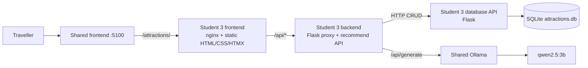
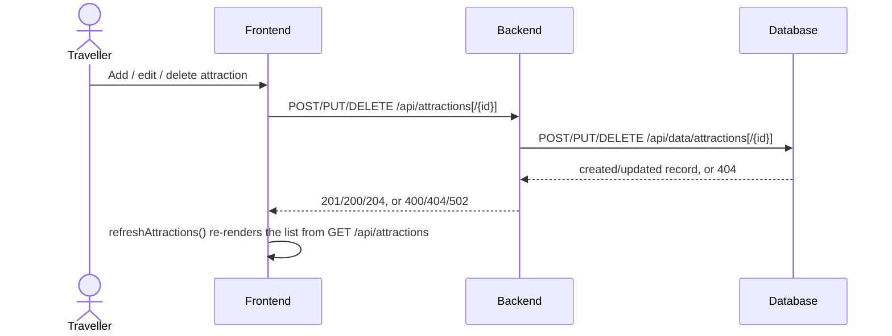
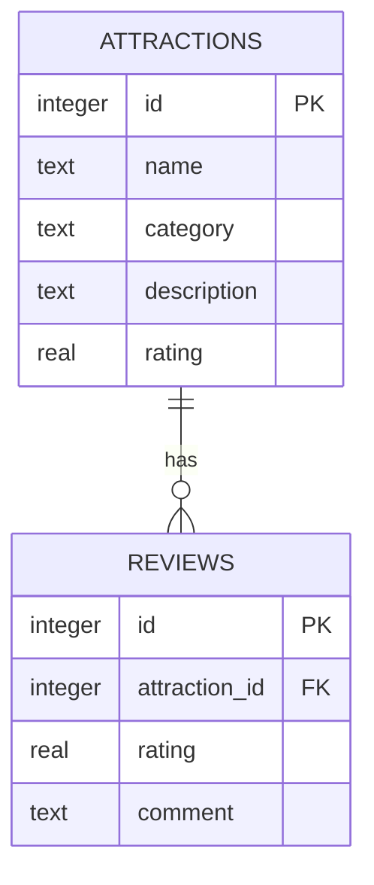
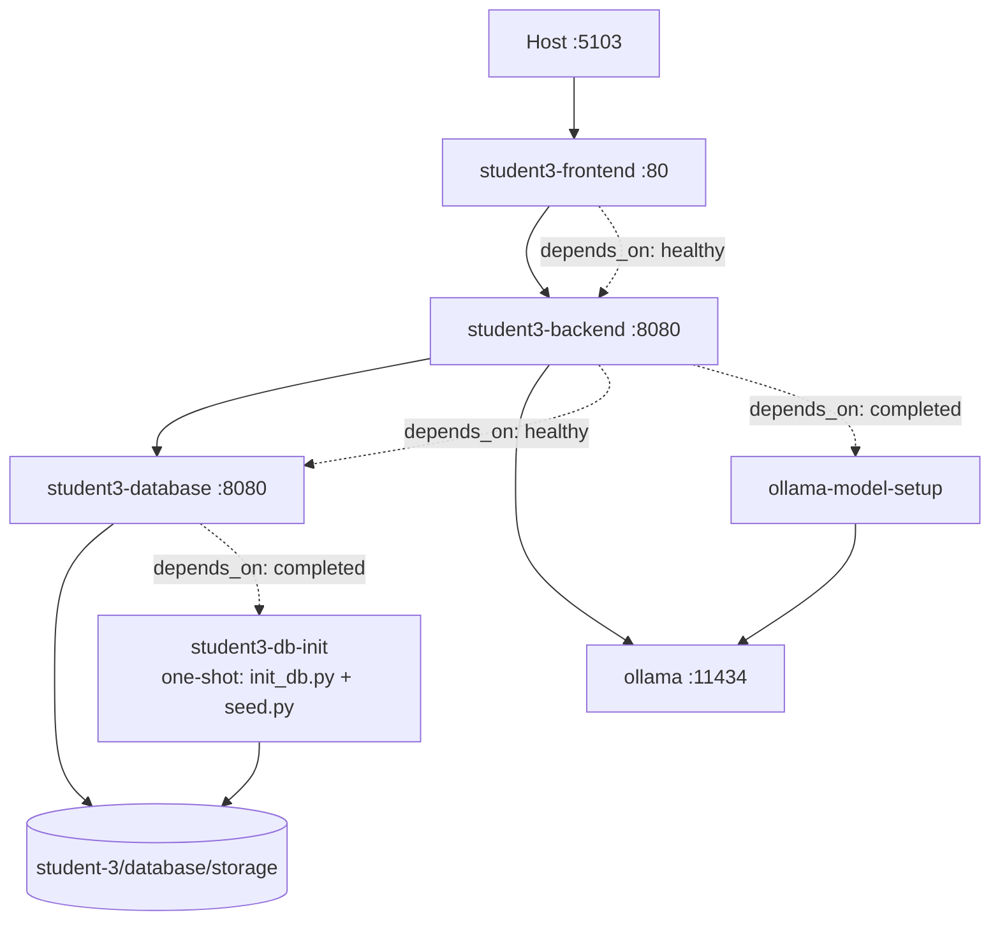
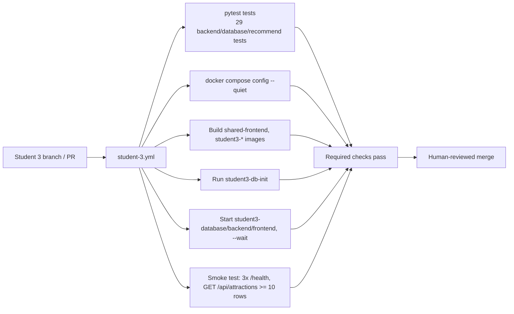
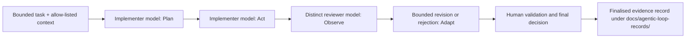

# Local Experience & Attraction Recommender Architecture and Data Design

## Individual Service Architecture

The browser calls only the backend through the frontend's nginx reverse proxy (`/api/` → `student3-backend`). The backend validates input, owns the AI recommendation loop, and reaches persistence only through the database API's HTTP contract. Only the database service opens `attractions.db`.

## AI Request Flow (Plan → Act → Observe → Adapt)

```mermaid
sequenceDiagram
    actor Traveller
    participant Frontend
    participant Backend as Backend (recommend.py)
    participant Database
    participant Ollama

    Traveller->>Frontend: Submit interest text
    Frontend->>Backend: POST /api/recommend {interest}
    Backend->>Backend: PLAN - infer category hint from interest text
    Backend->>Database: ACT - GET /api/data/attractions (?category)
    Database-->>Backend: up to 6 candidate attractions
    Backend->>Ollama: ACT - closed-context prompt (candidates + interest)
    Ollama-->>Backend: raw response
    Backend->>Backend: OBSERVE - non-empty, min length, names a candidate?
    alt Response usable
        Backend-->>Frontend: {source: "ai", recommendation}
    else Response unusable
        Backend->>Ollama: ADAPT - retry with narrower prompt (top 2 candidates)
        Ollama-->>Backend: retry response
        Backend->>Backend: OBSERVE - re-check usability
        alt Retry usable
            Backend-->>Frontend: {source: "ai_retry", recommendation}
        else Retry also unusable
            Backend->>Backend: ADAPT - deterministic templated fallback
            Backend-->>Frontend: {source: "fallback", recommendation}
        end
    end
```

Every stage prints a labelled `PLAN:`/`ACT:`/`OBSERVE:`/`ADAPT:` line to the terminal so the loop can be demonstrated live, per the Release 0 marking rubric.

## CRUD Request Flow (attractions)

## Conceptual Data Model and ERD

An attraction has zero or more reviews; a review belongs to exactly one attraction.

## Logical and Physical Design

- `attractions.id` and `reviews.id` are auto-incrementing SQLite integer primary keys.
- `reviews.attraction_id` is a required foreign key referencing `attractions.id`; the database API rejects a review whose `attraction_id` does not reference an existing attraction (`400 validation_error`) before any INSERT is attempted.
- Deleting an attraction cascades to its reviews at the application layer (`delete_attraction` explicitly deletes matching `reviews` rows before deleting the attraction row — SQLite foreign keys are not set to `ON DELETE CASCADE` in `schema.sql`, so this is enforced in `student-3/database/app.py`, not by the schema itself).
- `category` is a free-text column (not a DB-level enum); the `sight`/`restaurant`/`activity` values are enforced only by the frontend `<select>` and the filter buttons.
- `rating` is nullable on both tables; `attractionCardHtml()`/review rendering treat a missing rating as "no badge" rather than displaying a literal `null`.
- The database file is bind-mounted from `student-3/database/storage` to `/data`, initialised and seeded once by the one-shot `student3-db-init` job before `student3-database` starts.

## Docker Compose Architecture

## DevOps Pipeline

## Development Agentic Workflow

This development-loop diagram describes the shared `ai-services/agentic-loop` tool used to review my own engineering work (e.g. the PR #38 change). It is separate from the application-level `/api/recommend` Plan → Act → Observe → Adapt loop diagrammed above, which reviews traveller-facing recommendations, not code. As of this document, no finalised record exists yet for student-3 specifically — tracked in `known-issues.md`.
