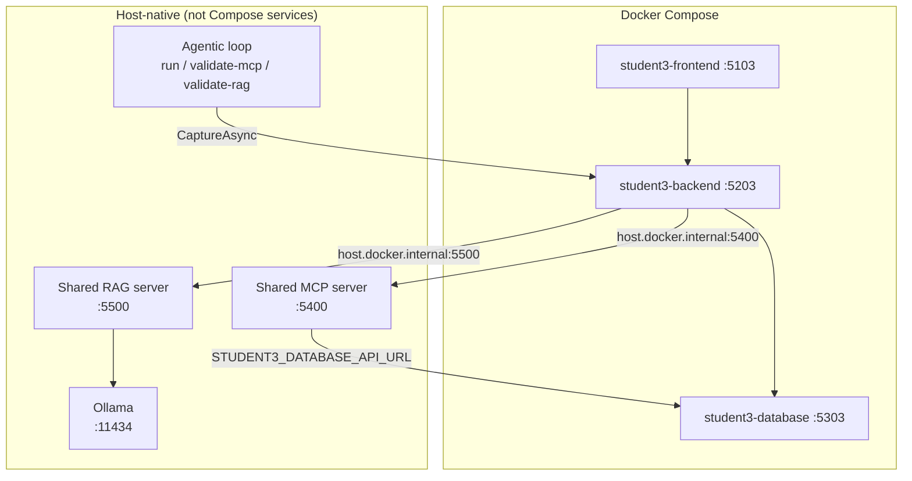
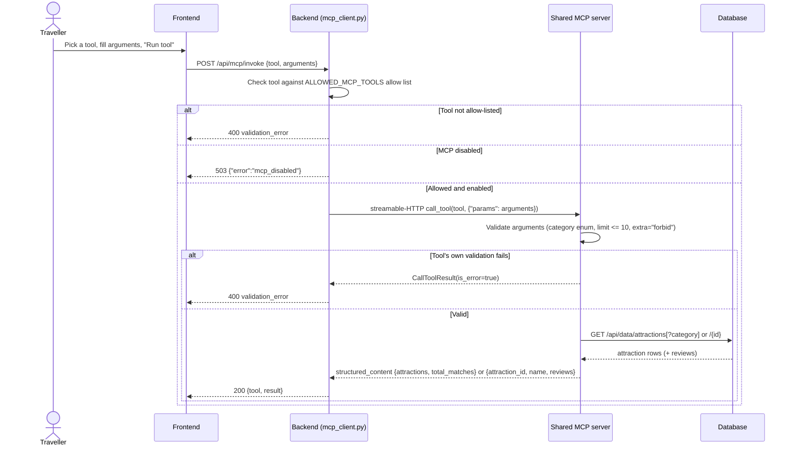
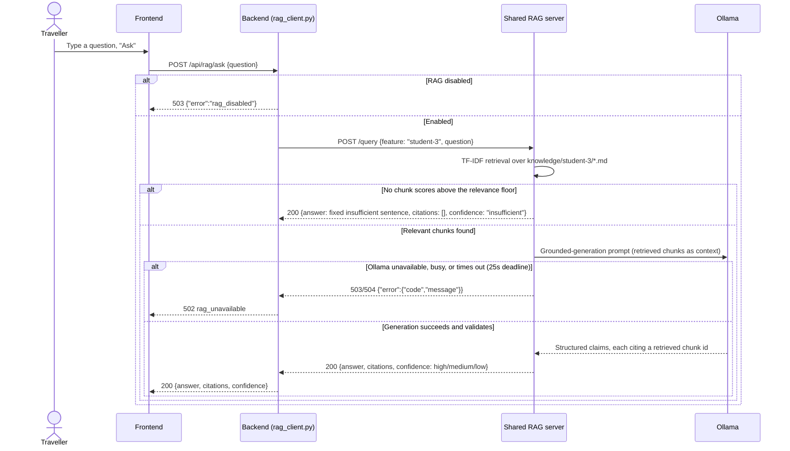
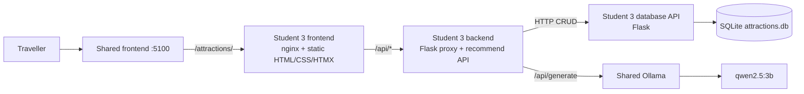
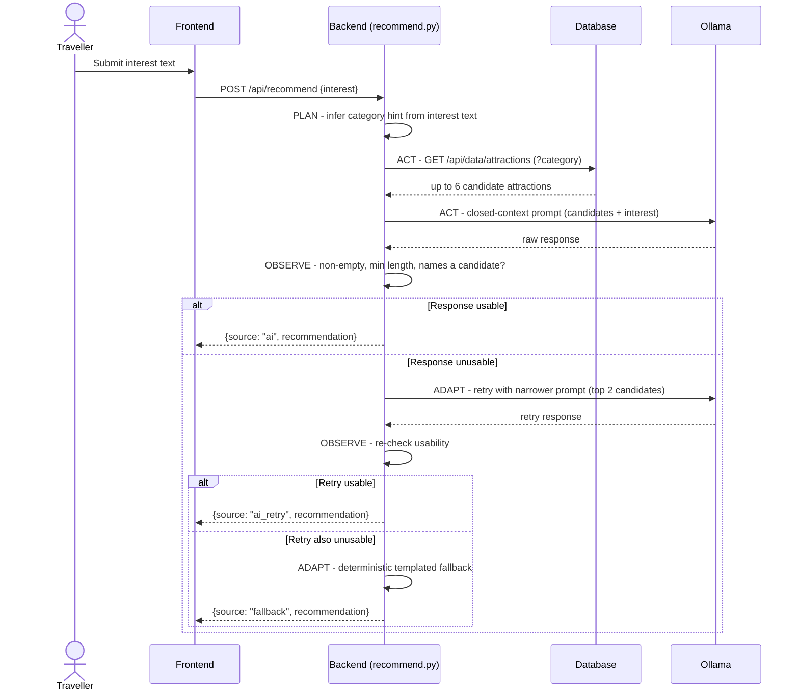
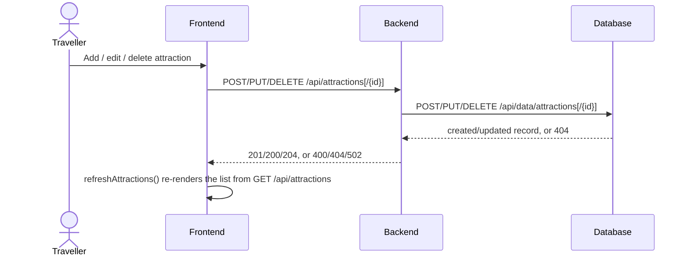
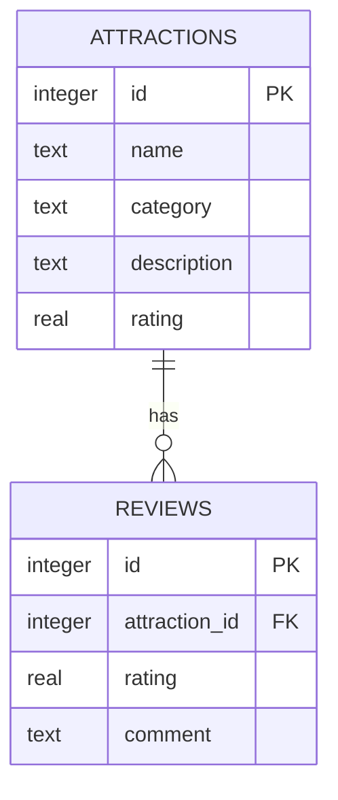
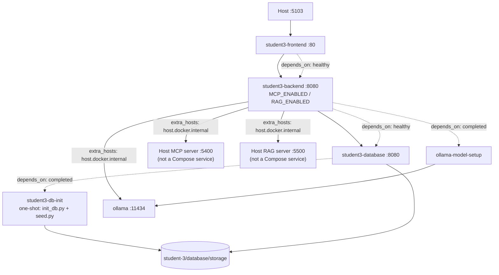
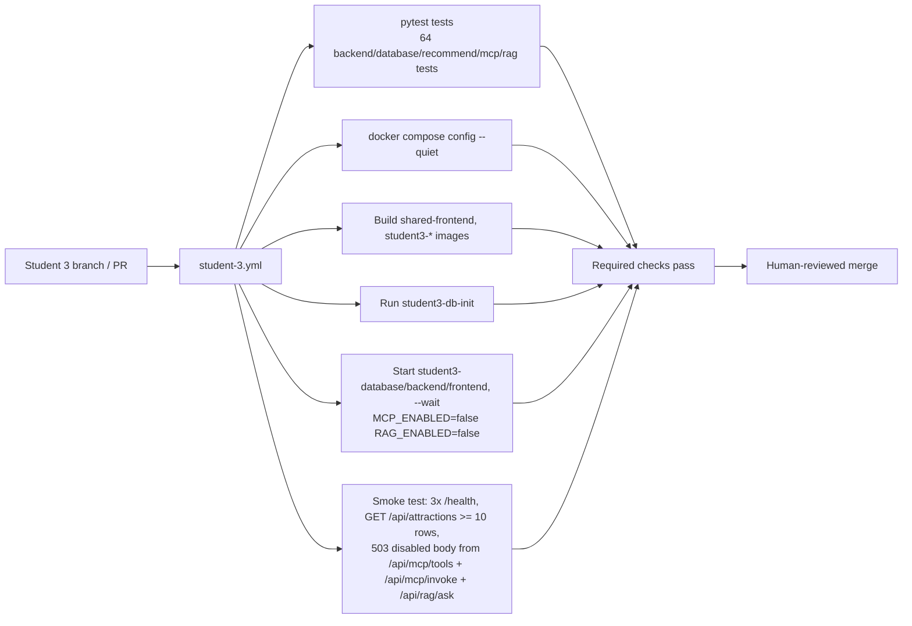
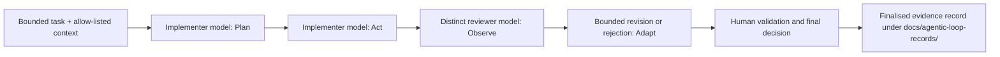

# Local Experience & Attraction Recommender Architecture and Data Design

## Release 1 Containerisation Boundary

Per the Release 1 brief, the shared MCP server, RAG server, and agentic
loop run natively on the host, never as Compose services — the same way
Ollama already does. Only the three student-3 application services stay
containerised.

```mermaid
flowchart TB
    subgraph Containerised["Docker Compose"]
        F[student3-frontend :5103]
        B[student3-backend :5203]
        D[student3-database :5303]
    end
    subgraph HostNative["Host-native (not Compose services)"]
        M[Shared MCP server<br/>:5400]
        R[Shared RAG server<br/>:5500]
        O[Ollama<br/>:11434]
        L[Agentic loop<br/>run / validate-mcp / validate-rag]
    end
    F --> B
    B --> D
    B -->|host.docker.internal:5400| M
    B -->|host.docker.internal:5500| R
    M -->|STUDENT3_DATABASE_API_URL| D
    R --> O
    L -->|CaptureAsync| B
```

`student3-backend` reaches the host-native MCP/RAG servers via
`host.docker.internal`, wired through `extra_hosts` in `docker-compose.yml`
(`host-gateway`, overridable via `LOCAL_AI_HOST` for non-Windows Docker
engines in CI). `MCP_ENABLED`/`RAG_ENABLED` (both default `true` for
student3-backend) let the backend fail closed with a `503` rather than
attempt a call when either service is intentionally disabled — see
`.env.example` and `student-3.yml`, which sets both to `false` for CI so
the pipeline never depends on a live MCP/RAG server being reachable.

## MCP Request Flow (`attractions.search` / `attractions.get_reviews`)

```mermaid
sequenceDiagram
    actor Traveller
    participant Frontend
    participant Backend as Backend (mcp_client.py)
    participant MCP as Shared MCP server
    participant Database

    Traveller->>Frontend: Pick a tool, fill arguments, "Run tool"
    Frontend->>Backend: POST /api/mcp/invoke {tool, arguments}
    Backend->>Backend: Check tool against ALLOWED_MCP_TOOLS allow list
    alt Tool not allow-listed
        Backend-->>Frontend: 400 validation_error
    else MCP disabled
        Backend-->>Frontend: 503 {"error":"mcp_disabled"}
    else Allowed and enabled
        Backend->>MCP: streamable-HTTP call_tool(tool, {"params": arguments})
        MCP->>MCP: Validate arguments (category enum, limit <= 10, extra="forbid")
        alt Tool's own validation fails
            MCP-->>Backend: CallToolResult(is_error=true)
            Backend-->>Frontend: 400 validation_error
        else Valid
            MCP->>Database: GET /api/data/attractions[?category] or /{id}
            Database-->>MCP: attraction rows (+ reviews)
            MCP-->>Backend: structured_content {attractions, total_matches} or {attraction_id, name, reviews}
            Backend-->>Frontend: 200 {tool, result}
        end
    end
```

The backend's allow list is a **second boundary on top of the MCP server's
own tool registration** — even if the shared server later exposes more
student-3 tools, `student3-backend` only ever invokes the two named here.
A tool-reported error (e.g. an invalid `category`) surfaces as a
JSON-RPC-level `is_error=true` result over the wire, not an HTTP failure —
`mcp_client.py` distinguishes this (`McpToolError` → `400`) from an
actually unreachable server (`McpUnavailableError` → `502`) or a malformed
response shape (`McpResponseError` → `502`).

## RAG Request Flow (`/api/rag/ask`)

```mermaid
sequenceDiagram
    actor Traveller
    participant Frontend
    participant Backend as Backend (rag_client.py)
    participant RAG as Shared RAG server
    participant Ollama

    Traveller->>Frontend: Type a question, "Ask"
    Frontend->>Backend: POST /api/rag/ask {question}
    alt RAG disabled
        Backend-->>Frontend: 503 {"error":"rag_disabled"}
    else Enabled
        Backend->>RAG: POST /query {feature: "student-3", question}
        RAG->>RAG: TF-IDF retrieval over knowledge/student-3/*.md
        alt No chunk scores above the relevance floor
            RAG-->>Backend: 200 {answer: fixed insufficient sentence, citations: [], confidence: "insufficient"}
        else Relevant chunks found
            RAG->>Ollama: Grounded-generation prompt (retrieved chunks as context)
            alt Ollama unavailable, busy, or times out (25s deadline)
                RAG-->>Backend: 503/504 {"error":{"code","message"}}
                Backend-->>Frontend: 502 rag_unavailable
            else Generation succeeds and validates
                Ollama-->>RAG: Structured claims, each citing a retrieved chunk id
                RAG-->>Backend: 200 {answer, citations, confidence: high/medium/low}
                Backend-->>Frontend: 200 {answer, citations, confidence}
            end
        end
    end
```

Retrieval is TF-IDF over hand-written Markdown docs (no embeddings — see
`ai-services/rag-server/retrieval.py`'s own rationale), so an
insufficient-context response never reaches Ollama at all; only a
plausibly-relevant question pays the generation cost. The frontend renders
`confidence: "insufficient"` as a visually distinct state (`.rag-insufficient`
in `style.css`), never as a normal answer with an empty citation list.

## Individual Service Architecture

```mermaid
flowchart LR
    U[Traveller] --> H[Shared frontend :5100]
    H -->|/attractions/| F[Student 3 frontend<br/>nginx + static HTML/CSS/HTMX]
    F -->|/api/*| B[Student 3 backend<br/>Flask proxy + recommend API]
    B -->|HTTP CRUD| D[Student 3 database API<br/>Flask]
    D --> S[(SQLite attractions.db)]
    B -->|/api/generate| O[Shared Ollama]
    O --> L[qwen2.5:3b]
```

The browser calls only the backend through the frontend's nginx reverse proxy (`/api/` → `student3-backend`). The backend validates input, owns the AI recommendation loop, and reaches persistence only through the database API's HTTP contract. Only the database service opens `attractions.db`.

## AI Request Flow (Plan → Act → Observe → Adapt)

```mermaid
sequenceDiagram
    actor Traveller
    participant Frontend
    participant Backend as Backend (recommend.py)
    participant Database
    participant Ollama

    Traveller->>Frontend: Submit interest text
    Frontend->>Backend: POST /api/recommend {interest}
    Backend->>Backend: PLAN - infer category hint from interest text
    Backend->>Database: ACT - GET /api/data/attractions (?category)
    Database-->>Backend: up to 6 candidate attractions
    Backend->>Ollama: ACT - closed-context prompt (candidates + interest)
    Ollama-->>Backend: raw response
    Backend->>Backend: OBSERVE - non-empty, min length, names a candidate?
    alt Response usable
        Backend-->>Frontend: {source: "ai", recommendation}
    else Response unusable
        Backend->>Ollama: ADAPT - retry with narrower prompt (top 2 candidates)
        Ollama-->>Backend: retry response
        Backend->>Backend: OBSERVE - re-check usability
        alt Retry usable
            Backend-->>Frontend: {source: "ai_retry", recommendation}
        else Retry also unusable
            Backend->>Backend: ADAPT - deterministic templated fallback
            Backend-->>Frontend: {source: "fallback", recommendation}
        end
    end
```

Every stage prints a labelled `PLAN:`/`ACT:`/`OBSERVE:`/`ADAPT:` line to the terminal so the loop can be demonstrated live, per the Release 0 marking rubric.

## CRUD Request Flow (attractions)

```mermaid
sequenceDiagram
    actor Traveller
    participant Frontend
    participant Backend
    participant Database

    Traveller->>Frontend: Add / edit / delete attraction
    Frontend->>Backend: POST/PUT/DELETE /api/attractions[/{id}]
    Backend->>Database: POST/PUT/DELETE /api/data/attractions[/{id}]
    Database-->>Backend: created/updated record, or 404
    Backend-->>Frontend: 201/200/204, or 400/404/502
    Frontend->>Frontend: refreshAttractions() re-renders the list from GET /api/attractions
```

## Conceptual Data Model and ERD

An attraction has zero or more reviews; a review belongs to exactly one attraction.

```mermaid
erDiagram
    ATTRACTIONS ||--o{ REVIEWS : has
    ATTRACTIONS {
        integer id PK
        text name
        text category
        text description
        real rating
    }
    REVIEWS {
        integer id PK
        integer attraction_id FK
        real rating
        text comment
    }
```

## Logical and Physical Design

- `attractions.id` and `reviews.id` are auto-incrementing SQLite integer primary keys.
- `reviews.attraction_id` is a required foreign key referencing `attractions.id`; the database API rejects a review whose `attraction_id` does not reference an existing attraction (`400 validation_error`) before any INSERT is attempted.
- Deleting an attraction cascades to its reviews at the application layer (`delete_attraction` explicitly deletes matching `reviews` rows before deleting the attraction row — SQLite foreign keys are not set to `ON DELETE CASCADE` in `schema.sql`, so this is enforced in `student-3/database/app.py`, not by the schema itself).
- `category` is a free-text column (not a DB-level enum); the `sight`/`restaurant`/`activity` values are enforced only by the frontend `<select>` and the filter buttons.
- `rating` is nullable on both tables; `attractionCardHtml()`/review rendering treat a missing rating as "no badge" rather than displaying a literal `null`.
- The database file is bind-mounted from `student-3/database/storage` to `/data`, initialised and seeded once by the one-shot `student3-db-init` job before `student3-database` starts.

## Docker Compose Architecture

```mermaid
flowchart TB
    P5103[Host :5103] --> S3F[student3-frontend :80]
    S3F --> S3B["student3-backend :8080<br/>MCP_ENABLED / RAG_ENABLED"]
    S3B --> S3D[student3-database :8080]
    INIT[student3-db-init<br/>one-shot: init_db.py + seed.py] --> V[(student-3/database/storage)]
    S3D --> V
    S3B -->|extra_hosts: host.docker.internal| OL[ollama :11434]
    S3B -->|extra_hosts: host.docker.internal| MCPH["Host MCP server :5400<br/>(not a Compose service)"]
    S3B -->|extra_hosts: host.docker.internal| RAGH["Host RAG server :5500<br/>(not a Compose service)"]
    MS[ollama-model-setup] --> OL
    S3F -. depends_on: healthy .-> S3B
    S3B -. depends_on: healthy .-> S3D
    S3D -. depends_on: completed .-> INIT
    S3B -. depends_on: completed .-> MS
```

`MCP_ENABLED`/`RAG_ENABLED` both default to `true` for `student3-backend`
(overridable via the identically-named env vars, per `.env.example`) — a
deliberate difference from Student 1/2's `false` default, since Student
3's own Stage 3 UI panels are the reason to enable them locally. CI always
overrides both to `false` regardless of the Compose default (see the
DevOps Pipeline diagram below), so the pipeline never depends on the
host-native MCP/RAG servers being reachable.

## DevOps Pipeline

```mermaid
flowchart LR
    C[Student 3 branch / PR] --> A[student-3.yml]
    A --> PT["pytest tests<br/>64 backend/database/recommend/mcp/rag tests"]
    A --> CC[docker compose config --quiet]
    A --> DB[Build shared-frontend, student3-* images]
    A --> INIT2[Run student3-db-init]
    A --> UP["Start student3-database/backend/frontend, --wait<br/>MCP_ENABLED=false RAG_ENABLED=false"]
    A --> SMOKE["Smoke test: 3x /health, GET /api/attractions >= 10 rows,<br/>503 disabled body from /api/mcp/tools + /api/mcp/invoke + /api/rag/ask"]
    PT --> G[Required checks pass]
    CC --> G
    DB --> G
    INIT2 --> G
    UP --> G
    SMOKE --> G
    G --> M[Human-reviewed merge]
```

`student-3.yml` deliberately forces `MCP_ENABLED`/`RAG_ENABLED` to
`false` for the CI run (a step-level `env:` override, not the Compose
default), so the pipeline is fully self-contained — it never starts or
depends on the host-native MCP/RAG servers, and its own smoke test instead
asserts that the disabled-flag failure mode itself works correctly. `on.paths`
also triggers on `ai-services/mcp-server/**` and `ai-services/rag-server/**`
changes, since student-3's backend depends on those shared contracts.

## Development Agentic Workflow

```mermaid
flowchart LR
    T[Bounded task + allow-listed context] --> P[Implementer model: Plan]
    P --> A[Implementer model: Act]
    A --> O[Distinct reviewer model: Observe]
    O --> D[Bounded revision or rejection: Adapt]
    D --> H[Human validation and final decision]
    H --> R[Finalised evidence record under docs/agentic-loop-records/]
```

This development-loop diagram describes the shared `ai-services/agentic-loop` tool used to review my own engineering work. It is separate from the application-level `/api/recommend` Plan → Act → Observe → Adapt loop diagrammed above, which reviews traveller-facing recommendations, not code.

### Release 1: MCP/RAG Validation Modes

The shared loop gained two extra commands this release, `validate-mcp` and `validate-rag`, which run the same Plan → Act → Observe → Adapt code-review loop above, but replace the human-supplied `--pre-test-command`/`--pre-test-result` with a **live call against a real feature backend** (`ServiceValidation.CaptureAsync`), so the recorded pre-test evidence is a genuine MCP tool invocation or RAG query, not a description of one. These commands already existed for `student-1`/`student-2` from earlier chunks; Stage 5 extended `ServiceValidation.cs` to also support `student-3` (`attractions.search`/`attractions.get_reviews` via `/api/mcp/invoke`, and `/api/rag/ask`, including a validator that correctly treats `confidence: "insufficient"` as a valid outcome rather than a failure — a rule student-3's own RAG contract needs that the shared validator for student-1/2 does not).

```mermaid
flowchart LR
    V["validate-mcp / validate-rag<br/>--feature student-3"] --> C[ServiceValidation.CaptureAsync]
    C -->|Real HTTP call| BE[Live student3-backend]
    BE --> RESP[Real response + contractPassed]
    RESP --> PT[Becomes the loop's pre-test evidence]
    PT --> P[Implementer: Plan / Act]
    P --> O[Reviewer: Observe]
    O --> AD[Adapt: bounded revision]
    AD --> H[Human decision]
    H --> R[Finalised record under docs/agentic-loop-records/]
```

Four Release 1 records were finalised through the plain `run` command
(`total_matches`, `RagResponseError.code` — rejected, `confidenceBadgeClass`
— kept), analysed phase by phase in `reviewrecord.md`. Four `validate-mcp`
attempts at the shared `IsValidStudent3Mcp` code failed for host-environment
reasons (implementer repetition once, then Ollama loading both loop models
simultaneously three times) rather than producing a finalisable record; the
required live Student 3 evidence was still captured directly via
`ServiceValidation.CaptureAsync`, bypassing the crashing CLI — see
`reviewrecord.md`'s 2026-09-30 entry and
`student-3/docs/evidence/release-1/stage5-loop-validation/`.
