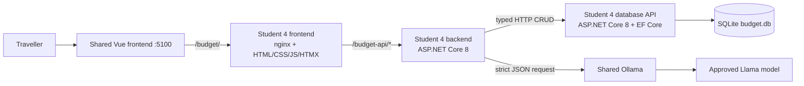
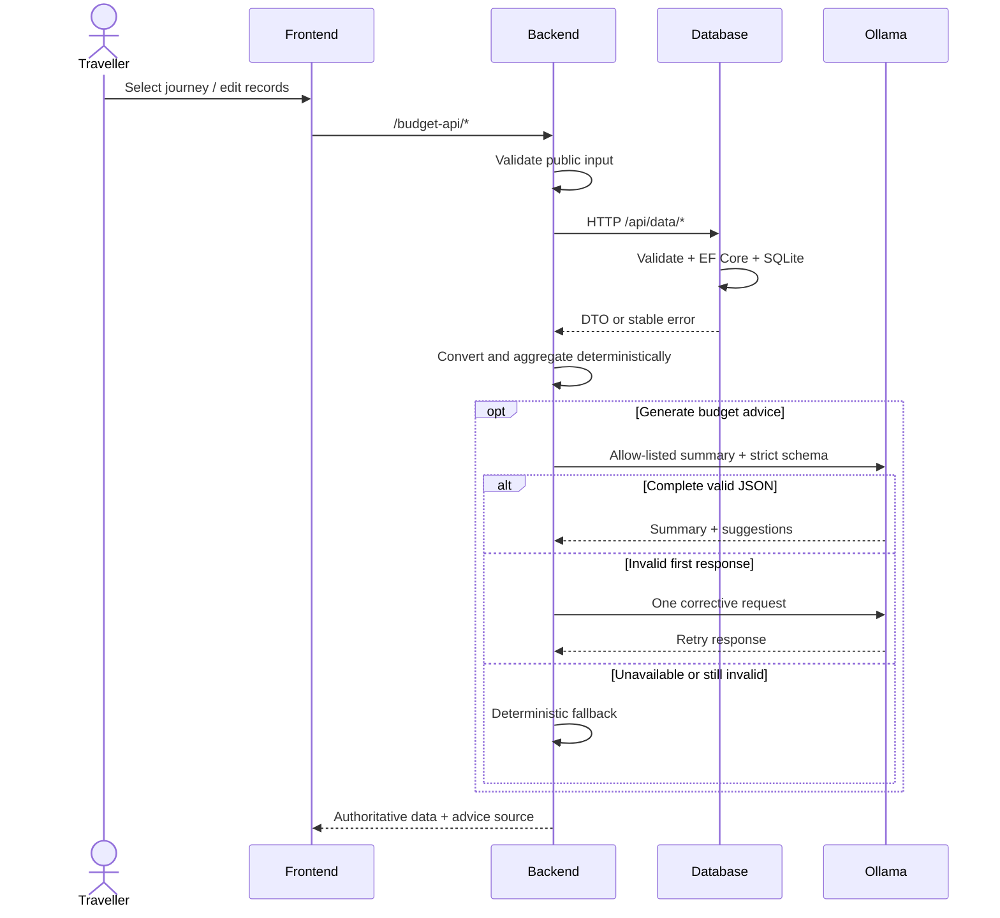
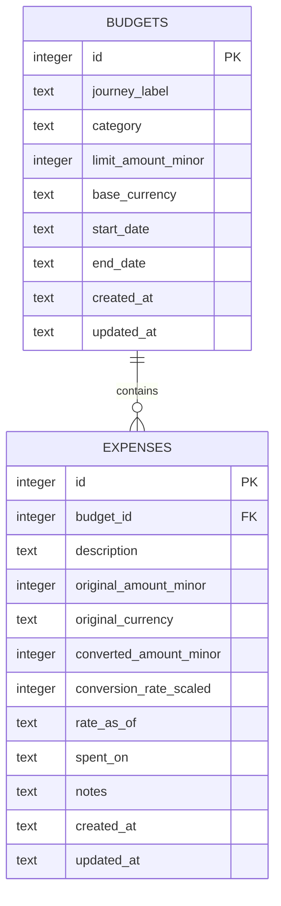
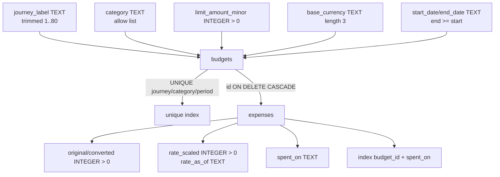
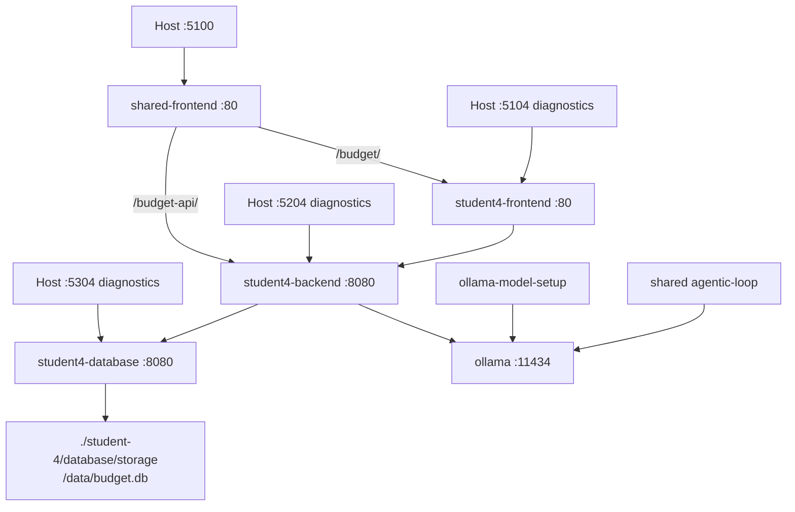
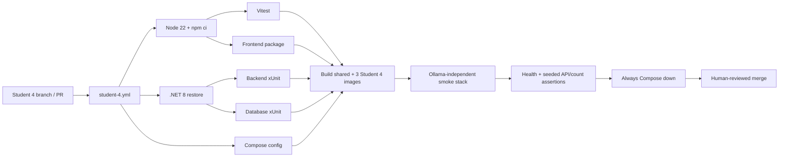
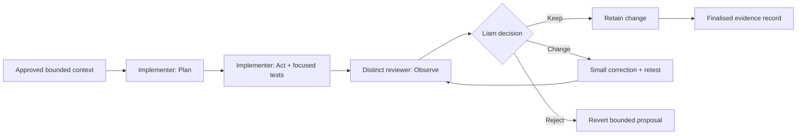

# Budget & Expense Tracker Architecture and Data Design

## Individual Service Architecture

Only the database service references EF Core SQLite or opens the database file.
The backend owns all authoritative conversion, dashboard, and insight
orchestration. The frontend calls no database or model endpoint directly.

## Request Flow

## Conceptual Model and ERD

A journey label groups one or more category budgets. A budget owns zero or more
expenses. It is local text, not a relation to another feature.

## Logical and Physical SQLite Design

- SQLite integer primary keys are positive and generated by the provider.
- Currency amounts are stored as integer minor units; rates are scaled by
  100,000,000 to preserve a deterministic snapshot.
- Dates use ISO `yyyy-MM-dd`; UTC timestamps use provider-supported UTC values.
- API validation enforces cross-row rules: one base currency per journey and
  expense dates within the parent budget period.
- Check, unique, foreign-key, and journey-currency triggers provide an atomic
    database enforcement layer.
- Startup applies migrations and an idempotent transaction creates 12 budgets
  and 24 expenses when their stable sample keys are absent.

## Docker Compose Topology

Database health gates backend startup; completed model setup and database
health gate the normal backend; backend health gates the frontend; Student 4
frontend health is added to the shared frontend dependency set.

## Student 4 DevOps Pipeline

## Development Plan -> Act -> Observe -> Adapt

This development workflow is separate from the runtime budget-advice path.
Only Liam supplies the final Adapt decision.