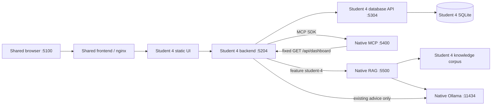
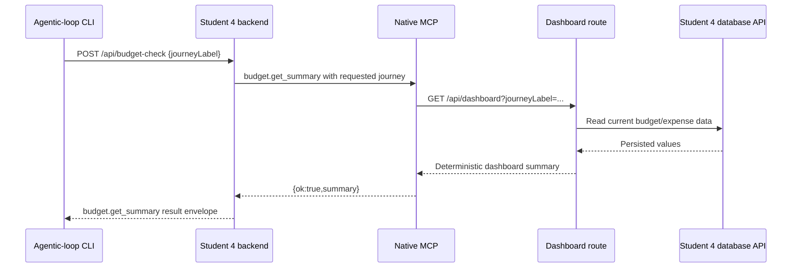
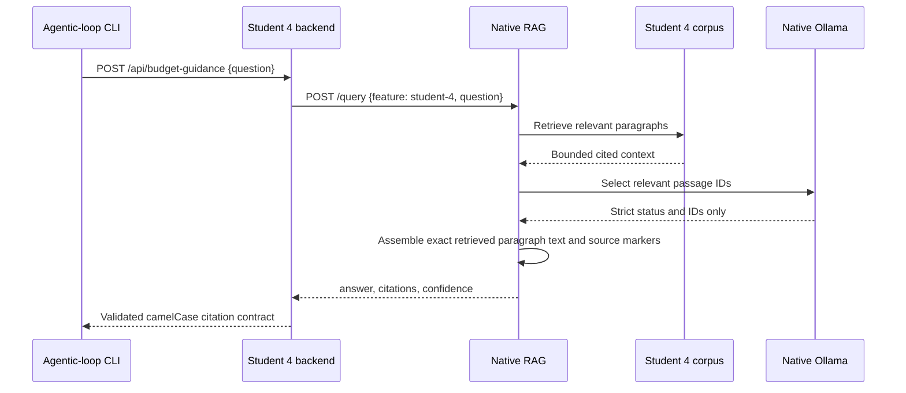

# Student 4 Release 1 Validation Runbook

Status: implementation and offline contract checks are distinct from live model, integrated-app, CI, and human acceptance. This runbook does not claim those gates passed.

## Architecture



The MCP callback re-enters the same backend process only through the existing MCP-free dashboard route; the database API remains the sole SQLite owner. RAG answers general budgeting questions and does not receive saved journey data.





Student 4 uses an isolated extractive mode in the shared RAG server. Its local
model receives only the question and retrieved passages, then returns a strict
`{status, chunk_ids}` selection (maximum three IDs, restricted to the retrieved
IDs). The server renders each selected full paragraph verbatim with its
`[chunk_id]` marker and source metadata. Empty/invalid selections, unknown or
duplicate IDs, extra fields, and answers above 2,000 characters map to 502;
valid insufficient output retains the shared exact abstention contract. This
reduces unsupported paraphrase and citation mismatch without proving that the
model selected a relevant passage. Students 1-3 retain the existing claims
generation path and prompt.

The 2026-10-02 direct live set used the refreshed native `llama3.2:3b` RAG
process: five answerable Student 4 questions grounded in exact quoted paragraphs,
including the held-out threshold and conversion paraphrases; the Mars negative
case returned the exact insufficient response. Two bounded prompt adaptations
were recorded: iteration 1 still abstained on both conversion questions; iteration
2 selected `expense-conversion#1` for both. Full outputs, source excerpts,
prompt/corpus hashes, and iteration results are in
[`rag-guidance-extractive-live-2026-10-02.json`](evidence/release-1/rag-guidance-extractive-live-2026-10-02.json).
The earlier freeform-model failure remains unchanged in
[`rag-guidance-live-2026-10-02.json`](evidence/release-1/rag-guidance-live-2026-10-02.json).

## Offline Validation

From the repository root, run the existing feature script. `All` retains the frontend/backend/database/shared-frontend checks and adds the loop, full shared MCP, and full shared RAG suites. `Shared` runs all three shared suites; `Loop`, `Mcp`, and `Rag` run them independently.

```powershell
pwsh -NoProfile -File scripts/test/student-4.ps1 -Area All
pwsh -NoProfile -File scripts/test/student-4.ps1 -Area Shared
pwsh -NoProfile -File scripts/test/student-4.ps1 -Area Loop
pwsh -NoProfile -File scripts/test/student-4.ps1 -Area Mcp
pwsh -NoProfile -File scripts/test/student-4.ps1 -Area Rag
```

The MCP and RAG dependency sets are pinned in their respective `requirements.txt` files. Use separate Python environments when running both suites locally; explicit overrides are preferred:

```powershell
$env:STUDENT4_MCP_PYTHON = (Resolve-Path ..\venv-mcp\Scripts\python.exe).Path
$env:STUDENT4_RAG_PYTHON = (Resolve-Path ..\venv-rag\Scripts\python.exe).Path
pwsh -NoProfile -File scripts/test/student-4.ps1 -Area Shared
```

`STUDENT4_PYTHON` is accepted as a common fallback when the environments are compatible. The runner does not install or mutate Python packages. CI creates isolated Python 3.11 environments and installs only the pinned MCP/RAG requirements.

## Native Live Validation

Keep Ollama, MCP, and RAG on the host. Start Ollama with the configured model already available, then launch MCP and RAG in separate PowerShell terminals from the repository root:

```powershell
$env:MCP_HOST = '127.0.0.1'
$env:MCP_PORT = '5400'
$env:STUDENT4_BACKEND_API_URL = 'http://127.0.0.1:5204'
& '..\venv-mcp\Scripts\python.exe' 'ai-services\mcp-server\server.py'
```

```powershell
$env:OLLAMA_URL = 'http://127.0.0.1:11434'
$env:RAG_MODEL = 'llama3.2:3b'
& '..\venv-rag\Scripts\python.exe' -m uvicorn server:app --host 127.0.0.1 --port 5500 --app-dir 'ai-services\rag-server'
```

For the integrated backend, set only the Student 4 mode variables before starting the shared Compose application. Keep the existing AI advice disabled unless testing that separate Release 0 path:

```powershell
$env:STUDENT4_AI_ENABLED = 'false'
$env:STUDENT4_MCP_ENABLED = 'true'
$env:STUDENT4_RAG_ENABLED = 'true'
```

The Compose backend reaches host-native MCP/RAG through its configured host gateway. Keep native services bound to loopback where possible; do not expose unauthenticated MCP/RAG/Ollama listeners publicly or disable DNS-rebinding protections. If the container cannot reach a loopback-only host listener, diagnose the Docker Desktop host route and use only a trusted private interface if required.

Run both loop modes against the integrated backend. The MCP request requires `--journey-label`; it has no trip ID or natural-language question. The context files below are covered by the loop's 16 KiB per-file / 32 KiB combined limits.

```powershell
dotnet run --project ai-services/agentic-loop -- validate-mcp `
  --feature student-4 `
  --task 'Check the read-only budget summary for this journey against its authoritative dashboard result.' `
  --context ai-services/mcp-server/tools/budget.py `
  --context student-4/backend/Api/BudgetCheckEndpoints.cs `
  --backend-url http://127.0.0.1:5204 `
  --journey-label 'Sydney Weekender'
```

```powershell
dotnet run --project ai-services/agentic-loop -- validate-rag `
  --feature student-4 `
  --task 'Check that the budgeting answer is supported by the cited Student 4 knowledge and report unsupported claims.' `
  --context ai-services/rag-server/knowledge/student-4/category-budgets.md `
  --context student-4/backend/Api/BudgetGuidanceEndpoints.cs `
  --backend-url http://127.0.0.1:5204 `
  --question 'What does the 80% category budget warning mean?'
```

MCP passes only for `budget.get_summary`, `ok: true`, the requested journey, coherent full totals/categories, supported statuses, and bounded values. RAG passes only for a valid answered response with known Student 4 source IDs, matching `chunkId` markers, score/confidence, and no malformed citation fields. The shared retrieval service uses snake_case `chunk_id` internally; Student 4's backend response is serialized as camelCase `chunkId`. The exact insufficient-context response is a correct abstention but **fails the positive RAG loop gate**. Dependency failures also fail; they are not abstentions.

Each mode first records the actual HTTP status/body and `contractPassed`; it then runs the normal two-model loop. Model review cannot override a failed contract or establish that a cited claim is entailed. Inspect the pending record and cited source, run the post-test, and let Liam explicitly choose kept/changed/rejected before finalising. Never auto-finalise or claim a human decision.

## CI And Evidence

Student 4 CI sets generic `AI_ENABLED`, `MCP_ENABLED`, and `RAG_ENABLED` false and also sets all three `STUDENT4_*_ENABLED` values false. It runs offline tests, validates Compose, builds the existing images, checks seeded counts and the shared route, then tears down. CI does not download models or prove native connectivity, generated grounded answers, the browser workflow, or a real loop record.

| Release 1 criterion | Current Student 4 evidence | Status |
|---|---|---|
| 1. Setup and architecture | HLD plus architecture and interaction diagrams above; native/container boundary is explicit. | Documented; final report evidence unverified. |
| 2. Student services | Student 4 frontend 19/19, backend 135/135, database 12/12; Student 4 and shared frontend production builds passed. Backend tests also passed with all generic and Student 4 AI/MCP/RAG flags false. | Offline checks passed; integrated runtime and CRUD acceptance unverified. |
| 3. MCP | Shared MCP suite 120/120; loop checks the requested journey, full totals/categories, status thresholds, error/malformed/mismatched responses, and required CLI label. | Offline checks passed; live UI/API success and database non-mutation unverified. |
| 4. RAG | Shared RAG suite 91 passed, 19 live-model tests skipped; Student 4 retrieval 17/17. Final direct live set: 5/5 answerable cases quote their selected source paragraphs; Mars correctly abstains. Prompt iteration 1's two conversion abstentions and the original freeform grounding failures are preserved. | Student 4 extractive mode and direct native model behavior observed; backend route/browser workflow, shared-loop finalisation, CI, independent hold-out evaluation, and human release acceptance remain unverified. |
| 5. Shared loop | Student 4 CLI/contract and reviewer-parser suite: 60 passed. The full suite has one existing symbolic-link test that this Windows account cannot execute (OS error 1314); Linux CI is expected to run it. | Offline contract checks passed with that local platform limitation; real mode outputs, post-tests, and Liam's decision unverified. |
| 6. CI | Workflow includes pinned shared Python requirements, all AI modes disabled, and shared code trigger paths. | Workflow source updated; successful GitHub Actions run unverified. |
| 7. Compose | `docker compose config --quiet` exited 0 with generic and Student 4 AI/MCP/RAG flags false; existing build/seed/health/route steps are preserved. | Config parse passed; no local image build/start/stop or container evidence claimed. |
| 8. Integrated software | Student 4 remains on the shared `/budget/` route and uses the existing backend/database owners. | All-five-feature validation and live MCP/RAG integration unverified. |
| 9. Report and contributions | This runbook maps evidence to criteria; PRs #104-#107 were published by `Liam-zel`. Implementation was AI-assisted under Liam's ownership. | Contribution provenance recorded; final group report/video links and review approvals unverified. |
| 10. Demonstration and Q&A | No attendance, video, tutor approval, or demonstration claim is made here. | Unverified; human-owned. |

| Pull request | Published by | Contribution attribution |
|---|---|---|
| #104 | `Liam-zel` | AI-assisted implementation; human authorship/review outcome is not inferred. |
| #105 | `Liam-zel` | AI-assisted implementation; human authorship/review outcome is not inferred. |
| #106 | `Liam-zel` | AI-assisted implementation; human authorship/review outcome is not inferred. |
| #107 | `Liam-zel` | AI-assisted implementation; human authorship/review outcome is not inferred. |

The `All` runner executed the frontend, backend, and database checks, then returned non-zero when the Windows account could not create the symlink required by one existing loop test. The loop suite excluding only that OS-dependent test passed 60/60; MCP and RAG were run separately and passed as listed. Do not replace any unverified row with code existence, an offline fixture, or a workflow definition. Record the actual run URL/output and a human decision when those are produced.
