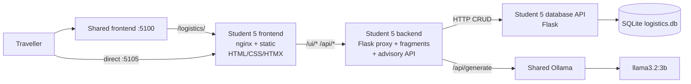
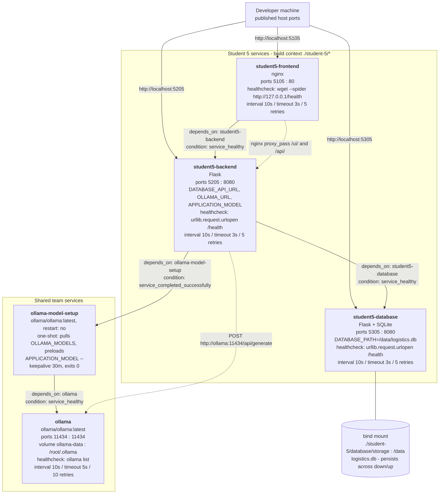
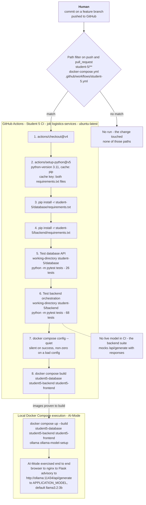

# Travel Logistics & Advisory Service - Architecture

Student 5 (Alex Chen), Release 0. Three containerised services plus the team's
shared Ollama runtime.

## Architecture Diagram


Host ports: shared frontend `5100`, Student 5 frontend `5105`, backend `5205`,
database `5305`, Ollama `11434`. Inside Compose each service is reached by DNS
name on its container port - `80` for the frontend, `8080` for the backend and
database. The model tag comes from `APPLICATION_MODEL`; `llama3.2:3b` is the
Compose default, not a literal in the code.

Two routing details the single line hides. The shared gateway proxies
`/logistics/` (stripping the prefix), plus `/ui/` and `/style.css` at its root,
to `student5-frontend` - so the fragment traffic works through the gateway, but
the gateway's own `/api/` belongs to Student 1, which means Student 5's JSON API
is reachable only on `:5105` or `:5205` directly. And `student5-frontend` is the
only proxy the browser ever crosses to reach the backend, which is what keeps
the backend free of CORS.

## The services

### student5-frontend - nginx, container port 80, host 5105

A static page and an edge, nothing more. `index.html` is one document with no
build step; every data block on it is an HTML fragment fetched from the
backend's `/ui/` blueprint and swapped in by HTMX 1.9.12, pinned to an exact
version and locked with a Subresource Integrity hash. nginx's second job is the
important one: it proxies `/ui/` and `/api/` to the backend so the whole
application looks same-origin, which means no fragment endpoint needs CORS and
every URL on the page can stay relative. Two details earn their keep - `resolver
127.0.0.11` plus a variable in `proxy_pass`, so the backend's address is
re-resolved per request instead of going stale when its container restarts on a
new IP; and a 180-second read timeout on both proxied locations, sized for the
slowest observed generation rather than the average, because the default 60
seconds cuts an advisory off mid-write and hands the page a 504 that HTMX will
not swap. `/health` is served by nginx itself and says nothing about the
backend, so a backend outage does not also mark the frontend unhealthy and
restart it.

### student5-backend - Flask, container port 8080, host 5205

The middle tier. It owns no data: the frontend talks to it, and it talks to the
database service over HTTP and to Ollama for generated advice. Three blueprints
are kept apart because they do not share failure semantics. `api` is a JSON
passthrough whose shapes are identical to the database service's, with
`relay()` as the single chokepoint that turns a `DatabaseResponse` into a Flask
response and forwards its status code verbatim. `advisory` owns a contract of
its own - `destination_id` is required and coerced to `int` before it is
interpolated into any URL - and is the only place the two dependencies are
combined. `ui` renders server-side HTML fragments and deliberately answers 200
even when something went wrong, because HTMX does not swap a non-2xx response
and a silent no-swap is the worst possible feedback. All configuration
(`DATABASE_API_URL`, `OLLAMA_URL`, `APPLICATION_MODEL`) is read once in
`create_app`, so no request-building code names a model or a host.

### student5-database - Flask + SQLite, container port 8080, host 5305

The only service in the repository that opens `student-5/database/storage/logistics.db`
(`/data/logistics.db` inside the container). It exposes three resources -
destinations, weather notes, transit options - over a JSON CRUD API, and owns
all validation for them: required fields, non-empty strings, integer and
existence checks on `destination_id`. It creates the schema on startup and runs
the seed only when `destinations` is empty, so a restart against an existing
volume is a no-op. Connections are per-request and every one issues
`PRAGMA foreign_keys = ON`, which is what makes the cascade deletes real.

### ollama - shared, container and host port 11434

Not owned by this feature. One shared runtime hosts every model tag the team
needs; `ollama-model-setup` pulls and preloads them before dependent services
start. Student 5 selects a tag through `APPLICATION_MODEL` and calls
`/api/generate` non-streaming. Streaming would require the frontend to hold an
open connection through the backend, which neither the fragment nor the JSON
contract supports.

## The AI workflow (the marked path)

```text
Browser
  -> POST /ui/advisory  (form: destination_id, month, interests)
  -> student5-frontend  (nginx proxy, 180s read)
  -> student5-backend   advisory.generate_advisory
       -> student5-database  GET /api/destinations/<id>
                             GET /api/weather-notes?destination_id=<id>
                             GET /api/transit-options?destination_id=<id>
       -> build_prompt: stored rows pasted in verbatim
       -> ollama POST /api/generate {model: APPLICATION_MODEL, stream: false}
       -> LLM
  -> <article class="advisory-result"> swapped into #advisory-panel
```

The browser never reaches Ollama. `ollama_client.py` is the only module in the
backend that knows how to, and `build_prompt` guarantees that every advisory -
JSON or fragment - is grounded in the same stored rows, because both endpoints
call the same function.

## The rule that shapes everything: no service touches another's SQLite file

`student5-database` is the sole owner of `/data/logistics.db`. The backend has
no `sqlite3` import at all - every read and write travels over HTTP through
`db_client.py`. The rule applies across the group as well: Student 5's services
open no other student's database, and no other student's service opens this one.

Two consequences worth stating. First, it is what makes the backend's 68 tests
runnable offline against mocked HTTP - there is no file access left to stub.
Second, it forces the two dependency-failure vocabularies to stay distinct,
because a database that cannot be *reached* is a different event from a database
that answers `404`:

| Situation | `db_client` / `ollama_client` | JSON API | `/ui/` fragment |
|---|---|---|---|
| Row not found | `DatabaseResponse(404, ...)` returned, not raised | `404`, database's own body | readable notice, `200` |
| Database unreachable | `DatabaseUnavailable` raised | `503 {"error": "database service unavailable"}` | "The travel database is unavailable right now.", `200` |
| Ollama unreachable, slow, or non-200 | `OllamaUnavailable` raised | `503 {"error": "ai service unavailable"}` | "The travel adviser is unavailable right now.", `200` |
| Backend container down | - | nginx `502` | `htmx:responseError` writes the same `.fragment-message` markup client-side |

## Compose wiring

| Service | Image source | Container : host | Depends on | Healthcheck |
|---|---|---|---|---|
| `student5-frontend` | `./student-5/frontend` | 80 : 5105 | `student5-backend` healthy | `wget --spider http://127.0.0.1/health` |
| `student5-backend` | `./student-5/backend` | 8080 : 5205 | `student5-database` healthy, `ollama-model-setup` completed | `urllib.request.urlopen` on `/health` |
| `student5-database` | `./student-5/database` | 8080 : 5305 | - | `urllib.request.urlopen` on `/health` |

Services address each other by Compose DNS name (`http://student5-database:8080`,
`http://ollama:11434`), never by host port. The database's healthcheck uses
Python's `urllib` because `python:3.11-slim` ships without `curl` or `wget`.

## Docker Compose architecture

The three Student 5 services are defined in the repository-root
`docker-compose.yml` alongside every other student's, and share the team's
Ollama runtime. What the diagram shows that the table above does not is the
*ordering*: `student5-backend` will not start until two independent conditions
are both met - `student5-database` reporting `service_healthy`, and
`ollama-model-setup` reporting `service_completed_successfully`. The second is a
one-shot container, not a long-running one: it pulls every tag in
`OLLAMA_MODELS`, preloads `APPLICATION_MODEL` with a 30-minute keepalive, then
exits 0. Gating on its *completion* rather than its health is what stops the
first advisory request arriving while the model is still downloading.
`student5-frontend` then gates on the backend being healthy, so by the time the
page is servable the whole chain beneath it is up. The database is the only one
of the three with storage: `./student-5/database/storage` is bind-mounted to
`/data`, which is why the data survives `docker compose down` and why the seed
is written to run only when `destinations` is empty.



## DevOps pipeline architecture

One workflow, `.github/workflows/student-5.yml`, job `logistics-services` on
`ubuntu-latest`, with `contents: read` and nothing else. It runs on `push` and
`pull_request`, but only when the change touches `student-5/**`,
`docker-compose.yml` or the workflow file itself. That second path matters:
this feature's ports, dependency conditions and bind mount live in the shared
Compose file, so another student editing it re-runs these checks rather than
silently breaking the stack.

The two pytest invocations are deliberately separate steps with separate
`working-directory` values. Both services define a module named `app`, so a
single combined run collides on import and fails during collection - splitting
them is a correctness requirement, not a stylistic one. Nothing in the pipeline
starts Ollama: the backend suite mocks `/api/generate` with `responses`, so CI
never pulls a model. That keeps the workflow fast and deterministic, and it is
why the AI path itself is evidenced by the local Compose run rather than by CI.
A per-step account of what each stage validates is in `testing-evidence.md`.



## Agentic AI workflow: Plan -> Act -> Observe -> Adapt

This is the loop **as it actually ran** for the `formatElapsed` deliverable, not
an idealised version of it. Two distinct models were used - implementer
`qwen2.5-coder:7b`, reviewer `llama3.2:3b` - both served by the shared `ollama`
container, as the healthcheck output in
`docs/evidence/agentic-loop-models.txt` confirms.

Three things in the diagram are worth reading carefully. First, `ParseVerdict`
is a **deterministic C# validator, not a model**: it requires exactly one
`[OBSERVE]` section, exactly one `Verdict` line, the `Findings` / `Validation
gaps` / `Scope check` headings in that order with none of them empty, and it
rejects an `ACCEPT` that carries a `REQUIRED` finding. On this run the reviewer
returned exactly that contradiction, so the loop issued its single
`FORMAT_CORRECTION_REQUIRED` re-prompt - one correction only, then it fails
rather than looping forever. Second, the model-side `[ADAPT]` is one *bounded*
revision followed by a second review; after that the loop stops and writes a
record marked awaiting human finalisation. It never applies anything to the
repository. Third, the decisive `[ADAPT]` is human. Here the reviewer's
`REQUIRED` finding described a division-by-zero on a `count` variable with an
empty input list, none of which exist anywhere in the proposed function - the 3B
model reviewed the worked example from its own prompt instead of the proposal.
That finding was rejected by inspection, the proposal was applied with the
45-second boundary read as inclusive, seven `node -e` assertions were run
(`docs/evidence/formatelapsed-assertions.txt`), and the reasoning was written
into `humanNotes` on the finalised record. A model verdict of `REVISE` therefore
sits in that record beside a human decision of `changed`, on purpose.

```mermaid
flowchart TD
    classDef human fill:#dbe9ff,stroke:#1a4f9c,color:#0b1b33,stroke-width:2px
    classDef model fill:#ffe8cc,stroke:#a35200,color:#331700,stroke-width:2px
    classDef tool fill:#dff2e1,stroke:#1d6f2b,color:#0c2b12,stroke-width:2px

    kickoff["<b>HUMAN</b> - task and context chosen<br/>AgenticLoop.dll run<br/>--task, a scope-bounded statement<br/>--context student-5/frontend/index.html<br/>--pre-test-command / --pre-test-result<br/>--reviewer-prompt reviewer-llama32-v2.md"]:::human

    plan["<b>MODEL</b> - implementer qwen2.5-coder:7b<br/><b>[PLAN]</b> goal, requirements, files,<br/>steps, risks, validation"]:::model
    act["<b>MODEL</b> - implementer qwen2.5-coder:7b<br/><b>[ACT]</b> proposed formatElapsed plus the<br/>commented-out assertion snippet"]:::model
    vimp{"<b>TOOL</b> - ValidateImplementerOutput<br/>exactly one [PLAN] before one [ACT],<br/>both non-empty"}:::tool
    stop1["Run aborts - nothing recorded"]:::tool

    observe["<b>MODEL</b> - reviewer llama3.2:3b<br/><b>[OBSERVE]</b> Verdict, Findings,<br/>Validation gaps, Scope check"]:::model
    parse{"<b>TOOL</b> - ParseVerdict, deterministic<br/>one [OBSERVE], one Verdict line,<br/>required headings in order and non-empty,<br/>ACCEPT may not carry a REQUIRED finding"}:::tool
    correction["<b>TOOL</b> - FORMAT_CORRECTION_REQUIRED<br/>one re-prompt of the reviewer, once only<br/>this run: ACCEPT with a REQUIRED finding<br/>was rejected here; the re-review returned REVISE"]:::tool

    adaptmodel["<b>MODEL</b> - implementer qwen2.5-coder:7b<br/><b>[ADAPT]</b> one bounded revision<br/>only when the verdict is REVISE or REJECT"]:::model
    observe2["<b>MODEL</b> - reviewer llama3.2:3b<br/><b>[OBSERVE]</b> on the adapted proposal<br/>this run: REVISE again, repeating the<br/>same ungrounded finding"]:::model
    parse2{"<b>TOOL</b> - ParseVerdict<br/>same validation on the final review"}:::tool

    pending["<b>TOOL</b> - record written, awaiting human finalisation<br/>docs/agentic-loop-records/<br/>20260906T053024Z-ad4b32c6....json<br/>the loop applies nothing to the repository"]:::tool

    adapt["<b>HUMAN</b> - <b>[ADAPT]</b>, the decisive step<br/>apply, amend or reject the proposal and<br/>accept or reject each reviewer finding<br/>this run: applied with the 45s boundary inclusive;<br/>the REQUIRED finding rejected as ungrounded"]:::human
    posttest["<b>HUMAN</b> - post-test<br/>node -e, seven formatElapsed assertions<br/>result: all 7 assertions passed"]:::human
    finalise["<b>HUMAN</b> - AgenticLoop.dll finalise<br/>--record --decision changed --notes<br/>--post-test-command --post-test-result<br/>finalised JSON record, schemaVersion 2"]:::human

    kickoff --> plan --> act --> vimp
    vimp -->|"valid"| observe
    vimp -.->|"invalid"| stop1
    observe --> parse
    parse -->|"malformed"| correction
    correction --> parse
    parse -->|"valid: ACCEPT"| pending
    parse -->|"valid: REVISE or REJECT"| adaptmodel
    adaptmodel --> observe2 --> parse2 --> pending
    pending --> adapt --> posttest --> finalise
```



**Legend.** Blue is performed by a human. Orange is performed by an Ollama model,
and each such box names the tag that produced it. Green is deterministic code in
`AgenticLoopApplication.cs` with no model involved. The full transcript of this
run is in `docs/evidence/agentic-loop-run-part1.png` and `-part2.png`, the
finalise command in `agentic-loop-finalise.png`, and the resulting record in
`agentic-loop-run-final-record.json`.
