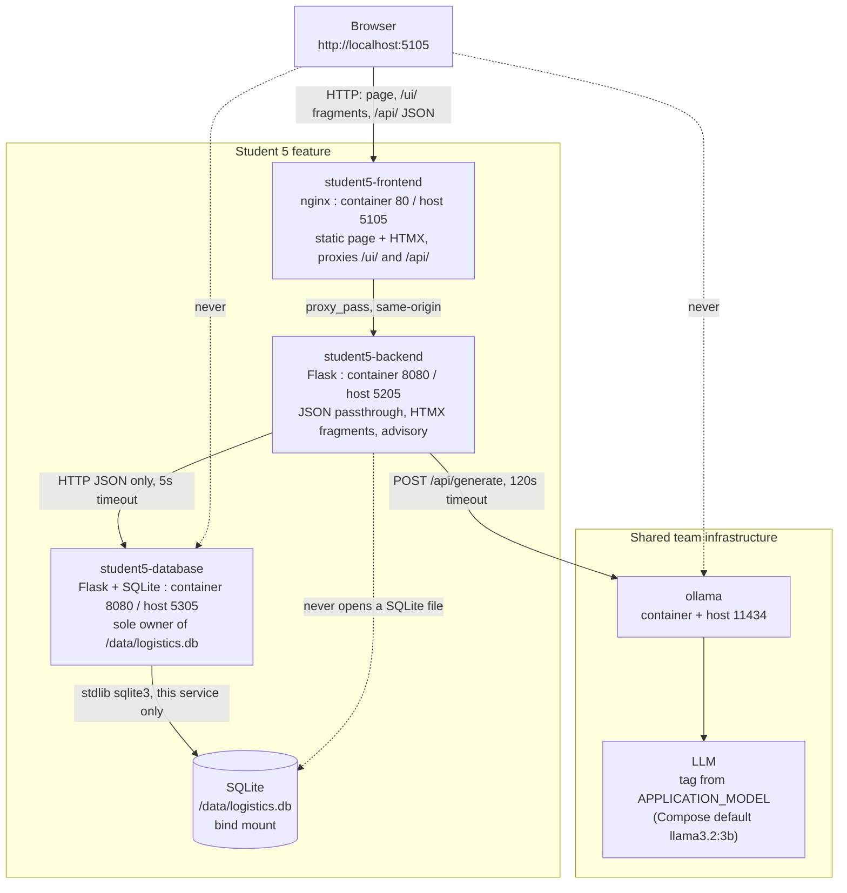

# Travel Logistics & Advisory Service - Architecture

Student 5 (Alex Chen), Release 0. Three containerised services plus the team's
shared Ollama runtime.

## Runtime topology



## The services

### student5-frontend - nginx, container port 80, host 5105

A static page and an edge, nothing more. `index.html` is one document with no
build step; every data block on it is an HTML fragment fetched from the
backend's `/ui/` blueprint and swapped in by HTMX 1.9.12, pinned to an exact
version and locked with a Subresource Integrity hash. nginx's second job is the
important one: it proxies `/ui/` and `/api/` to the backend so the whole
application looks same-origin, which means no fragment endpoint needs CORS and
every URL on the page can stay relative. Two details earn their keep - `resolver
127.0.0.11` plus a variable in `proxy_pass`, so the backend's address is
re-resolved per request instead of going stale when its container restarts on a
new IP; and a 180-second read timeout on both proxied locations, sized for the
slowest observed generation rather than the average, because the default 60
seconds cuts an advisory off mid-write and hands the page a 504 that HTMX will
not swap. `/health` is served by nginx itself and says nothing about the
backend, so a backend outage does not also mark the frontend unhealthy and
restart it.

### student5-backend - Flask, container port 8080, host 5205

The middle tier. It owns no data: the frontend talks to it, and it talks to the
database service over HTTP and to Ollama for generated advice. Three blueprints
are kept apart because they do not share failure semantics. `api` is a JSON
passthrough whose shapes are identical to the database service's, with
`relay()` as the single chokepoint that turns a `DatabaseResponse` into a Flask
response and forwards its status code verbatim. `advisory` owns a contract of
its own - `destination_id` is required and coerced to `int` before it is
interpolated into any URL - and is the only place the two dependencies are
combined. `ui` renders server-side HTML fragments and deliberately answers 200
even when something went wrong, because HTMX does not swap a non-2xx response
and a silent no-swap is the worst possible feedback. All configuration
(`DATABASE_API_URL`, `OLLAMA_URL`, `APPLICATION_MODEL`) is read once in
`create_app`, so no request-building code names a model or a host.

### student5-database - Flask + SQLite, container port 8080, host 5305

The only service in the repository that opens `student-5/database/storage/logistics.db`
(`/data/logistics.db` inside the container). It exposes three resources -
destinations, weather notes, transit options - over a JSON CRUD API, and owns
all validation for them: required fields, non-empty strings, integer and
existence checks on `destination_id`. It creates the schema on startup and runs
the seed only when `destinations` is empty, so a restart against an existing
volume is a no-op. Connections are per-request and every one issues
`PRAGMA foreign_keys = ON`, which is what makes the cascade deletes real.

### ollama - shared, container and host port 11434

Not owned by this feature. One shared runtime hosts every model tag the team
needs; `ollama-model-setup` pulls and preloads them before dependent services
start. Student 5 selects a tag through `APPLICATION_MODEL` and calls
`/api/generate` non-streaming. Streaming would require the frontend to hold an
open connection through the backend, which neither the fragment nor the JSON
contract supports.

## The AI workflow (the marked path)

```text
Browser
  -> POST /ui/advisory  (form: destination_id, month, interests)
  -> student5-frontend  (nginx proxy, 180s read)
  -> student5-backend   advisory.generate_advisory
       -> student5-database  GET /api/destinations/<id>
                             GET /api/weather-notes?destination_id=<id>
                             GET /api/transit-options?destination_id=<id>
       -> build_prompt: stored rows pasted in verbatim
       -> ollama POST /api/generate {model: APPLICATION_MODEL, stream: false}
       -> LLM
  -> <article class="advisory-result"> swapped into #advisory-panel
```

The browser never reaches Ollama. `ollama_client.py` is the only module in the
backend that knows how to, and `build_prompt` guarantees that every advisory -
JSON or fragment - is grounded in the same stored rows, because both endpoints
call the same function.

## The rule that shapes everything: no service touches another's SQLite file

`student5-database` is the sole owner of `/data/logistics.db`. The backend has
no `sqlite3` import at all - every read and write travels over HTTP through
`db_client.py`. The rule applies across the group as well: Student 5's services
open no other student's database, and no other student's service opens this one.

Two consequences worth stating. First, it is what makes the backend's 68 tests
runnable offline against mocked HTTP - there is no file access left to stub.
Second, it forces the two dependency-failure vocabularies to stay distinct,
because a database that cannot be *reached* is a different event from a database
that answers `404`:

| Situation | `db_client` / `ollama_client` | JSON API | `/ui/` fragment |
|---|---|---|---|
| Row not found | `DatabaseResponse(404, ...)` returned, not raised | `404`, database's own body | readable notice, `200` |
| Database unreachable | `DatabaseUnavailable` raised | `503 {"error": "database service unavailable"}` | "The travel database is unavailable right now.", `200` |
| Ollama unreachable, slow, or non-200 | `OllamaUnavailable` raised | `503 {"error": "ai service unavailable"}` | "The travel adviser is unavailable right now.", `200` |
| Backend container down | - | nginx `502` | `htmx:responseError` writes the same `.fragment-message` markup client-side |

## Compose wiring

| Service | Image source | Container : host | Depends on | Healthcheck |
|---|---|---|---|---|
| `student5-frontend` | `./student-5/frontend` | 80 : 5105 | `student5-backend` healthy | `wget --spider http://127.0.0.1/health` |
| `student5-backend` | `./student-5/backend` | 8080 : 5205 | `student5-database` healthy, `ollama-model-setup` completed | `urllib.request.urlopen` on `/health` |
| `student5-database` | `./student-5/database` | 8080 : 5305 | - | `urllib.request.urlopen` on `/health` |

Services address each other by Compose DNS name (`http://student5-database:8080`,
`http://ollama:11434`), never by host port. The database's healthcheck uses
Python's `urllib` because `python:3.11-slim` ships without `curl` or `wget`.
