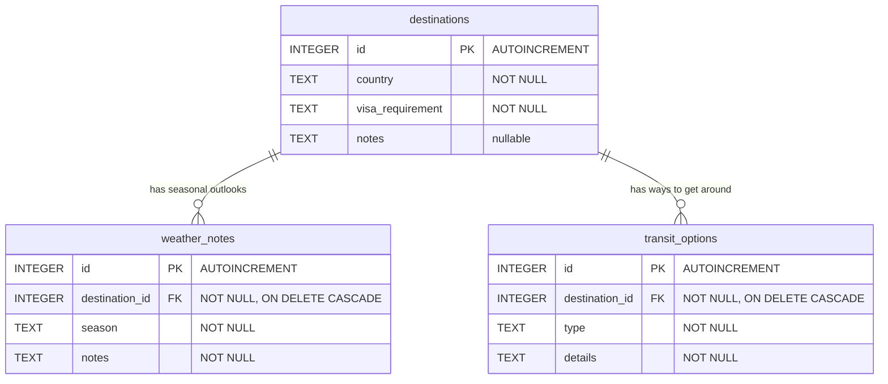

# Travel Logistics & Advisory Service - Data Design

Student 5 (Alex Chen), Release 0. Source of truth: `database/schema.sql`,
`database/seed.sql`, `database/app.py`.

## Conceptual design

The feature answers one question: *what do we know about travelling to this
country?* Three kinds of fact answer it.

- A **destination** is a country, together with the entry rule an Australian
  passport holder faces and any free-text entry notes. It is the thing a
  traveller selects, and everything else hangs off it.
- A **weather note** is one season's outlook for one destination. A destination
  has several because packing advice for Japan in March is not packing advice
  for Japan in July.
- A **transit option** is one way of moving around at one destination - a rail
  pass, a metro card, an airport link - with the practical detail attached.

Both weather notes and transit options are meaningless without their
destination, so they are owned by it: delete the country and its notes and
options go with it. Nothing points the other way, and there are no relationships
between the three tables other than that ownership. That is deliberate - it
keeps the whole model a one-level hierarchy that the advisory prompt can render
as three flat text blocks.

The AI advisory holds no data of its own. It is generated on request from these
rows and never stored, so there is no cached advice to go stale when a visa
rule is corrected.

## Entity relationship diagram

## Logical design

### destinations

| Column | Type | Key | Constraints | Notes |
|---|---|---|---|---|
| `id` | INTEGER | PK | `AUTOINCREMENT` | |
| `country` | TEXT | | `NOT NULL`, non-empty after trim | Rejected with `400` if missing, non-string, or whitespace only |
| `visa_requirement` | TEXT | | `NOT NULL`, non-empty after trim | Sample data uses `visa-free`, `visa-on-arrival`, `eVisa`, `embassy-visa`. This is a data convention, **not** a database `CHECK` constraint - the column accepts any non-empty string |
| `notes` | TEXT | | nullable | The one nullable column in the schema. `null` is accepted; `""` is rejected |

### weather_notes

| Column | Type | Key | Constraints | Notes |
|---|---|---|---|---|
| `id` | INTEGER | PK | `AUTOINCREMENT` | |
| `destination_id` | INTEGER | FK -> `destinations.id` | `NOT NULL`, `ON DELETE CASCADE` | Must be a real `int` (a bool is rejected) and must already exist - checked on both `POST` and `PUT`, returning `400` naming the id |
| `season` | TEXT | | `NOT NULL`, non-empty after trim | e.g. `Spring (Mar-May)`, `Wet (Nov-Mar)` |
| `notes` | TEXT | | `NOT NULL`, non-empty after trim | |

### transit_options

| Column | Type | Key | Constraints | Notes |
|---|---|---|---|---|
| `id` | INTEGER | PK | `AUTOINCREMENT` | |
| `destination_id` | INTEGER | FK -> `destinations.id` | `NOT NULL`, `ON DELETE CASCADE` | Same validation as above |
| `type` | TEXT | | `NOT NULL`, non-empty after trim | Sample data uses `metro`, `rail`, `bus`, `rideshare`, `ferry`, `airport-link` - again a convention, not a `CHECK` |
| `details` | TEXT | | `NOT NULL`, non-empty after trim | |

### Cascade deletes

`weather_notes.destination_id` and `transit_options.destination_id` are declared
`REFERENCES destinations(id) ON DELETE CASCADE`. Deleting a destination through
`DELETE /api/destinations/<id>` therefore removes its weather notes and transit
options in the same statement.

This only works because SQLite disables foreign-key enforcement by default and
the setting is **per connection**. `database/app.py:connect()` issues
`PRAGMA foreign_keys = ON` on every connection it opens; the identical pragma at
the top of `schema.sql` covers only the connection that runs that script. Losing
the pragma in `connect()` would silently turn cascades off and leave orphan
child rows - which is why it lives in the one function every request path goes
through, rather than being set at startup.

### Write semantics

- **`POST`** requires the fields in `REQUIRED_FIELDS`; any writable column not
  supplied is stored as `NULL`.
- **`PUT` is a partial merge.** Columns the client omits keep their current
  value, so the backend can change one field without re-sending the row.
  Required fields cannot go missing, because the stored row already satisfies
  them. Supplied values are still validated.
- Table names are interpolated into SQL strings, which is safe because they come
  only from the module-level `REQUIRED_FIELDS` / `WRITABLE_FIELDS` constants and
  never from request data. Every **value** is passed as a bound parameter.

## Physical design

| Property | Value |
|---|---|
| Engine | SQLite via Python's stdlib `sqlite3` - no ORM |
| File path in container | `/data/logistics.db` (env `DATABASE_PATH`, default `/data/logistics.db`) |
| Host storage | bind mount `./student-5/database/storage:/data` in `docker-compose.yml` |
| Row access | `sqlite3.Row` row factory, so rows serialise straight to JSON objects |
| Connection scope | one per request, opened lazily via Flask's `g`, closed in `teardown_appcontext` |
| Owner | `student5-database` only. No other service in the repository opens this file, and this service opens no other student's file |

### Startup and seeding

`init_db(database_path)` runs once per process, inside `create_app`:

1. `os.makedirs` the parent directory, so a fresh volume works with no manual step.
2. Execute `schema.sql`, which uses `CREATE TABLE IF NOT EXISTS` throughout.
3. `SELECT COUNT(*) FROM destinations`. **Only if that count is zero**, execute
   `seed.sql`.
4. Commit and close.

The seed is therefore **idempotent by construction**: restarting the container
against an existing bind mount re-creates nothing and inserts nothing. This is
also why `seed.sql` can use explicit ids (`1`..`12`) for its destinations - it
can only ever run against an empty table, so the ids cannot collide, and the
child rows' foreign keys stay readable in the source.

A fresh database seeds **12 destinations, 14 weather notes and 14 transit
options**. Fiji (id 12) deliberately has no transit options, which is the case
the grounded advisory prompt has to handle by saying so rather than inventing
ferries.

### Test isolation

Every test gets its own database file through pytest's `tmp_path` fixture, so
the 26-test suite never touches `/data` or the checked-in `storage/` directory.

### What is not here

No indexes beyond the implicit primary keys, no `CHECK` constraints on the
`visa_requirement` / `type` vocabularies, no `created_at` / `updated_at`
columns, and no migration tooling. At 40 seeded rows and a single-writer
classroom workload, each of those would be cost without benefit. The vocabulary
constraint is the one most likely to be worth adding later, if the UI grows a
dropdown that has to agree with the database.
